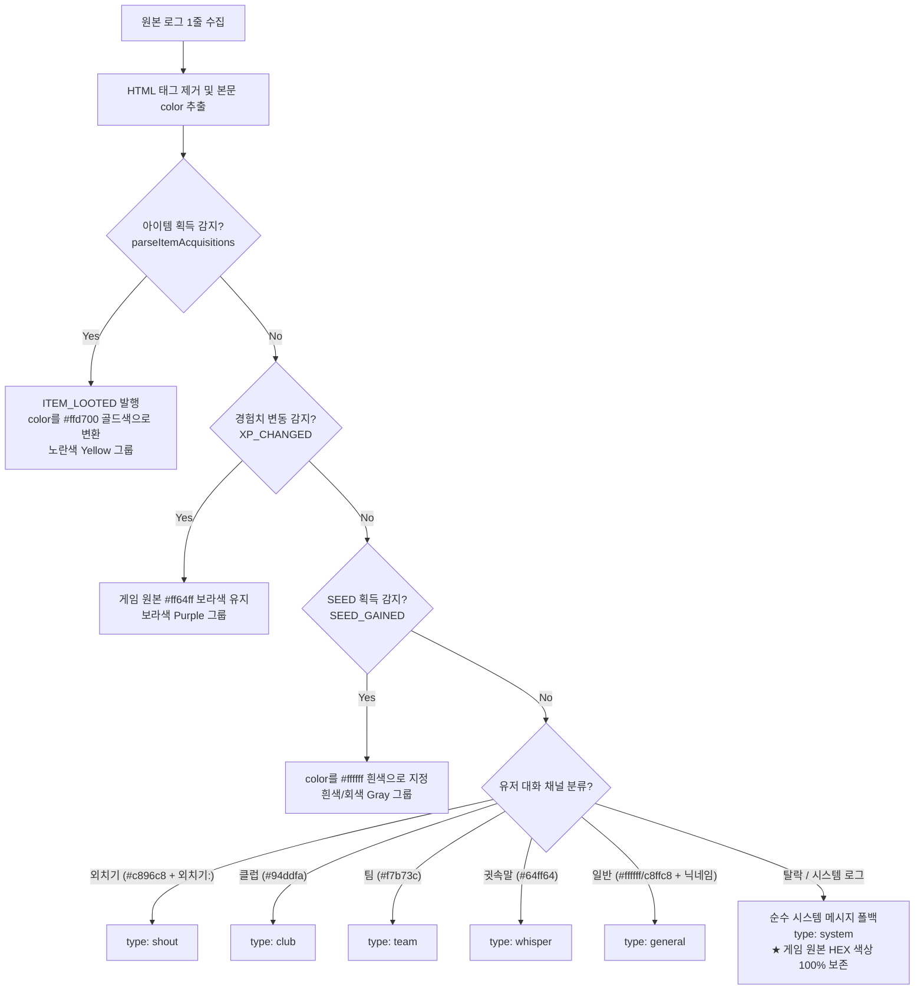

# 테일즈위버 채팅 파싱 파이프라인 및 시스템 메시지 색상 분류 가이드

이 문서는 TW-Overlay에서 테일즈위버 원본 채팅 로그를 수집·파싱하고, 6대 시스템 색상군(`SystemColorGroup`)으로 분류 및 필터링하는 전체 기술 아키텍처를 정의합니다.

---

## 1. 테일즈위버 원본 채팅 로그 파일 구조

테일즈위버 게임 클라이언트는 실시간으로 채팅 로그를 HTML 형식으로 기록합니다 (`ChatLog/TWChatLog_YYYY_MM_DD.html`).

```html
<!-- 원본 로그 예시 -->
<body bgcolor="black">
<font size="2" color="white"> [14시 22분 11초] </font> <font size="2" color="#ff64ff">군고구마가 배속에서 소화 되자 노련했던 집중력이 사라졌습니다.</font></br>
<font size="2" color="white"> [14시 22분 15초] </font> <font size="2" color="#ff64ff">경험치가 1,000,000 올랐습니다.</font></br>
<font size="2" color="white"> [14시 41분 26초] </font> <font size="2" color="#c8ffc8">화속성의 앰플 효과가 발동 되었습니다.</font></br>
<font size="2" color="white"> [ 0시 26분 37초] </font> <font size="2" color="#ff6464">고정 타겟팅은 Shift + ` 로 설정할 수 있습니다.</font></br>
<font size="2" color="white"> [ 0시 38분 30초] </font> <font size="2" color="#ff64ff">[엘소 스크롤 (1 포인트)]을(를) [36]개 획득하였습니다.</font></br>
<font size="2" color="white"> [ 0시 23분 40초] </font> <font size="2" color="#c896c8">외치기 : 아어무입7연쩔 보스패턴피해야함 10억</font></br>
<font size="2" color="white"> [ 2시 23분 47초] </font> <font size="2" color="#94ddfa">클럽 공지 : '전기세비싸' 님께서 '[클럽 보스] 그라델' 를 생성 하였습니다.</font></br>
```

- **타임스탬프**: `[HH시 mm분 ss초]` (앞부분 흰색 폰트)
- **본문 색상**: `<font color="...">` 태그로 게임 엔진이 고유 색상(HEX 코드)을 직접 태깅함

---

## 2. TW-Overlay 파싱 & 색상 결정 파이프라인

`src/modules/chatParser.ts`, `chatLogProcessor.ts`, `chatLogManager.ts`를 거치며 다음과 같이 단계별로 처리됩니다:



### ⚠️ 핵심 색상 변환 요약
1. **아이템 획득 (`ITEM_LOOTED`)**: 원본이 보라색(`#ff64ff`)이더라도, 사용자가 득템을 직관적으로 알아볼 수 있도록 **골드/노란색 (`#ffd700`)**으로 변환 ➔ **노란색 (`yellow`)**
2. **경험치 획득 (`XP_CHANGED`)**: 게임 원본 그대로 **보라색 (`#ff64ff`)** 유지 ➔ **보라색 (`purple`)**

---

## 3. 시스템 메시지 6대 색상군 (`SystemColorGroup`) 및 카테고리 정의

`src/shared/chatChannels.ts`의 `getSystemColorGroup(colorHex)` 함수는 메시지의 HEX 색상값을 RGB 및 HSV 색상각(Hue)으로 변환하여 6대 색상군으로 분류합니다:

```typescript
// HSV 기반 시스템 메시지 색상군 판별 공식
function getSystemColorGroup(colorHex: string): SystemColorGroup {
  // 1. 무채색 (채도 S < 0.20 또는 밝기 V < 40 또는 Max-Min < 30) -> 'gray'
  // 2. 색상각 (Hue, 0° ~ 360°):
  //    - 45° <= Hue <= 65°   -> 'yellow' (노란색)
  //    - 65° <  Hue <= 165°  -> 'green'  (초록색)
  //    - 165° < Hue <= 260°  -> 'blue'   (파란색)
  //    - 260° < Hue <  340°  -> 'purple' (보라색)
  //    - 그 외 (0°/360° 부근)-> 'red'    (붉은색)
}
```

### 📊 6대 색상 카테고리 명칭 및 인게임 실측 데이터

| 색상 ID | 공식 카테고리명 (UI 표시명) | 대표 HEX 코드 | 색상 생성 주체 | 인게임 실제 메시지 유형 (실측) |
| :---: | :--- | :---: | :---: | :--- |
| 🟣 **`purple`** | **보라색 (경험치 획득 / 버프 / 소모품 / 코어)** | `#ff64ff`<br>(약 85만 건) | **게임 원본** | • **경험치 획득 / 버프 / 소모품 / 코어 효과 발동**<br>- `경험치가 1,000,000 올랐습니다.`<br>- `군고구마가 배속에서 소화 되자 노련했던 집중력이 사라졌습니다.`<br>- `경험의 심장를 사용하였습니다.`<br>- `[전기세비싸]님이 [퇴마사의 은총] 아이템을 사용하셨습니다`<br>- `[어비스 코어] 진화 2단계-3세트 효과가 발동되었습니다.` |
| 🟡 **`yellow`** | **노란색 (아이템 획득 / 서버 긴급 공지)** | `#ffd700`<br>`#ffff00`<br>`#ffec44` | **프로그램 변환**<br>+ 게임 원본 | • **아이템 획득(득템, 엘소 등) / 전 서버 긴급 공지**<br>- `[엘소 스크롤 (1 포인트)]을(를) [36]개 획득하였습니다.` (`#ffd700`)<br>- `[일루미네이션 카메라] 1개를 획득했습니다.` (`#ffd700`)<br>- 전 서버 긴급 점검 공지, 핫타임 이벤트 방송 (`#ffff00`) |
| 🔴 **`red`** | **붉은색 (시스템 공지 / 팁)** | `#ff6464`<br>(약 4,100건) | **게임 원본** | • **인게임 시스템 공지 / 사기 주의 / 단축키 팁**<br>- `아이템을 빌려줄 경우 사기를 조심하시기 바랍니다.`<br>- `운영자는 어떠한 경우에도 아이템을 요구하거나...`<br>- `아이템 거래소 이용 시 판매 비용의 5%가 수수료로 부과됩니다.`<br>- `고정 타겟팅은 Shift + \` 로 설정할 수 있습니다.` |
| 🟢 **`green`** | **초록색 (던전 진행 / 상태이상 / 앰플)** | `#c8ffc8`<br>`#64ff80`<br>(약 11,000건) | **게임 원본** | • **던전 진행 카운트 / 속성 앰플 / 무력화 / 피버**<br>- `남은 공격 횟수 : 30`<br>- `3초 후 자동으로 퇴장합니다.`<br>- `화속성의 앰플 효과가 발동 되었습니다.`<br>- `무력화되었습니다. 공격/이동이 불가능하고...`<br>- `Fever가 10% 회복되었습니다.` |
| 🔵 **`blue`** | **파란색 (인게임 알림)** | `#00ffff`<br>(약 1,700건) | **게임 원본** | • **테일즈위버 인게임 기능 알림**<br>- `채팅 로그 기능이 동작하고 있습니다. 채팅 로그 기능을 종료하면 좀 더 쾌적한 게임 플레이가 가능합니다.` |
| ⚪ **`gray`** | **흰색/회색 (보스 기믹 대사 / NPC 대사)** | `#ffffff`<br>`#a8a8a8`<br>(약 17,000건) | **프로그램 지정**<br>+ 게임 원본 | • **보스/사제 패턴 대사, NPC 일반 대사, SEED 획득**<br>- `검의 사제, 셀리니아코스 : 집행을 시작하겠소.`<br>- `궤의 사제, 프로에드로스 : 파문이다!!!`<br>- `[자동] 1,000,000 SEED를 획득했습니다` (`#ffffff`)<br>- `Talesweaver Chat Message Log Date : ...` |

---

## 4. 오버레이 화면 및 커스텀 탭 필터링 원리

### 1) 실시간 스트리밍 (`src/chatOverlayRenderer.ts`의 `shouldShowChat`)
- **[통합 (`Basic`)] & [기본 채널 (`System`, `General` 등)] 탭**:
  - 해당 탭에 포함된 모든 메시지를 온전하게 화면에 렌더링 (전체 시스템 메시지 노출)
- **[사용자 정의 커스텀 탭 (`custom_xxx`)]**:
  - `customTab.channels.includes('system')`이 활성화되어 있을 때,
  - `customTab.systemColorFilters`에 등록된 색상군(예: 커스텀 탭에서 `노랑` 선택 시 아이템 획득 메시지만 출력)에 일치하는 시스템 메시지만 독립적으로 실시간 렌더링

### 2) 과거 대화 히스토리 조회 (`src/modules/chatLogProcessor.ts`의 `getChatHistory`)
- 커스텀 탭 카테고리(`custom_xxx`) 요청 시 메모리 히스토리 저장소에서 해당 커스텀 탭의 `channels` 및 `systemColorFilters` 조건에 부합하는 항목들만 즉시 필터링 및 시간순 정렬하여 반환합니다.
- 오버레이 렌더러는 메인 프로세스가 필터링한 결과를 바탕으로 렌더링합니다.
