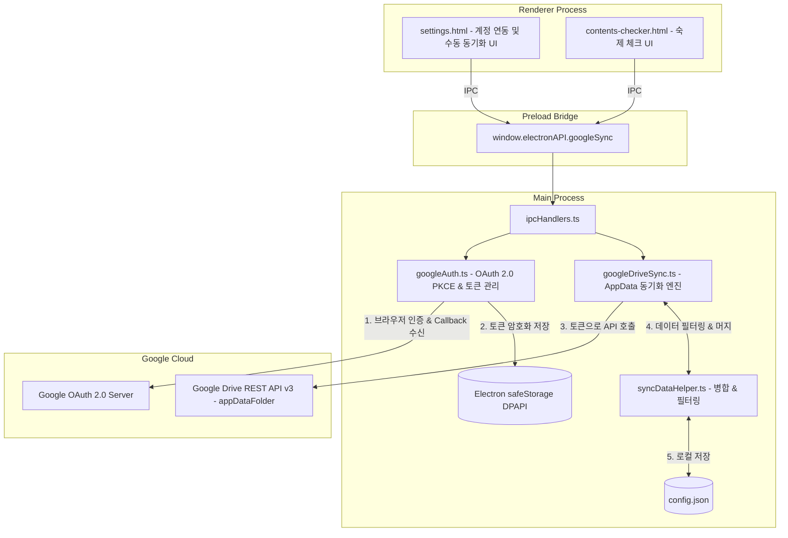
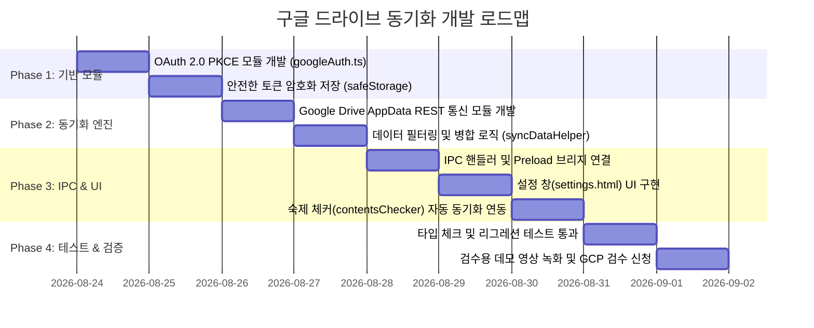

# Google Drive AppData 기반 클라우드 동기화 상세 개발 계획서

본 문서는 **TW-Overlay**에서 Google OAuth 2.0 및 Google Drive `appDataFolder`를 활용하여 다중 PC 환경 간 숙제 체크리스트와 설정을 원활하고 안전하게 동기화하기 위한 아키텍처 및 구현 계획을 정의합니다.

---

## 1. 개요 및 핵심 원칙

### 1.1 목표
* 사용자가 집 PC, 서브 노트북, PC방 등 다양한 기기에서 TW-Overlay를 사용할 때 **숙제(일일/주간 컨텐츠) 체크 상태, 캐릭터 목록, 개인 설정**을 자동으로 동기화할 수 있도록 지원합니다.
* 별도의 자체 데이터베이스나 서버를 구축하지 않고, 유저 개인의 Google Drive 숨김 앱 폴더(`appDataFolder`)를 활용하여 **운영 비용 0원, 보안/개인정보 책임 최소화**를 달성합니다.

### 1.2 핵심 설계 원칙
1. **Local-First (로컬 우선, 0ms 지연 시간)**:
   * 모든 UI 렌더링과 체크박스 상호작용은 로컬 메모리 및 `config.json`을 우선으로 처리합니다.
   * 네트워크 지연으로 인한 UI 버벅임이나 렉을 완전히 배제하고, 클라우드 통신은 백그라운드에서 비동기로 수행합니다.
2. **최소 권한 원칙 (Least Privilege)**:
   * 전체 구글 드라이브 접근 권한(`.../auth/drive`)이 아닌, **앱 전용 숨김 공간 권한(`.../auth/drive.appdata`)**만 요구합니다.
   * 이를 통해 유저의 개인 드라이브 파일에는 일체 접근하지 않으며, 구글의 보안 심사(CASA) 면제로 손쉽게 검수를 통과합니다.
3. **안전한 자격 증명 보관 (Secure Storage)**:
   * OAuth Refresh Token 및 Access Token은 평문으로 저장하지 않고, Electron의 `safeStorage` (Windows DPAPI 암호화)를 통해 안전하게 암호화하여 로컬에 저장합니다.
4. **선택적 동기화 (기기 독립적 설정 분리)**:
   * 모니터 해상도에 종속적인 **창 위치(`positions`)**나 PC별 파일 경로(**`chatLogPath`**)는 동기화에서 제외하고 기기별 로컬로 유지합니다.

---

## 2. 동기화 데이터 스펙 및 구조

### 2.1 동기화 대상과 로컬 유지 대상 분류

| 구분 | 포함 항목 | 이유 |
| :--- | :--- | :--- |
| **클라우드 동기화 대상** | • `contentsCheckerItems` (일일/주간 숙제 목록 및 캐릭터별 완료 상태 `completedState`)<br>• `characterPresets` (캐릭터 목록 및 메인 캐릭터 설정)<br>• `lootKeywords` (득템 알림 키워드 목록)<br>• `customAlarms` (커스텀 알람 목록)<br>• `quickSlots` (퀵슬롯 설정)<br>• `bossNotifier` 설정, `buffTimer` 설정 등 사용자 공통 환경설정 | 여러 PC에서 동일하게 유지되어야 하는 핵심 데이터 |
| **로컬 기기 전용 유지 (동기화 제외)** | • `positions` (모든 HUD/창 위치 좌표 및 크기)<br>• `chatLogPath` (PC별 테일즈위버 채팅 로그 경로)<br>• `opacity` 계열 (기기별 모니터 패널 특성에 따른 투명도)<br>• `diary.db` (대용량 SQLite 로그 파일 - 초기 제외) | PC마다 모니터 해상도, 설치 드라이브 경로가 다르므로 기기별 독립 유지가 필수적인 항목 |

### 2.2 클라우드 동기화 파일 구조 (`tw_overlay_sync.json`)

Google Drive `appDataFolder`에 단일 JSON 파일(`tw_overlay_sync.json`) 형태로 보관합니다.

```json
{
  "schemaVersion": 1,
  "appVersion": "0.18.0",
  "deviceId": "win-desktop-a1b2c3d4",
  "lastSyncedAt": 1771755600000,
  "updatedBy": "user@gmail.com",
  "data": {
    "characterPresets": [
      { "id": "char-1", "name": "루시안" },
      { "id": "char-2", "name": "보리스" }
    ],
    "contentsCheckerItems": [
      {
        "id": "daily-club-boss",
        "completedState": {
          "char-1": { "currentCount": 1, "lastCompletedAt": 1771752000000 }
        }
      }
    ],
    "lootKeywords": ["연마", "스페셜 스킬"],
    "quickSlots": []
  }
}
```

---

## 3. 상세 아키텍처 및 모듈 설계



---

### 3.1 Google OAuth 모듈 (`src/modules/googleAuth.ts`)

#### ① 인증 흐름 (PKCE + Loopback Server)
1. 사용자가 설정 창에서 `[Google 계정 연동]` 버튼 클릭.
2. 메인 프로세스에서 임시 로컬 HTTP 서버(예: `http://127.0.0.1:54321/callback`)를 수신 대기.
3. PKCE용 `code_verifier`와 `code_challenge` 생성.
4. `shell.openExternal()`을 통해 사용자의 기본 웹 브라우저(Chrome/Edge 등)에서 구글 로그인 동의 페이지 오픈:
   ```
   https://accounts.google.com/o/oauth2/v2/auth?
     client_id=...&
     redirect_uri=http://127.0.0.1:54321/callback&
     response_type=code&
     scope=https://www.googleapis.com/auth/drive.appdata https://www.googleapis.com/auth/userinfo.email&
     code_challenge=...&
     code_challenge_method=S256
   ```
5. 브라우저에서 인증 완료 후 `http://127.0.0.1:54321/callback?code=...`로 리다이렉트되면, 로컬 HTTP 서버가 요청을 받아 코드를 획득하고 브라우저에는 "연동 완료! 창을 닫아주세요" HTML 응답 반환 후 서버 종료.
6. 구글 토큰 엔드포인트(`https://oauth2.googleapis.com/token`)로 코드를 전송하여 `access_token`과 `refresh_token` 발급.

#### ② 안전한 토큰 보관 및 갱신
* 발급받은 `refresh_token`은 `safeStorage.encryptString()`으로 암호화하여 `userData/auth_tokens.bin`에 저장.
* `access_token` 만료(보통 1시간) 시 `refresh_token`을 이용하여 백그라운드에서 자동으로 갱신(Silent Refresh).

---

### 3.2 Google Drive 동기화 엔진 (`src/modules/googleDriveSync.ts`)

Google Drive v3 REST API를 직접 `fetch` 기반으로 호출합니다 (외부 무거운 SDK 의존성 없이 가볍게 구현).

1. **파일 조회 (`findSyncFile`)**:
   * `GET https://www.googleapis.com/drive/v3/files?spaces=appDataFolder&q=name='tw_overlay_sync.json' and trashed=false`
2. **파일 다운로드 (`downloadSyncFile`)**:
   * `GET https://www.googleapis.com/drive/v3/files/{fileId}?alt=media`
3. **파일 업로드 / 덮어쓰기 (`uploadSyncFile`)**:
   * 신규 생성 시: `POST https://www.googleapis.com/upload/drive/v3/files?uploadType=multipart` (`parents: ['appDataFolder']`)
   * 기존 파일 갱신 시: `PATCH https://www.googleapis.com/upload/drive/v3/files/{fileId}?uploadType=media`

---

### 3.3 데이터 병합 및 충돌 방지 (`src/modules/syncDataHelper.ts`)

* **타임스탬프 기반 최신 우선 정책**:
  * 로컬의 마지막 수정 시간(`localLastModified`)과 클라우드의 `lastSyncedAt`을 비교.
* **숙제 체크 상태(`completedState`) 세부 병합**:
  * 각 캐릭터별 컨텐츠 완료 타임스탬프(`lastCompletedAt`)를 개별 비교하여 더 최신의 완료 상태를 보존.
* **로컬 백업 생성**:
  * 클라우드 데이터를 처음 로드하거나 덮어쓰기 전, 만약의 사태에 대비해 `userData/config.backup.json` 자동 생성.

---

### 3.4 동기화 트리거 및 라이프사이클

1. **앱 시작 시 (자동 다운로드/동기화)**:
   * 구글 연동 계정이 있다면 백그라운드에서 클라우드 파일 확인.
   * 클라우드 데이터가 로컬보다 최신이면 조용히 반영하고 렌더러에 `sync-updated` 브로드캐스트.
2. **숙제 체크 시 (디바운스 자동 업로드)**:
   * 유저가 체크박스를 클릭하면 로컬 저장은 0ms 즉시 수행.
   * 클라우드 동기화는 **5초 디바운스(Debounce)** 타이머를 두어 연속 클릭이 끝난 후 1회 백그라운드 업로드.
3. **앱 종료 시 (동기화 완료 보장)**:
   * 디바운스 대기 중인 동기화가 있다면 즉시 플러시(Flush)하여 업로드 완료 후 앱 종료.
4. **수동 버튼 (설정 창)**:
   * `[지금 클라우드에 백업]`: 현재 로컬 상태를 클라우드에 강제 업로드.
   * `[클라우드에서 불러오기]`: 클라우드 데이터를 내려받아 로컬에 강제 덮어쓰기.

---

## 4. UI / UX 설계 사양

### 4.1 설정 창 (`src/settings.html`) 디자인

* **위치**: 설정 창의 사이드바 메뉴 또는 상단에 `[ ☁️ 클라우드 동기화 ]` 전용 섹션 추가.
* **Glassmorphism 디자인 토큰 준수**:
  * 기존 TW-Overlay 디자인 시스템(`rgba(15, 23, 42, 0.85)`, `accent-color: #3b82f6` 등) 완벽 적용.

#### UI 상태별 화면 구성:
1. **미연동 상태**:
   * 구글 로고 아이콘과 함께 `[ Google 계정으로 로그인 ]` 버튼 제공.
   * 안내 문구: *"구글 계정을 연동하면 다른 PC에서도 숙제 체크리스트와 설정을 동일하게 사용할 수 있습니다."*
2. **연동 완료 상태**:
   * 연동된 계정 표시 (`drt****@gmail.com`)
   * 마지막 동기화 시간 표시 (`2026-08-23 19:30:15`)
   * 자동 동기화 활성화 토글 스위치 (ON/OFF)
   * 액션 버튼 그룹:
     * `[ ⬆️ 지금 클라우드에 백업 ]`
     * `[ ⬇️ 클라우드에서 불러오기 ]`
     * `[ 연동 해제 (로그아웃) ]`

---

## 5. Google Cloud Console 및 검수 준비 가이드

### 5.1 Google Cloud Console 프로젝트 세팅
1. **Google Cloud Console**에서 새 프로젝트 생성 (`TW-Overlay-Sync`).
2. **OAuth 동의 화면 (Consent Screen)** 설정:
   * 사용자 유형: **외부 (External)**
   * 앱 이름: `TW-Overlay`
   * 사용자 지원 이메일 / 개발자 이메일 입력
   * **범위(Scope)**: `https://www.googleapis.com/auth/drive.appdata` 추가
3. **사용자 인증 정보 (Credentials)**:
   * `OAuth 클라이언트 ID` 생성 → 애플리케이션 유형: **데스크톱 앱 (Desktop App)**
   * 발급된 `Client ID` 및 `Client Secret` 획득.

### 5.2 개인정보처리방침 (Privacy Policy) 배포
* GitHub 저장소 또는 GitHub Pages에 `privacy.html` 배포 (도메인 또는 URL 확보).
* Google Drive AppData 폴더에만 접근하며, 일체의 데이터를 외부 서버에 수집하지 않는다는 내용 명시.

### 5.3 YouTube 데모 영상 녹화 (검수 제출용)
* 화면 녹화 내용 (약 1분):
  1. TW-Overlay 설정 창에서 [Google 계정 연동] 클릭
  2. 웹 브라우저에서 Google 로그인 및 AppData 동의 화면 진행
  3. 로그인 완료 후 동기화 상태 갱신 확인
  4. 숙제 체크 후 클라우드 백업 완료 확인
* YouTube에 **'일부 공개(Unlisted)'**로 업로드 후 검수 요청 시 링크 제출.

---

## 6. 구현 단계별 실행 계획



### 6.1 파일별 작업 내역

1. **`src/shared/types.ts`**:
   * `GoogleSyncStatus`, `SyncPayload`, `GoogleAccountProfile` 인터페이스 추가
2. **`src/modules/googleAuth.ts` (신규)**:
   * PKCE 생성, 로컬 루프백 서버(`http.createServer`), 토큰 교환/갱신, `safeStorage` 암복호화
3. **`src/modules/googleDriveSync.ts` (신규)**:
   * Google Drive v3 AppData REST API 통신 (목록 조회, 다운로드, 멀티파트 업로드)
4. **`src/modules/syncDataHelper.ts` (신규)**:
   * `config.json`에서 동기화 대상 추출, 충돌 병합(Merge), 로컬 백업 관리
5. **`src/modules/ipcHandlers.ts`**:
   * `google-auth:login`, `google-auth:logout`, `google-sync:status`, `google-sync:backup`, `google-sync:restore` 채널 등록
6. **`src/preload.ts`**:
   * `window.electronAPI.googleSync` 네임스페이스에 타입 안정성이 보장된 API 노출
7. **`src/settings.html`**:
   * 클라우드 동기화 섹션 마크업 및 이벤트 핸들링 추가
8. **`src/modules/contentsChecker.ts`**:
   * 체크리스트 변경 시 `requestDebouncedSync()` 호출 트리거 연결

---

## 7. 검증 및 품질 보증 (QA Plan)

1. **자동화 검증**:
   * `npm run typecheck`: TypeScript 정적 타입 검증 오류 0건 유지
   * `npm test`: 기존 렌더러 테스트 및 회귀 테스트 통과 보장
2. **다중 기기 시뮬레이션 테스트**:
   * PC-A에서 숙제 체크 및 백업 → PC-B에서 불러오기 후 체크 상태 동일성 확인
   * PC-A와 PC-B의 해상도가 다를 때 `positions`(창 위치)가 왜곡되지 않고 기기별로 온전히 유지되는지 검증
   * 네트워크 오프라인 상태에서 앱 정상 실행 여부 확인 (오류 없이 로컬 모드로 조용히 폴백)
