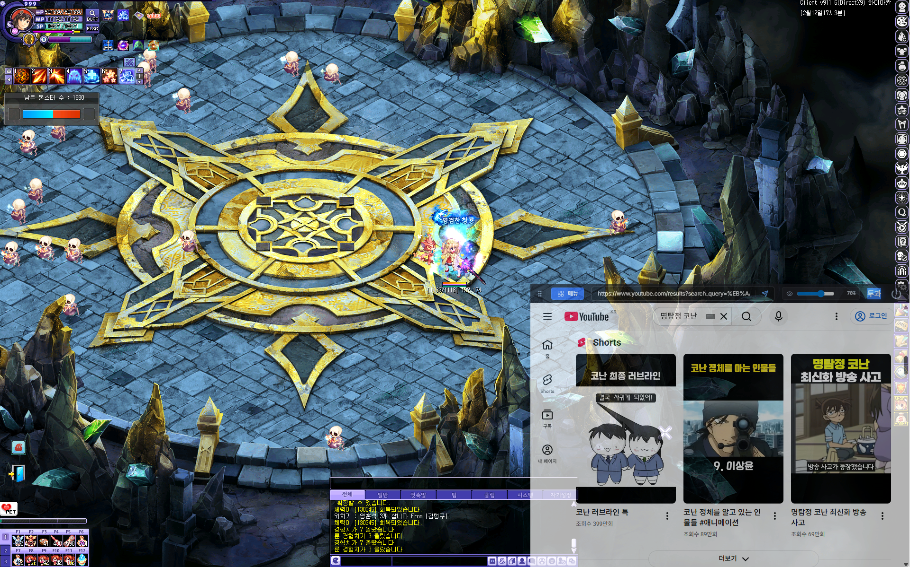

# 🎮 TW-Overlay (테일즈위버 오버레이 프로그램)

테일즈위버(TalesWeaver) 플레이어를 위한 **올인원 테일즈위버 오버레이 프로그램**입니다. 
구글에서 많이 검색하시는 테일즈위버 채팅 오버레이, 실시간 경험치 오버레이 HUD, 지능형 버프 타이머 등 게임 화면과 연동되는 자석형 위젯과 다양한 게임 내 편리 도구를 통해 최상의 플레이 환경을 제공합니다.

## 📸 스크린샷

## 🚀 최신 버전: v2.6.6 (2026.08.19)
이번 업데이트는 채팅 오버레이 제외 필터 추가 및 최소 세로 크기 완화, 숫자 UI tabular-nums 적용, 앱 정보 넥슨 저작권 고지가 추가된 **v2.6.6** 패치 업데이트입니다.

- **💬 채팅 오버레이 제외 필터 기능 추가** (특정 키워드가 포함된 채팅을 오버레이에서 숨기는 블랙리스트 필터, 최소 5글자 이상, 즉시 적용)
- **📏 채팅 오버레이 최소 세로 크기 완화** (200px → 80px로 더 얇게 조절 가능)
- **🔢 숫자 UI 흔들림 방지 개선** (전역 및 팝업 화면에 `tabular-nums` 적용으로 숫자 자릿수 변경 시 레이아웃 흔들림 제거)
- **⚖️ 앱 정보 저작권 고지 추가** (테일즈위버 리소스 넥슨 저작권 고지 추가)

*(이전 버전의 변경 사항은 [release-note](release-note/) 폴더의 릴리즈 노트를 참조해 주세요.)*

---

## 🌟 주요 기능 카탈로그 (테일즈위버 오버레이 핵심 기능)

테일즈위버 오버레이(TW-Overlay)에서 제공하는 모든 편리 도구를 분류하였습니다. 각 제목을 클릭하면 상세 가이드 페이지로 이동합니다.

### 📊 실시간 게임 데이터 분석
- **[실시간 경험치 HUD](./docs/experience-hud.md)**: 실시간 획득 경험치, EPM, 사냥 리듬 차트 및 정수 기댓값 표시
- **[실시간 로그 엔진](./docs/realtime-log-engine.md)**: 채팅 로그 실시간 추적을 통한 자동 일지 기록 및 득템 알림
- **[지능형 버프 타이머](./docs/intelligent-buff-timer.md)**: 핵심 버프(심장류, 퇴마사)를 감지하여 뱃지 형태로 남은 시간을 보여줍니다.

### 🛡 보안 및 사기 방지
- **[사기꾼 탐지 AI (BETA)](./docs/scam-detector.md)**: 1:1 메신저 대화를 Gemma 4 E2B 로컬 LLM으로 실시간 분석하여 사기 패턴 감지 및 경보

### 🔔 알림 및 실시간 모니터링
- **[집중 대화방](./docs/focused-chat.md)**: 지정한 여러 닉네임과 내 대화만 카카오톡형 말풍선으로 모아보기
- **[지정 단어 알림 설정](./docs/word-alarm.md)**: 특정 키워드 감지 시 사운드 경보 및 전후 10분 대화 DB 기록
- **[외치기 히스토리](./docs/shout-history.md)**: 실시간 외치기 수집 및 검색, 닉네임 원클릭 복사
- **[필드보스 알림 설정](./docs/boss-settings.md)**: 주요 보스 출현 시간 관리 및 알림 수신 설정
- **[사용자 지정 알림 설정](./docs/custom-alert.md)**: 특정 아이템 획득이나 이벤트 발생 시 사운드 및 오버레이 경보 시스템
- **[갤러리 모니터](./docs/gallery.md)**: 커뮤니티 최신글 실시간 감시 및 키워드 알림
- **[매직위버 거래 게시판](./docs/trade.md)**: 서버별 거래 게시물 모니터링 및 매물 알림
- **[ETA 랭킹](./docs/eta-ranking.md)**: 실시간 에타 랭킹 조회

### 🧮 전문 계산기 및 시뮬레이터
- **사냥 경험치 계산기**: 도핑과 사냥 조건을 조합하여 시간당 경험치와 경험의 정수 획득량 계산
- **렐릭 강화 계산기**: 신조·루나리아 렐릭의 능력치별 강화 시뮬레이션, 진화 재료와 SEED 기댓값 조회
- **[시에나의 기운 시뮬레이터](./docs/siena-aura.md) (v1.13.1 Hot)**: 증폭, 능력치 재설정, 추가 옵션 시뮬레이션 및 자동 설정 기능
- **[캐릭터 계수 계산기](./docs/coefficient-calculator.md)**: 스탯 투자에 따른 정밀 데미지 상승폭 분석
- **[제복 색상 시뮬레이터](./docs/uniform-color.md)**: 캐릭터 제복 염색 미리보기 (비설화님 twsnowflower 연동)
- **검 강화하기**: 별도 창에서 즐기는 검 강화 게임 (twliker 연동)
- **[마정석 가치 계산기](./docs/magic-stone-calculator.md)**: 획득한 마정석 수량별 수익 정산 도구
- **[강화 및 진화 시뮬레이터](./docs/evolution-calculator.md)**: 아이템 강화 확률 및 기댓값 계산

### 📖 활동 기록 및 체크리스트
- **오늘 요약 HUD**: 오늘 획득한 아이템·SEED·ELSO와 미완료 숙제를 게임 화면에 간략 표시
- **[스마트 모험 일지](./docs/diary.md)**: 활동 점수, **월간 수익 그래프**, 득템 현황 및 자동 기록 축약 리포트
- **[숙제 체크리스트](./docs/contents-checker.md)**: 일일/주간 컨텐츠 수행 여부 관리 및 자동 초기화

### 📚 정보 사전 및 시스템 설정
- **[전투 장비 사전](./docs/equipment-dic.md)**: 전체 무기 및 장비 능력치 한계값 확인 및 대조 비교
- **[게임 용어 사전](./docs/abbreviation.md)**: 테일즈위버에서 통용되는 줄임말 및 용어 검색
- **[버프 정보 도감](./docs/buffs.md)**: 주요 버프의 효과 및 획득처 정보 확인
- **[인게임 채팅 오버레이](./docs/chat-overlay.md)**: 게임 화면 위에 얹히는 투명 채팅창 위젯 및 투과 모드 설정
- **[사이드바 위젯](./docs/index.md)**: 게임 화면에 밀착되는 메인 컨트롤 패널 UI
- **[오버레이 브라우저](./docs/overlay.md)**: 게임 화면 위에 고정되어 통과 및 클릭 제어가 가능한 오버레이 위젯 창
- **[환경 설정](./docs/settings.md)**: 앱 버전 관리, 단축키, 사운드, 최적화 등 전반적인 설정

## 🚀 시작하기 (테일즈위버 오버레이 프로그램 설치 및 다운로드)

### 설치 방법
[Releases](https://github.com/twliker/tw-overlay/releases) 페이지에서 최신 버전의 `twOverlay-Setup-2.6.7.exe` 파일을 다운로드하여 실행하세요.

### 단축키 및 팁
- **단축키:** 
  - `Ctrl + Shift + T`: 브라우저 클릭 투과 모드 토글 (기본값)
  - `Ctrl + Shift + C`: 숙제 체크리스트 창 열기/닫기 (기본값)
  - `Ctrl + Shift + D`: 하단 독(Dock) 런처 보이기/숨기기 (기본값)
  - `Ctrl + Shift + A`: 어벤던로드 HUD 열기/닫기 (기본값)
  - `Ctrl + Shift + Y`: 오늘 요약 HUD 모드 순환 (접힘 → 펼침 → 숨김)
- **관리자 권한:** 게임 네트워크 최적화(Fast Ping) 기능을 활성화하려면 반드시 관리자 권한으로 실행해야 합니다.
- **데이터 관리:** 모든 설정과 일지 기록은 환경 설정의 '데이터 관리' 탭에서 ZIP 파일로 백업할 수 있습니다.

## 🛠 기술 스택 및 라이선스
- **Engine:** Electron (Node.js) / TypeScript
- **Backend:** Native Win32 API (Koffi), SQLite (better-sqlite3)
- **Frontend:** HTML5, Tailwind CSS, Lucide Icons, **Chart.js**
- **License:** MIT License

---
**twliker** / TW-Overlay Developer
