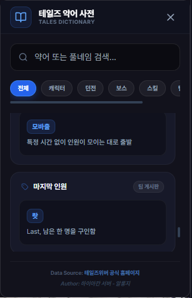

# 게임 용어 & 줄임말 사전

## 언제 쓰는 기능인가요?

팀 게시판이나 채팅에서 본 테일즈위버 줄임말의 뜻을 빠르게 찾을 때 사용합니다.

## 어디에서 켜나요?

사이드바 또는 독 메뉴의 **게임 용어 & 줄임말 사전**을 엽니다.

## 기본 사용법

1. 약어, 전체 이름 또는 설명의 일부를 검색합니다.
2. 캐릭터, 던전, 보스, 스킬 같은 분류로 범위를 좁힙니다.
3. 결과 카드에서 뜻과 사용 예를 확인합니다.

## 자주 혼동하는 점

- 커뮤니티 용어는 서버나 시기에 따라 뜻이 달라질 수 있습니다.
- 사전은 앱에 포함된 데이터라 인터넷이 없어도 검색할 수 있지만, 외부 참고 링크는 인터넷이 필요합니다.
- 결과가 없다고 해서 사용되지 않는 표현이라는 뜻은 아닙니다.

## 문제 해결

- **검색 결과가 없음:** 띄어쓰기 없이 입력하거나 약어의 일부만 검색하세요.
- **뜻이 현재와 다름:** 앱 업데이트를 확인하고 제보 링크로 수정 내용을 알려 주세요.
- **외부 링크가 안 열림:** 기본 브라우저와 인터넷 연결을 확인하세요.
