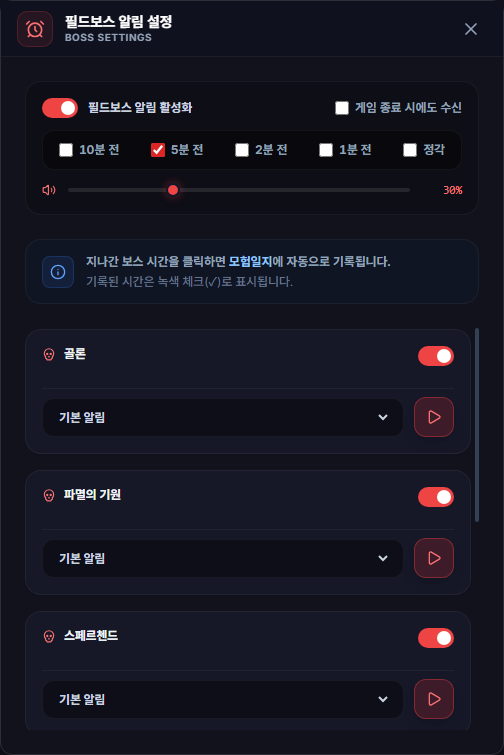

# 필드보스 알림 설정

## 언제 쓰는 기능인가요?

필드보스 출현 시각을 확인하고 원하는 보스만 미리 소리나 Windows 알림으로 안내받을 때 사용합니다.

## 어디에서 켜나요?

사이드바 또는 독 메뉴의 **필드보스 알림 설정**을 엽니다.

## 기본 사용법

1. 필드보스 알림을 켭니다.
2. 출현 몇 분 전에 받을지 알림 시점을 선택합니다.
3. 보스별 사용 여부와 소리를 정합니다.
4. 미리듣기로 음량을 확인합니다.
5. 게임이 꺼진 동안에도 받을 필요가 있다면 백그라운드 알림 옵션을 켭니다.

## 입장 마감 안내

혼란한 대지와 파멸의 기원 카드의 **입장 마감까지 HUD 표시**를 켜면, 등장 후 각각 4분·6분의 입장 가능 시간을 게임 화면 오른쪽 위에 표시합니다. 마지막 1분은 색상으로 강조하고 종료 시각에는 자동으로 숨깁니다.

- 전체 필드보스 알림과 해당 보스의 사용 여부가 모두 켜져 있어야 표시합니다.
- 사전 알림 시점 선택과는 독립적입니다. 정각 소리 알림을 끄더라도 입장 안내를 사용할 수 있습니다.
- 앱을 입장 가능 시간 도중 실행하거나 절전에서 복귀해도 남은 시간만 표시합니다.
- 안내 시간은 등록된 출현 시각과 PC 시각을 기준으로 합니다.
- **파멸의 기원**은 채팅 로그에서 마티아의 전투 시작 대사를 감지하면 이번 회차의 안내를 즉시 숨깁니다. 시작 대사를 놓쳤더라도 대미지 결과가 나오면 숨기며, 대미지 부족으로 보상을 받지 못한 경우도 포함합니다.
- 입구 출현 공지나 일반 퇴장 안내만으로는 숨기지 않습니다. 로그 기록과 감시가 정상 동작해야 하며, 감지하지 못하면 기존 6분 마감 시각까지 표시합니다.
- 자동으로 숨긴 안내는 다음 출현 회차부터 다시 표시합니다. 앱 전체를 종료하고 다시 실행하면 숨김 상태가 초기화되어 남은 안내가 표시될 수 있습니다.
- **혼란한 대지**는 기존처럼 4분 마감 시각까지 표시합니다.
- 보스별 안내 선택은 일반 설정과 함께 저장·동기화됩니다.

## 자주 혼동하는 점

- 전체 알림과 보스별 알림이 모두 켜져 있어야 해당 보스 알림이 울립니다.
- 여러 사전 알림 시점을 고르면 한 출현에 알림이 여러 번 올 수 있습니다.
- 음량 0%는 무음으로 저장되며, 미리듣기도 소리 없이 알림만 표시합니다.
- 사용자 지정 사운드의 로컬 파일 경로는 Google Drive로 동기화되지 않습니다.
- 절전 중 지나간 알림은 복귀 후 소리를 몰아서 재생하지 않고 놓친 알림 이력으로만 남깁니다.

## 문제 해결

- **소리가 안 남:** 전체/보스별 사용 여부, 선택 시점과 마스터 음량을 확인하세요.
- **게임을 끄면 알림이 안 옴:** 백그라운드 알림 옵션과 TW-Overlay 트레이 실행 여부를 확인하세요.
- **시간이 지난 것으로 표시됨:** PC 시각과 시간대가 자동으로 맞춰져 있는지 확인하세요.
