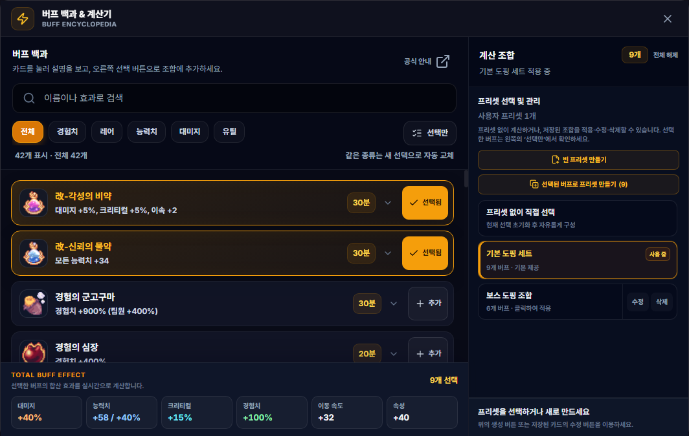
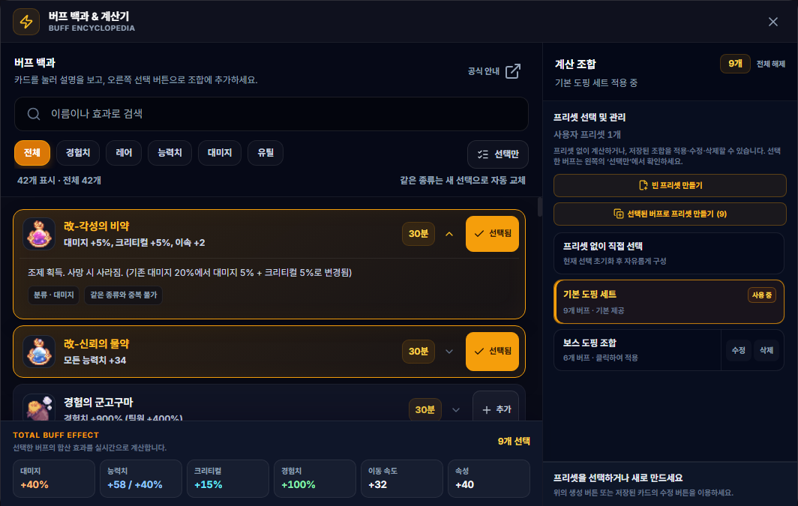
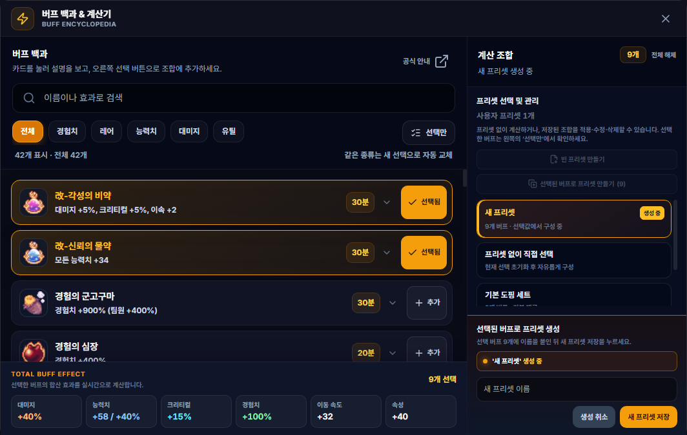
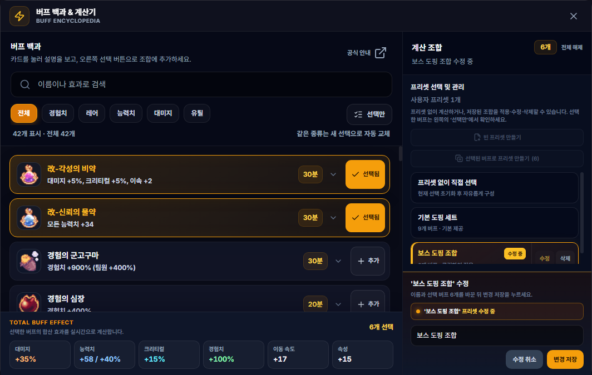

# 버프 백과 & 계산기

## 언제 쓰는 기능인가요?

버프의 효과와 지속 조건을 검색하고, 여러 도핑을 함께 사용할 때의 합계를 비교할 때 사용합니다.

## 어디에서 켜나요?

사이드바 또는 독 메뉴의 **버프 백과 & 계산기**를 엽니다.

## 기본 사용법

1. 왼쪽 버프 백과에서 이름·효과를 검색하거나 분류를 선택합니다.
2. 버프 카드를 누르면 획득처와 중첩 조건을 포함한 상세 설명이 펼쳐집니다.
3. 프리셋이 필요 없다면 오른쪽의 **프리셋 없이 직접 선택** 카드를 누릅니다. 기존 선택이 모두 초기화되며 빈 조합에서 버프를 자유롭게 추가할 수 있습니다.
4. 카드 오른쪽 **추가** 버튼으로 사용할 버프를 계산에 넣습니다. 같은 종류가 이미 선택됐다면 버튼이 **교체**로 표시됩니다.
5. 선택한 버프만 확인하거나 해제하려면 왼쪽 위의 **선택만**을 누릅니다. 왼쪽 하단의 **합산 효과**에서 경험치·대미지·능력치 합계를 확인할 수 있습니다.
6. 오른쪽에서 원하는 프리셋 카드를 누르면 해당 조합이 즉시 적용됩니다. 적용 중인 카드는 테두리와 상태 배지로 구분됩니다.
7. 빈 조합부터 만들려면 **빈 프리셋 만들기**, 현재 선택을 복사하려면 **선택된 버프로 프리셋 만들기**를 누릅니다. 선택 버프가 없으면 두 번째 버튼은 비활성화됩니다.
8. 목록에 `생성 중`으로 강조된 **새 프리셋** 카드가 나타나면 하단에서 이름을 입력하고 **새 프리셋 저장**을 누릅니다.
9. 기존 조합을 바꾸려면 저장된 프리셋 카드의 **수정**을 누릅니다. 선택한 카드는 테두리와 `수정 중` 배지로 표시되며, 변경 후 **변경 저장**을 누르면 됩니다. 필요 없는 프리셋은 같은 카드의 **삭제**로 제거합니다.

## 자주 혼동하는 점

- 같은 중첩 그룹의 버프는 동시에 적용할 수 없습니다. 같은 종류의 다른 카드를 누르면 기존 선택이 자동으로 교체됩니다.
- **기본 도핑 세트**는 시작용 조합입니다. 적용한 뒤에도 버프를 자유롭게 추가·제거할 수 있으며, 바뀐 조합은 `수정됨`으로 표시됩니다.
- **새 프리셋 저장**은 기존 프리셋을 덮어쓰지 않습니다. 기존 프리셋은 반드시 해당 카드의 **수정 → 변경 저장**으로 갱신하세요.
- **수정 취소**를 누르면 수정에 들어가기 전 이름과 버프 조합으로 돌아갑니다.
- **생성 취소**를 누르면 임시 새 프리셋 카드가 사라지고 생성 전 조합으로 돌아갑니다.
- 버프가 많아 현재 선택만 확인하고 싶다면 분류 오른쪽의 **선택만**을 사용하세요.
- 버프의 획득처와 중첩 조건은 목록의 카드를 눌러 확인할 수 있습니다.
- 효과 합계는 사전에 등록된 설명을 기준으로 계산하며 게임 내 예외 조건이 모두 포함되지는 않을 수 있습니다.
- 저장한 프리셋은 대미지 계수 계산기와 시간 측정 기능에서도 사용할 수 있습니다.

## 문제 해결

- **버프가 다른 버프로 바뀜:** 같은 중첩 그룹은 하나만 선택할 수 있으므로 정상 동작입니다.
- **합계가 기대와 다름:** 선택된 카드와 중복·조건부 효과를 확인하세요.
- **프리셋이 안 보임:** 같은 Windows 사용자 계정과 앱 데이터로 실행 중인지 확인하세요.
