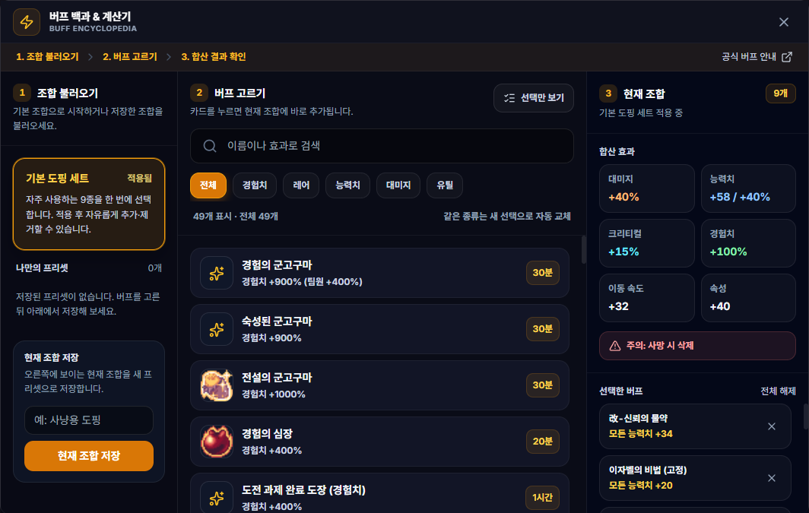

# 버프 백과 & 계산기

## 언제 쓰는 기능인가요?

버프의 효과와 지속 조건을 검색하고, 여러 도핑을 함께 사용할 때의 합계를 비교할 때 사용합니다.

## 어디에서 켜나요?

사이드바 또는 독 메뉴의 **버프 백과 & 계산기**를 엽니다.

## 기본 사용법

1. 이름이나 효과로 버프를 검색하고 분류를 선택합니다.
2. 사용할 버프 카드를 선택합니다.
3. 아래 합계에서 경험치, 대미지와 스탯 효과를 확인합니다.
4. 자주 쓰는 조합은 프리셋으로 저장합니다.

## 자주 혼동하는 점

- 같은 중첩 그룹의 버프는 동시에 적용할 수 없습니다. 같은 종류의 다른 카드를 누르면 기존 선택이 자동으로 교체됩니다.
- **기본 도핑 세트**를 적용한 동안에는 세트 내용을 보호하기 위해 개별 카드를 바꿀 수 없습니다. 세트의 해제 아이콘을 누른 뒤 직접 선택하세요.
- 사망·재접속 시 사라지는 버프가 포함되면 경고를 확인하세요.
- 효과 합계는 사전에 등록된 설명을 기준으로 계산하며 게임 내 예외 조건이 모두 포함되지는 않을 수 있습니다.
- 저장한 프리셋은 대미지 계수 계산기와 시간 측정 기능에서도 사용할 수 있습니다.

## 문제 해결

- **버프가 다른 버프로 바뀜:** 같은 중첩 그룹은 하나만 선택할 수 있으므로 정상 동작입니다.
- **합계가 기대와 다름:** 선택된 카드와 중복·조건부 효과를 확인하세요.
- **프리셋이 안 보임:** 같은 Windows 사용자 계정과 앱 데이터로 실행 중인지 확인하세요.
