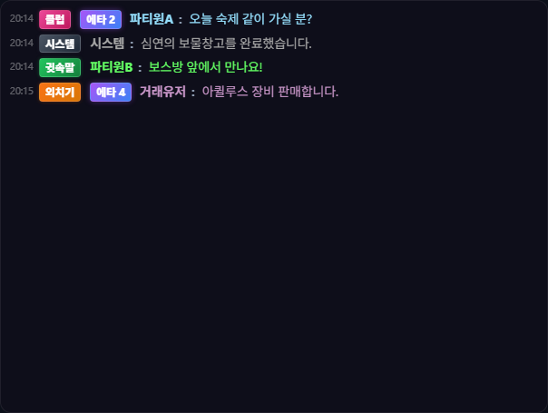
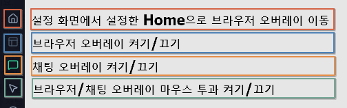

# 채팅 오버레이

## 언제 쓰는 기능인가요?

게임 위에서 원하는 채팅 채널만 큰 글씨와 지정한 색상으로 보거나, 메인·서브 창을 나눠 표시할 때 사용합니다.

## 어디에서 켜나요?

사이드바·독 메뉴의 채팅 오버레이 버튼을 사용하거나 설정의 **채팅 오버레이**에서 메인·서브 창을 켭니다.

## 기본 사용법

1. 각 창에서 통합, 일반, 귓속말, 팀, 클럽, 외치기, 시스템 탭을 선택합니다.
2. 설정에서 글자 크기, 배경 투명도와 채널별 색상을 맞춥니다.
3. 상단에 필요한 기본 탭만 남기려면 **오버레이 상단 기본 탭 표시**에서 탭을 체크합니다.
4. 여러 채널을 하나로 묶은 새 탭이 필요하면 **사용자 정의 탭 관리**에서 이름과 채널을 고른 뒤 **탭 추가**를 누릅니다.
5. 키워드·제외 필터가 필요하면 같은 설정 화면에서 추가합니다.
6. 과거 채팅은 위로 스크롤해 더 불러옵니다.
7. 스크롤하거나 창을 옮길 때는 사이드바·독의 마우스 아이콘 또는 기본 단축키 `Ctrl + Shift + T`로 마우스 투과를 끕니다.
8. 상단 이동 영역을 드래그해 원하는 위치로 옮긴 뒤, 게임을 조작할 때는 마우스 투과를 다시 켭니다.

## 마우스 투과가 적용되는 창

- **적용 대상:** 웹 브라우저 오버레이, 채팅 오버레이 메인, 보조 1, 보조 2
- **적용되지 않는 창:** 사이드바·독, 설정 창과 그 밖의 일반 기능 창
- 사이드바·독의 마우스 아이콘이 **초록색이면 투과가 켜진 상태**입니다. 이때 적용 대상 창의 클릭, 휠 스크롤과 드래그는 게임으로 전달됩니다.
- 마우스 투과가 켜진 동안에는 스크롤바가 숨겨집니다. 과거 채팅을 보려면 투과를 끄고 스크롤하세요.
- **채팅 오버레이 보이기/숨기기**와 **마우스 투과**는 별도 상태입니다. 창을 다시 표시해도 저장된 투과 상태가 유지됩니다.

## 자주 혼동하는 점

- 메인·서브 채팅 창은 각각 선택 탭과 투명도를 가질 수 있습니다.
- **기본 탭 표시**는 기존 탭을 보이거나 숨기는 설정이고, **사용자 정의 탭 관리**는 선택한 채널을 묶은 새 탭을 만드는 기능입니다.
- 기본 탭을 모두 해제하면 오버레이가 빈 상태가 되지 않도록 통합 탭이 유지됩니다.
- 마우스 투과 중에는 스크롤바도 조작할 수 없으므로 숨겨집니다. 스크롤하려면 먼저 마우스 투과를 해제하세요.
- 창 크기와 위치는 저장 즉시 반영됩니다. 설정 창을 오래 열어 둔 채 다른 값을 저장하면 오래된 설정이 덮이지 않도록 현재 크기를 기준으로 보존합니다.
- 설정의 **게임창 따라가기**를 켜면 일반 창모드와 창모드 전체화면에서 사용한 상대 위치를 각각 기억합니다. 화면 모드 전환 중에는 채팅창을 잠시 고정하고 전환이 끝나면 해당 모드의 마지막 위치를 복원합니다. 따라가기를 끄면 화면 모드와 관계없이 현재 화면 위치에 고정합니다.
- 게임이 없거나 최소화된 상태에서 트레이로 연 채팅창은 화면 중앙에 임시 표시되며, 그 상태에서 옮긴 위치는 게임용 위치로 저장되지 않습니다.
- NPC 대사, 경험치·엘소 메시지와 사기 의심 닉네임 강조는 설정에 따라 달라집니다.
- 채팅 원문과 로컬 채팅 DB는 Google Drive로 동기화되지 않습니다.

## 문제 해결

- **새 채팅이 안 보임:** 게임의 채팅 로그 저장과 앱의 로그 경로를 확인하세요.
- **스크롤·클릭·드래그가 안 됨:** 사이드바·독에서 초록색 마우스 아이콘을 누르거나 `Ctrl + Shift + T`로 마우스 투과를 해제하세요.
- **알림 소리는 들리지만 사이드바와 채팅 오버레이가 안 보임:** 알림용 채팅 로그 인식과 게임 창 감지는 별개입니다. 게임이 최소화되어 있지 않은지, 테일즈위버와 TW-Overlay의 관리자 권한이 같은지 확인하세요.
- **설정한 탭이 사라짐:** 새 사용자 정의 탭을 만들려던 경우 **탭 추가**를 먼저 누른 뒤 저장했는지 확인하세요. 기존 탭을 골라 표시하려면 **오버레이 상단 기본 탭 표시**를 사용하세요.
- **특정 메시지만 안 보임:** 선택 채널, 커스텀 탭, 키워드와 제외 필터를 확인하세요.
- **과거 기록이 없음:** 보존 기간이 지났거나 앱이 해당 로그를 아직 읽지 않았을 수 있습니다.
