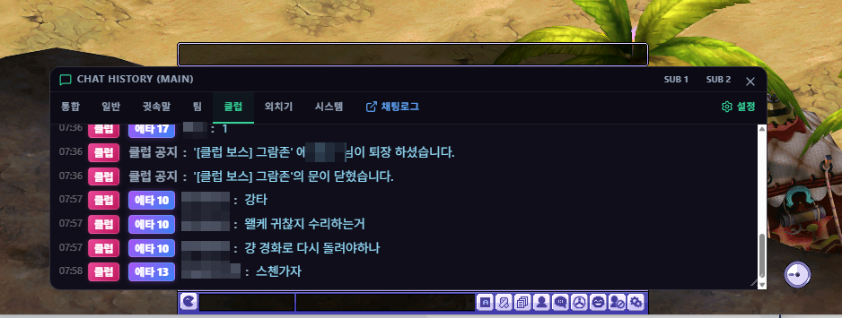

# 채팅 오버레이

## 언제 쓰는 기능인가요?

게임 위에서 원하는 채팅 채널만 큰 글씨와 지정한 색상으로 보거나, 메인·서브 창을 나눠 표시할 때 사용합니다.

## 어디에서 켜나요?

사이드바·독 메뉴의 채팅 오버레이 버튼을 사용하거나 설정의 **채팅 오버레이**에서 메인·서브 창을 켭니다.

## 기본 사용법

1. 각 창에서 전체, 일반, 귓속말, 팀, 클럽, 외치기, 시스템 탭을 선택합니다.
2. 설정에서 글자 크기, 배경 투명도와 채널별 색상을 맞춥니다.
3. 필요하면 커스텀 탭과 키워드·제외 필터를 만듭니다.
4. 과거 채팅은 위로 스크롤해 더 불러옵니다.
5. 게임 조작 중에는 기본 단축키 `Ctrl + Shift + T`로 마우스 투과를 켜거나 끕니다.

## 자주 혼동하는 점

- 메인·서브 채팅 창은 각각 선택 탭과 투명도를 가질 수 있습니다.
- 창 크기와 위치는 저장 즉시 반영됩니다. 설정 창을 오래 열어 둔 채 다른 값을 저장하면 오래된 설정이 덮이지 않도록 현재 크기를 기준으로 보존합니다.
- NPC 대사, 경험치·엘소 메시지와 사기 의심 닉네임 강조는 설정에 따라 달라집니다.
- 채팅 원문과 로컬 채팅 DB는 Google Drive로 동기화되지 않습니다.

## 문제 해결

- **새 채팅이 안 보임:** 게임의 채팅 로그 저장과 앱의 로그 경로를 확인하세요.
- **클릭이나 드래그가 안 됨:** `Ctrl + Shift + T`로 마우스 투과를 해제하세요.
- **특정 메시지만 안 보임:** 선택 채널, 커스텀 탭, 키워드와 제외 필터를 확인하세요.
- **과거 기록이 없음:** 보존 기간이 지났거나 앱이 해당 로그를 아직 읽지 않았을 수 있습니다.
