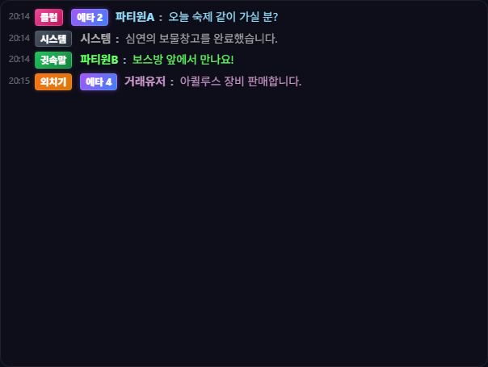
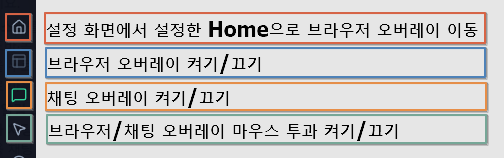

# 채팅 오버레이

검색 중 자정이 지나거나 로그를 다시 연결하면 실행한 검색어로 새 이력을 조회합니다. 검색 입력창에 아직 실행하지 않은 글이 있어도 마지막으로 실행한 검색 조건을 유지합니다.

기존 **창별 글꼴과 크기**에서 **글꼴 파일 추가**로 TTF·OTF·WOFF·WOFF2 파일(20MB 이하)을 불러올 수 있습니다. 메인 예시에 먼저 표시한 뒤 메인·보조 1·보조 2에 각각 선택하고 채팅 설정을 저장합니다. **모두 메인 글꼴로**를 누르면 두 보조 창도 메인의 글꼴을 따릅니다. 창별 글자 크기는 별도로 유지합니다.

파일은 앱의 로컬 저장소에 복사하므로 원본을 이동해도 유지되며 로컬 ZIP 백업에 포함됩니다. 클라우드 설정과 활동 프리셋은 선택 정보만 보관합니다. 다른 PC에 같은 파일이 없거나 읽을 수 없으면 기본 글꼴로 표시하고 설정 화면에서 안내합니다. 같은 파일을 추가하면 다시 사용할 수 있습니다. 집중 채팅의 기존 표시 설정은 유지합니다.

## 언제 쓰는 기능인가요?

게임 위에서 원하는 채팅 채널만 큰 글씨와 지정한 색상으로 보거나, 메인·서브 창을 나눠 표시할 때 사용합니다.

## 어디에서 켜나요?

사이드바·독 메뉴의 채팅 오버레이 버튼을 사용하거나 설정의 **채팅 오버레이**에서 메인·서브 창을 켭니다.

## 기본 사용법

1. 각 창에서 통합, 일반, 귓속말, 팀, 클럽, 외치기, 시스템 탭을 선택합니다.
2. 설정에서 글자 크기, 배경 투명도와 채널별 색상을 맞춥니다.
3. 상단에 필요한 기본 탭만 남기려면 **오버레이 상단 기본 탭 표시**에서 탭을 체크합니다.
4. 여러 채널을 하나로 묶은 새 탭이 필요하면 **사용자 정의 탭 관리**에서 이름과 채널을 고른 뒤 **탭 추가**를 누릅니다.
5. 키워드·제외 필터가 필요하면 같은 설정 화면에서 추가합니다.
6. 과거 채팅은 위로 스크롤해 더 불러옵니다. 필터로 숨긴 기록이 연속되어도 표시할 기록이 나올 때까지 자동으로 더 찾습니다. 처음 연 화면에 스크롤할 만큼 기록이 없으면 화면을 채우거나 오늘 기록의 끝에 도달할 때까지 불러옵니다.
   메인·보조 창에서 같은 탭을 열어도 각 창의 과거 탐색 위치는 독립적으로 유지됩니다.
7. 스크롤하거나 창을 옮길 때는 사이드바·독의 마우스 아이콘 또는 기본 단축키 `Ctrl + Shift + T`로 마우스 투과를 끕니다.
8. 상단 이동 영역을 드래그해 원하는 위치로 옮긴 뒤, 게임을 조작할 때는 마우스 투과를 다시 켭니다.

## 마우스 투과가 적용되는 창

- **적용 대상:** 웹 브라우저 오버레이, 채팅 오버레이 메인, 보조 1, 보조 2
- **적용되지 않는 창:** 사이드바·독, 설정 창과 그 밖의 일반 기능 창
- 사이드바·독의 마우스 아이콘이 **초록색이면 투과가 켜진 상태**입니다. 이때 적용 대상 창의 클릭, 휠 스크롤과 드래그는 게임으로 전달됩니다.
- 마우스 투과가 켜진 동안에는 스크롤바가 숨겨집니다. 과거 채팅을 보려면 투과를 끄고 스크롤하세요.
- **채팅 오버레이 보이기/숨기기**와 **마우스 투과**는 별도 상태입니다. 창을 다시 표시해도 저장된 투과 상태가 유지됩니다.

## 자주 혼동하는 점

- 메인·서브 채팅 창은 각각 선택 탭과 투명도를 가질 수 있습니다.
- **기본 탭 표시**는 기존 탭을 보이거나 숨기는 설정이고, **사용자 정의 탭 관리**는 선택한 채널을 묶은 새 탭을 만드는 기능입니다.
- 기본 탭을 모두 해제하면 오버레이가 빈 상태가 되지 않도록 통합 탭이 유지됩니다.
- 마우스 투과 중에는 스크롤바도 조작할 수 없으므로 숨겨집니다. 스크롤하려면 먼저 마우스 투과를 해제하세요.
- 창 크기와 위치는 저장 즉시 반영됩니다. 설정 창을 오래 열어 둔 채 다른 값을 저장하면 오래된 설정이 덮이지 않도록 현재 크기를 기준으로 보존합니다.
- 설정의 **게임창 따라가기**를 켜면 일반 창모드와 창모드 전체화면에서 사용한 상대 위치를 각각 기억합니다. 화면 모드 전환 중에는 채팅창을 잠시 고정하고 전환이 끝나면 해당 모드의 마지막 위치를 복원합니다. 따라가기를 끄면 화면 모드와 관계없이 현재 화면 위치에 고정합니다.
- 게임이 없거나 최소화된 상태에서 트레이로 연 채팅창은 화면 중앙에 임시 표시되며, 그 상태에서 옮긴 위치는 게임용 위치로 저장되지 않습니다.
- NPC 대사, 경험치·엘소 메시지와 사기 의심 닉네임 강조는 설정에 따라 달라집니다.

**NPC 및 몬스터 대사 표시**를 끄고 저장하면 확인된 NPC 대사를 메인·보조 창에서 숨깁니다. 일반 이력, 검색 결과, 추가 페이지와 새로 수신한 대사에 공통으로 적용됩니다. 이름에 공백이 있다는 이유만으로 NPC로 판단하지 않으므로 `남은 공격 횟수`, 피버 효과, 클리어 횟수 같은 진행 안내는 유지합니다. 확인되지 않은 발신자는 임의로 숨기지 않습니다.

여러 줄로 나뉜 NPC 대사는 동일한 시각·색상과 후속 줄의 들여쓰기 또는 확인된 문장 연결 형태를 사용합니다. 마티아 대사의 마지막 `!`, `돌아가다` 뒤에 나뉜 `니...`도 같은 대사로 처리하며, 뒷줄이 늦게 기록돼도 NPC 숨김을 적용합니다. 다른 안내·숫자·사용자 대화를 추측해 합치지 않습니다. 표시를 다시 켜면 기록을 다시 볼 수 있고 원본 로그는 삭제하지 않습니다.

사용자 탭 이름이 `System`, `General` 등 기본 탭의 이름과 같아도 각 탭의 선택·검색·이전 기록은 독립적으로 유지됩니다. 기존 사용자 탭을 삭제하거나 이름을 바꿀 필요는 없습니다.

NPC 대사를 표시할 때는 `검의 사제, 셀리니아코스 : 집행을 시작하겠소.`처럼 이름과 대사를 보여줍니다. 앞에 `[시스템] 시스템 :`이나 별도 `[NPC]` 표시는 붙이지 않습니다. 시간은 기존 표시 설정을 따르며 시스템 탭·사용자 정의 탭의 채널 및 색상 필터는 그대로 적용됩니다.

- 채팅 원문과 로컬 채팅 DB는 Google Drive로 동기화되지 않습니다.

## 문제 해결

- **새 채팅이 안 보임:** 게임의 채팅 로그 저장과 앱의 로그 경로를 확인하세요.
- **스크롤·클릭·드래그가 안 됨:** 사이드바·독에서 초록색 마우스 아이콘을 누르거나 `Ctrl + Shift + T`로 마우스 투과를 해제하세요.
- **알림 소리는 들리지만 사이드바와 채팅 오버레이가 안 보임:** 알림용 채팅 로그 인식과 게임 창 감지는 별개입니다. 게임이 최소화되어 있지 않은지, 테일즈위버와 TW-Overlay의 관리자 권한이 같은지 확인하세요.
- **설정한 탭이 사라짐:** 새 사용자 정의 탭을 만들려던 경우 **탭 추가**를 먼저 누른 뒤 저장했는지 확인하세요. 기존 탭을 골라 표시하려면 **오버레이 상단 기본 탭 표시**를 사용하세요.
- **특정 메시지만 안 보임:** 선택 채널, 커스텀 탭, 키워드와 제외 필터를 확인하세요.
- **과거 기록이 없음:** 보존 기간이 지났거나 앱이 해당 로그를 아직 읽지 않았을 수 있습니다.

## 창별 글꼴

환경 설정 → 채팅 & 커뮤니티 → 채팅 오버레이에서 메인·보조 1·보조 2의 글꼴과 크기를 따로 정합니다. 보조 창의 **메인과 같게 / 메인 크기 따르기**는 메인 값을 계속 따라갑니다. 기존 설정은 그대로 상속됩니다. 글꼴은 Windows 기본 글꼴 중 선택하며 설치되지 않은 글꼴은 시스템 대체 글꼴로 표시합니다. 아래 채팅 예시가 입력 즉시 바뀌며, 실제 창에는 저장 버튼으로 적용합니다.

메인 글자 크기는 기존과 같은 10~28px 범위입니다. 이전에 선택한 10·11px도 설정 화면을 열고 다른 항목을 저장할 때 그대로 유지됩니다.

## 외치기 종류 필터

무료(From)·유료(Click)·공지 표시를 각각 켜고 끌 수 있습니다. 채팅 오버레이의 통합/사용자 탭, 과거 탐색과 검색에도 적용됩니다. 외치기 히스토리 창에서는 상단 체크박스로 별도 선택할 수 있습니다. 설정을 꺼도 원본 기록은 계속 수집합니다. 종류 정보가 없는 이전 기록은 숨기지 않으며, 공지를 개인 거래 알림으로 보내지 않습니다.

검색 중 필터를 바꾸면 현재 검색어로 결과를 갱신합니다. 외치기 종류뿐 아니라 NPC·경험치·엘소 숨김, 제외 문구, 선택 채널·사용자 탭 색상도 먼저 적용한 뒤 표시할 결과를 최대 500건 찾습니다. 숨긴 메시지가 많아도 그 이전의 표시 가능한 대화를 계속 검색합니다.

## 채팅 간단 표시

**채팅 간단 표시**를 켜면 시간과 에타 배지를 접어 본문 공간을 확보합니다. 기본은 기존 표시이며 메인·보조 1·보조 2·집중 대화방에 공통 적용됩니다. 채널 구분, 사칭 주의와 개인 메모는 유지됩니다. 접힌 시간·에타는 메시지 위에 마우스를 올리면 확인할 수 있습니다(입력 투과 중에는 투과를 먼저 끄세요). 설정 예시에서 확인한 뒤 채팅 설정을 저장합니다. 검색 결과·불러온 이력·읽던 위치를 유지하며 기록 수집에는 영향을 주지 않습니다.

## 에타 배지 색상

채팅 오버레이 설정에서 에타 구간 색상을 켜면 1~20 / 21~40 / 41~60 / 61~80 / 81 이상의 배지를 구분합니다. 각 색상은 직접 바꿀 수 있으며 설정 예시와 집중 대화방에도 같은 색상이 적용됩니다. 기본은 기존 배지 모습입니다.

## 닉네임 개인 메모

채팅 오버레이나 집중 대화방의 닉네임을 우클릭해 최대 200자의 메모를 저장합니다. 닉네임 옆에 짧게 표시되며 마우스를 올리면 전체 내용을 읽을 수 있습니다. 설정의 채팅 오버레이 화면에서도 목록을 관리합니다. 하이아칸과 네냐플은 별도로 저장하며 로컬 ZIP 백업에 포함됩니다.

Escape는 메모 편집창만 닫습니다. 저장 응답을 기다리는 동안 다른 메모를 열거나 내용을 추가로 입력해도 새 편집은 유지됩니다. 저장을 누른 뒤 추가로 입력한 내용은 다시 저장해야 반영됩니다.

메모 저장·삭제나 다른 창에서의 메모 변경은 현재 불러온 채팅과 읽던 행의 위치를 유지하며 배지만 갱신합니다. 검색어·강조·결과와 과거 추가 조회도 유지됩니다. 채팅 색상·에타 배지 색상 및 서버별 메모 표시를 바꿀 때도 같은 원칙을 따릅니다. 맨 아래를 보던 창은 새 메시지를 계속 따라갑니다.

집중 대화방도 메모·에타 색상 변경 시 표시된 대화와 읽던 위치를 유지합니다. 표시 대상이 아닌 채팅이 많이 쌓인 뒤에도 설정 변경이 대화 목록을 지우지 않습니다.

우클릭 또는 메모 배지 클릭으로 **닉네임 정보·메모**를 엽니다. 닉네임 클릭은 복사를 유지합니다. 앱이 이미 받은 에타 자료에서 같은 서버·닉네임의 에타와 캐릭터 종류를 함께 표시하며, 자료의 기준일과 오래된 자료 여부를 안내합니다. 정보가 없거나 조회에 실패해도 메모는 저장할 수 있습니다. 캐릭터 코드 해석은 `tw-overlay-data/scraper.js`의 수집 인코딩을 따릅니다.

설정의 **간단 표시**를 켜면 채팅 행에는 본문 대신 ‘메모’를 표시합니다. 전체 메모는 툴팁이나 배지를 눌러 확인합니다. 기본값은 기존의 짧은 본문 표시이며 메인·보조·집중 채팅에 공통 적용됩니다. 표시를 바꿔도 검색·불러온 이력·읽던 위치를 유지합니다.
