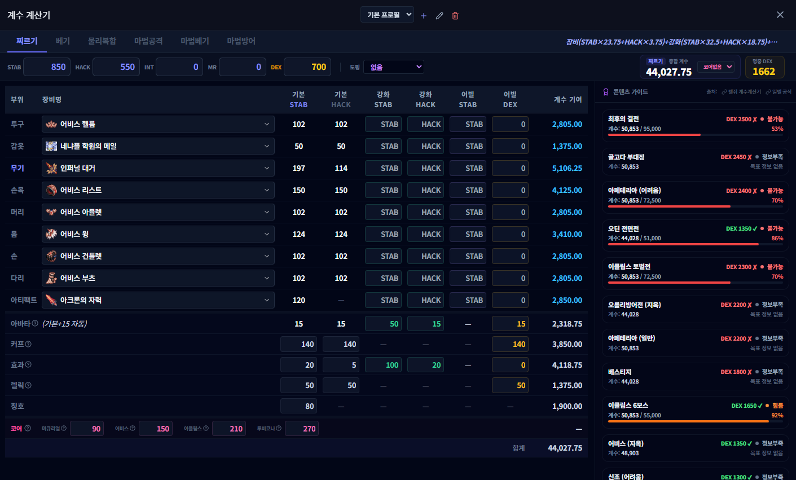

# 대미지 계수 계산기

## 언제 쓰는 기능인가요?

캐릭터 스탯, 장비와 버프를 입력해 공격 계수와 콘텐츠별 명중 기준을 비교할 때 사용합니다.

## 어디에서 켜나요?

사이드바 또는 독 메뉴의 **대미지 계수 계산기**를 엽니다. 장비 사전의 **계수 계산기 입력**에서도 선택한 장비를 전달할 수 있습니다.

## 기본 사용법

1. 찌르기, 베기, 물리복합, 마법 등 공격 계열을 선택합니다.
2. 캐릭터 기본 스탯과 추가 보너스를 입력합니다.
3. 장비 부위별 아이템, 강화 수치와 옵션을 선택합니다.
4. 사용할 버프 프리셋을 적용합니다.
5. 계산된 계수와 콘텐츠별 명중 기준 표시를 확인합니다.
6. 여러 캐릭터나 세팅은 프로필로 나눠 저장합니다.

## 자주 혼동하는 점

- 계산값은 입력한 데이터 기준입니다. 게임 패치나 잘못된 장비·버프 선택은 자동으로 보정되지 않습니다.
- 명중 기준은 콘텐츠 비교용 참고값이며 실제 전투의 모든 조건을 포함하지 않을 수 있습니다.
- 시간 측정 기록은 측정 시작 시점의 선택 프로필과 스탯을 함께 저장합니다.
- 프로필은 현재 PC에 저장됩니다.

## 문제 해결

- **장비가 검색되지 않음:** 이름 일부로 다시 검색하거나 장비 사전에서 계산기로 보내세요.
- **계수가 크게 다름:** 공격 계열, 주·부스탯, 코어와 중복 버프를 확인하세요.
- **프로필을 바꿨는데 기록이 다름:** 시간 측정 기록은 현재가 아니라 측정 당시 스탯을 사용합니다.
