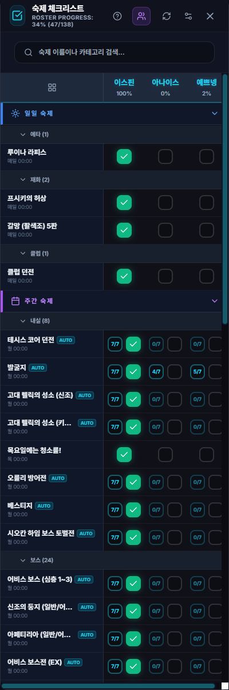

# 숙제 체크리스트

## 언제 쓰는 기능인가요?

여러 캐릭터의 일일·주간 콘텐츠 완료 횟수를 한곳에서 관리하고, 지원 콘텐츠의 완료 로그를 자동 반영할 때 사용합니다.

## 어디에서 켜나요?

사이드바·독 메뉴의 **숙제 체크리스트**를 엽니다. 설정에서 게임 시작 시 자동 열기를 선택할 수도 있습니다.

## 기본 사용법

1. 캐릭터를 등록하고 현재 확인할 캐릭터를 선택합니다.
2. 숙제 카드를 좌클릭하면 횟수가 늘고, 우클릭하면 줄어듭니다.
3. 체크박스로 즉시 완료 또는 완료 해제를 할 수 있습니다.
4. 하지 않는 숙제는 N/A로 바꿔 완료율 계산에서 제외합니다.
5. 관리 모드에서 숙제 추가·수정·숨김, 최대 횟수와 순서를 바꿉니다.
6. 여러 캐릭터를 한 번에 보려면 바둑판 보기를 사용합니다.

지원 콘텐츠의 완료 채팅이 감지되면 자동으로 횟수가 올라갑니다. 적용할 캐릭터가 여러 명이면 선택 팝업이 뜨며, 이미 완료했거나 제외한 캐릭터를 빼고 후보가 한 명일 때만 자동으로 그 캐릭터에 적용합니다.

## 자주 혼동하는 점

- 일일 숙제는 매일, 주간 숙제는 정해진 주간 초기화 시각에 새 주기로 바뀝니다.
- 검색 중에는 드래그 정렬을 사용할 수 없습니다.
- 최대 횟수를 줄이면 기존 횟수도 새 최대값을 넘지 않게 조정됩니다.
- Google 동기화를 연결하면 캐릭터, 숙제 정의, 완료 상태와 캐릭터 선택 대기도 다른 PC와 합쳐집니다.

## 문제 해결

- **자동 완료가 반영되지 않음:** 게임 채팅 로그 저장과 앱의 채팅 로그 경로를 확인하세요.
- **캐릭터 선택 팝업이 반복됨:** 해당 숙제를 이미 완료·제외한 캐릭터와 미완료 후보가 맞는지 확인하세요.
- **원하지 않는 숙제가 보임:** 관리 모드에서 숨기거나 삭제하세요. 기본 숙제는 삭제 대신 숨김만 가능한 항목이 있습니다.
- **다른 PC와 값이 다름:** 체크리스트의 동기화 상태 아이콘을 확인하고 설정의 데이터 관리에서 오류 내용을 확인하세요.
