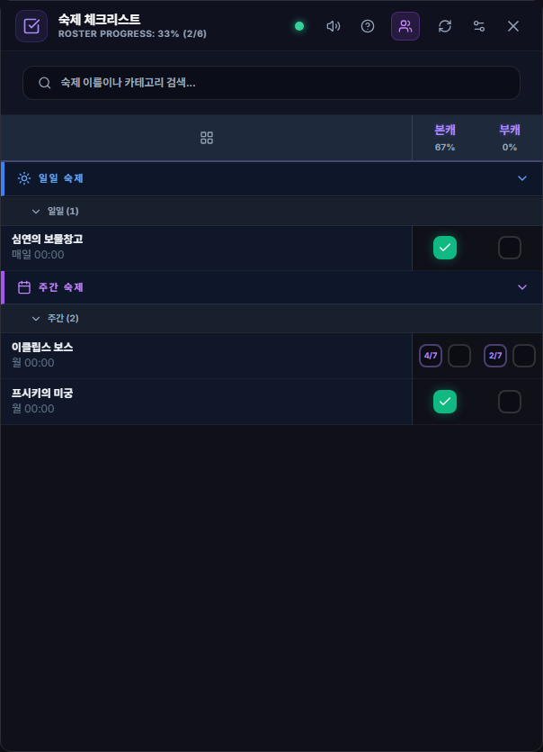
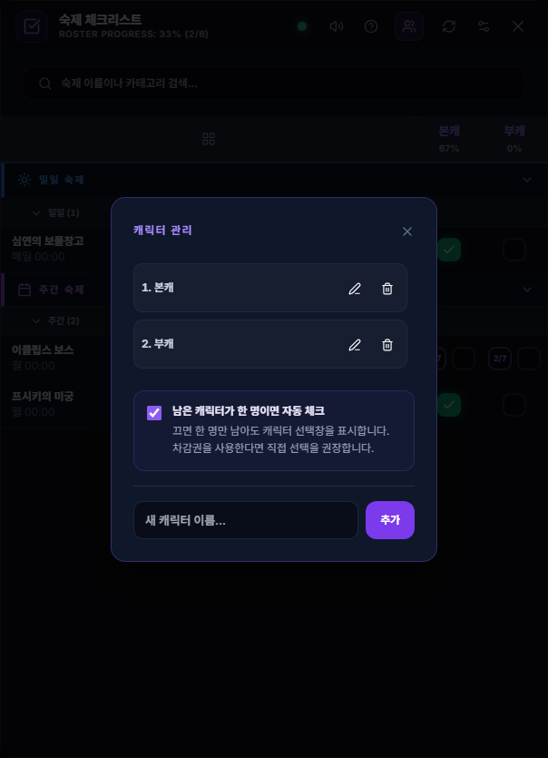
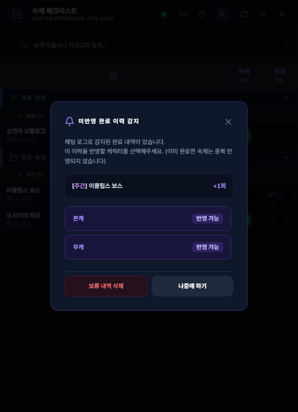

# 숙제 체크리스트

## 언제 쓰는 기능인가요?

여러 캐릭터의 일일·주간 콘텐츠 완료 횟수를 한곳에서 관리하고, 지원 콘텐츠의 완료 로그를 자동 반영할 때 사용합니다.

## 어디에서 켜나요?

사이드바·독 메뉴의 **숙제 체크리스트**를 엽니다. 설정에서 게임 시작 시 자동 열기를 선택할 수도 있습니다.

## 기본 사용법

1. 캐릭터를 등록하고 현재 확인할 캐릭터를 선택합니다.
2. 숙제 카드를 좌클릭하면 횟수가 늘고, 우클릭하면 줄어듭니다.
3. 체크박스로 즉시 완료 또는 완료 해제를 할 수 있습니다.
4. 하지 않는 숙제는 N/A로 바꿔 완료율 계산에서 제외합니다.
5. 관리 모드에서 숙제 추가·수정·숨김, 최대 횟수와 순서를 바꿉니다.
6. 여러 캐릭터를 한 번에 보려면 바둑판 보기를 사용합니다.

지원 콘텐츠의 완료 채팅이 감지되면 자동으로 횟수가 올라갑니다. 적용할 캐릭터가 여러 명이면 선택 팝업이 뜹니다. 캐릭터 관리의 **남은 캐릭터가 한 명이면 자동 체크**를 끄면, 미완료 후보가 한 명뿐이어도 직접 캐릭터를 선택합니다. 차감권처럼 앱이 사용 여부를 알 수 없는 아이템을 쓴다면 이 옵션을 끄는 것을 권장합니다.

**설계자의 채굴장**은 `숨겨진 구역으로 이동할 수 있는 포탈이 맵 중앙에 생성되었습니다.` 시스템 안내가 나오면 일일 숙제 1회로 감지합니다. 입장 직후나 조각 획득마다 완료 처리하지 않으며, 숨겨진 구역의 마지막 보상까지 기다릴 필요도 없습니다. 채굴장·발굴지의 하급 조합 조각 획득은 숙제 횟수에 영향을 주지 않습니다. 과거 로그 재분석도 같은 기준을 사용합니다. 이전 버전에서 잘못 완료된 캐릭터 상태는 체크리스트에서 직접 해제할 수 있습니다.

과거 로그 동기화에서 복원한 숙제는 예외입니다. 저장된 채팅 로그만으로는 실제 수행 캐릭터를 판별할 수 없으므로 현재 일일·주간 주기에 해당하는 완료 횟수를 모두 **메인 캐릭터**에 반영합니다. 지난주·지지난주처럼 이미 끝난 주기의 완료 기록도 실제 수행 날짜의 모험일지에 메인 캐릭터 숙제로 복원합니다. 이 동작은 현재 선택한 캐릭터나 캐릭터 목록 순서에 따라 바뀌지 않습니다.

## 자주 혼동하는 점

숙제창의 가시성 설정(관리 모드)에서 **조작하지 않을 때 자동 접기**를 켤 수 있습니다. 기본은 꺼짐입니다. 창 밖으로 마우스를 옮기고 15초 동안 조작하지 않으면 제목줄만 남으며, 제목에 마우스를 올리거나 펼치기 버튼을 누르면 기존 목록으로 돌아옵니다. 접힌 창의 버튼 위에서는 클릭할 버튼을 유지하므로 펼치기를 눌러도 관리 모드가 열리지 않으며, 닫기는 그대로 창을 닫습니다. 저장한 옵션은 창을 다시 열어도 유지되고 다른 창에서 변경한 설정도 반영합니다. 캐릭터 선택·관리·입력·설정 저장 중에는 접지 않습니다. 접힌 동안 새 캐릭터 선택이 필요해지면 다시 펼칩니다. 검색 내용과 목록 스크롤은 유지하며 프리셋과 창 크기에는 펼친 높이를 저장합니다.

오늘의 요약에는 최근 자동 감지된 숙제를 `설계자의 채굴장 1/1`처럼 제목과 횟수/총횟수 한 줄로 표시합니다. 접힌 요약에서도 보이며, 감지된 숙제가 없으면 줄을 숨깁니다. 캐릭터 선택 전에는 보류 횟수를, 반영 후에는 해당 캐릭터에 적용된 횟수를 보여줍니다. 새 감지로 교체되고 날짜나 숙제 초기화 시각이 지나면 사라집니다. 수동 체크와 과거 로그 복원은 이 줄을 새 감지로 갱신하지 않으며, 앱을 다시 켜면 새 감지부터 표시합니다.

- 일일 숙제는 매일, 주간 숙제는 정해진 주간 초기화 시각에 새 주기로 바뀝니다.
- 검색 중에는 드래그 정렬을 사용할 수 없습니다.
- 최대 횟수를 줄이면 기존 횟수도 새 최대값을 넘지 않게 조정됩니다.
- 최대 횟수를 늘려 현재 횟수가 부족해지면 완료가 해제되고, 줄인 최대값에 도달하면 완료로 바뀝니다. N/A 항목은 완료 처리하지 않습니다.
- 초기화 요일·시각과 최대 횟수를 함께 바꾸면 새 초기화 규칙을 먼저 적용합니다. 지난 주기의 진행도는 0회로 초기화하고, 현재 주기에 유효한 횟수만 최대값에 맞춥니다. 주기 초기화로 과거 완료 일지를 지우거나 오늘 완료 기록을 만들지 않습니다.
- 숙제 숨김·추가·삭제와 캐릭터 추가는 오늘 모험 일지의 완료 수·전체 수에도 즉시 반영됩니다.
- 이전 날짜에 완료한 주간 숙제를 해제하거나 N/A로 바꾸면 원래 완료 날짜의 일지 기록도 취소됩니다.
- 완료된 숙제에서 `+`를 다시 누르거나 같은 횟수의 보류 내역을 적용해도 완료 날짜는 바뀌지 않습니다. 이후 완료를 해제하면 처음 완료한 날짜의 일지 기록이 취소됩니다.
- 단일 후보 자동 체크 옵션은 기존 사용자 동작을 보존하기 위해 기본으로 켜져 있습니다.
- Google 동기화를 연결하면 캐릭터, 숙제 정의, 완료 상태와 캐릭터 선택 대기도 다른 PC와 합쳐집니다.

## 문제 해결

- **자동 완료가 반영되지 않음:** 게임 채팅 로그 저장과 앱의 채팅 로그 경로를 확인하세요.
- **캐릭터 선택 팝업이 반복됨:** 해당 숙제를 이미 완료·제외한 캐릭터와 미완료 후보가 맞는지 확인하세요.
- **원하지 않는 숙제가 보임:** 관리 모드에서 숨기거나 삭제하세요. 기본 숙제는 삭제 대신 숨김만 가능한 항목이 있습니다.
- **다른 PC와 값이 다름:** 체크리스트의 동기화 상태 아이콘을 확인하고 설정의 데이터 관리에서 오류 내용을 확인하세요.
