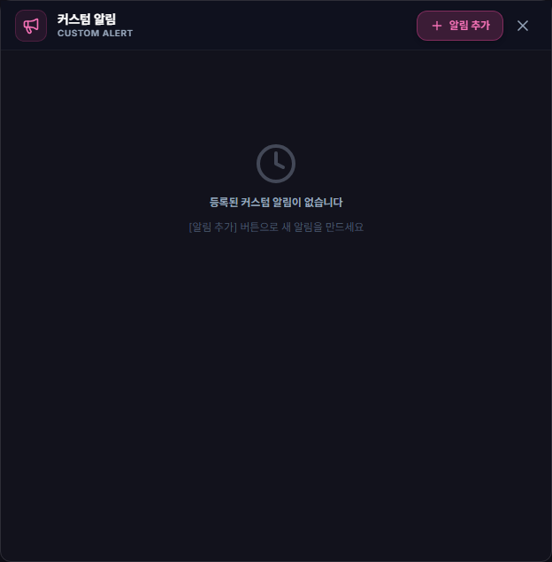

# 커스텀 알림

## 언제 쓰는 기능인가요?

매일 특정 시각 또는 매시간 특정 분에 반복되는 개인 알림을 만들 때 사용합니다.

## 어디에서 켜나요?

사이드바 또는 독 메뉴의 **커스텀 알림**을 엽니다.

## 기본 사용법

1. 매일 특정 시각 또는 매시 특정 분 방식을 선택합니다.
2. 기준 시각과 정각·사전 알림 시점을 정합니다.
3. 표시할 문구와 소리를 선택합니다.
4. 저장한 뒤 목록에서 사용 여부를 켭니다.
5. 필요하면 기존 알림을 수정하거나 삭제합니다.

## 자주 혼동하는 점

- 사전 알림을 여러 개 고르면 한 기준 시각에 여러 번 알릴 수 있습니다.
- 저장 즉시 백그라운드 알림 일정에 반영됩니다.
- 절전 중 지나간 알림은 복귀 후 소리를 몰아서 재생하지 않고 이력으로만 남깁니다.
- 내장 사운드 설정은 동기화할 수 있지만 사용자 파일의 절대 경로는 Google Drive로 올리지 않습니다.

## 문제 해결

- **알림이 안 옴:** 해당 항목이 켜져 있는지, 시각·분과 사전 알림 선택을 확인하세요.
- **같은 알림이 여러 번 옴:** 여러 사전 시점을 선택했는지 확인하세요.
- **소리가 안 남:** 미리듣기, 항목별 소리와 전체 음량을 확인하세요.
