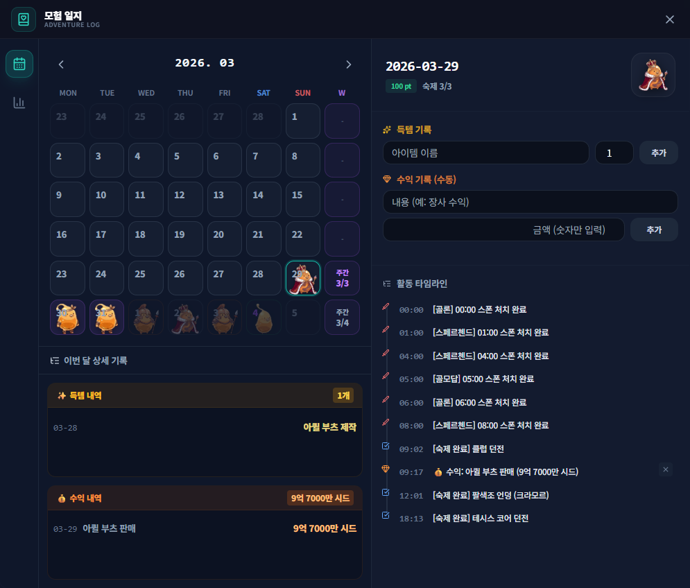
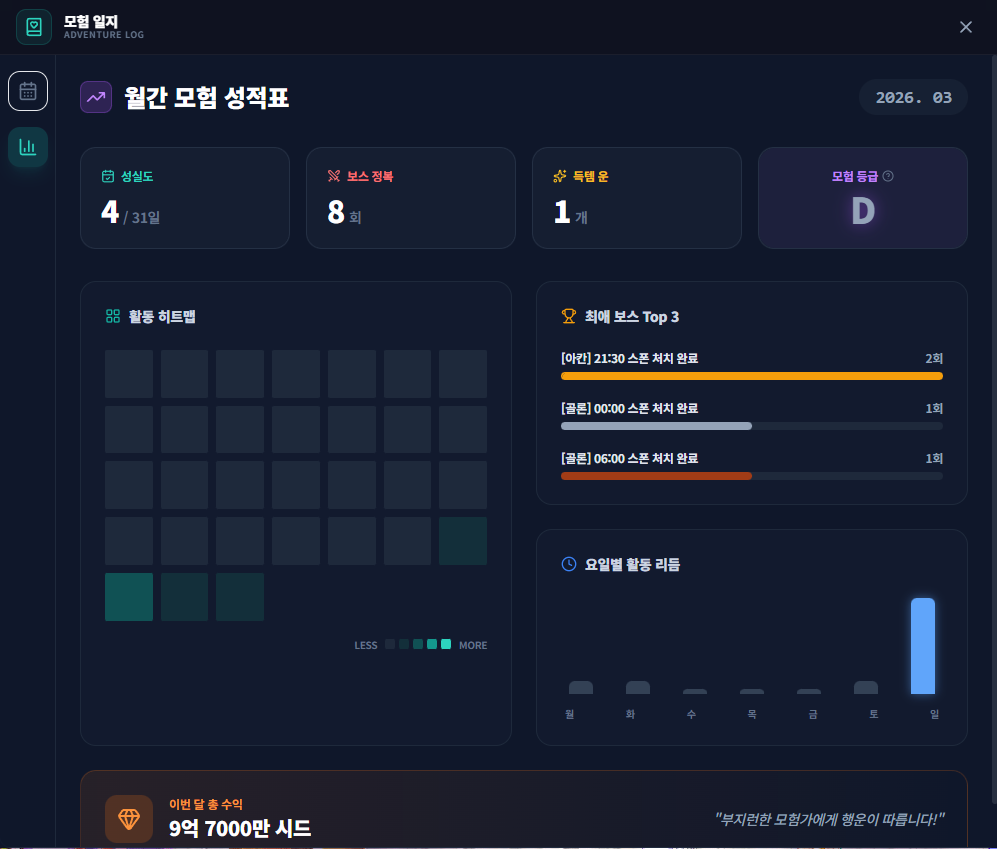

# 모험 일지

## 언제 쓰는 기능인가요?

날짜별 숙제, 득템, 수익과 게임 활동을 모아 보고 월간 통계와 기록을 확인할 때 사용합니다.

## 어디에서 켜나요?

사이드바 또는 독 메뉴의 **모험 일지**를 엽니다.

## 기본 사용법

1. 달력에서 날짜를 선택해 그날의 기록을 봅니다.
2. 자동으로 감지된 득템·숙제·SEED 기록과 직접 추가한 기록을 함께 확인합니다.
3. 필요한 수익이나 메모는 수동으로 추가합니다.
4. 통계 화면에서 월간 합계와 활동 분포를 확인합니다.
5. 삭제 버튼이 있는 수동 원본 기록만 개별 삭제할 수 있습니다.

## 자주 혼동하는 점

- 같은 아이템의 여러 기록은 화면에서 합쳐 보일 수 있지만 원본 기록은 로컬 DB에 따로 남습니다.
- 자동·과거 기록에는 잘못된 묶음 삭제를 막기 위해 삭제 버튼이 없을 수 있습니다.
- 마정석은 교환 전 보유만으로 수익 처리하지 않습니다. 금화 주머니 환산 또는 사용자가 확정한 계산 결과를 기록합니다.
- 모험 일지 DB는 Google Drive 설정·숙제 동기화 대상이 아닙니다.

## 문제 해결

- **오늘 기록이 안 보임:** 달력의 선택 날짜와 PC 날짜를 확인하세요.
- **자동 기록이 누락됨:** 게임 채팅 로그와 앱의 로그 경로를 확인하세요.
- **합계가 예상과 다름:** 묶인 항목을 펼쳐 원본 시각과 수량을 확인하세요.
- **다른 PC에 일지가 없음:** 일지는 로컬 데이터이므로 로컬 백업·복원을 사용하세요.
