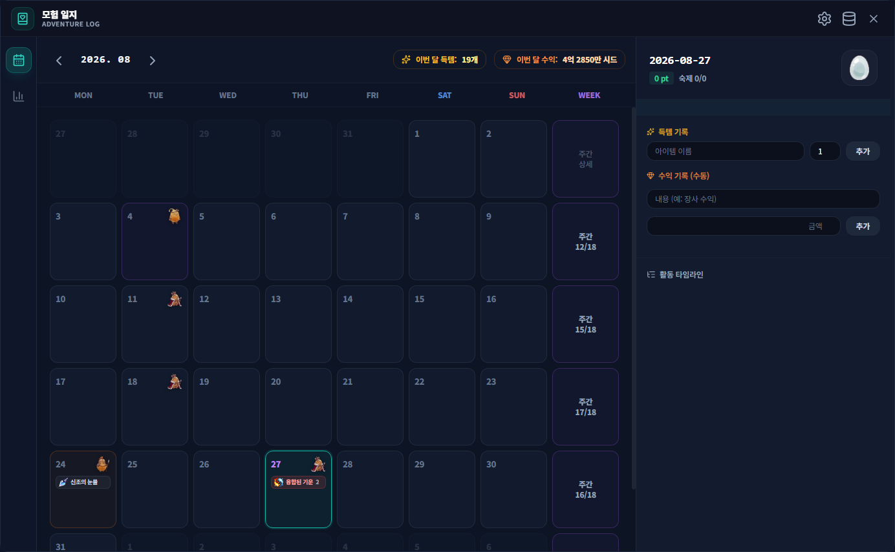
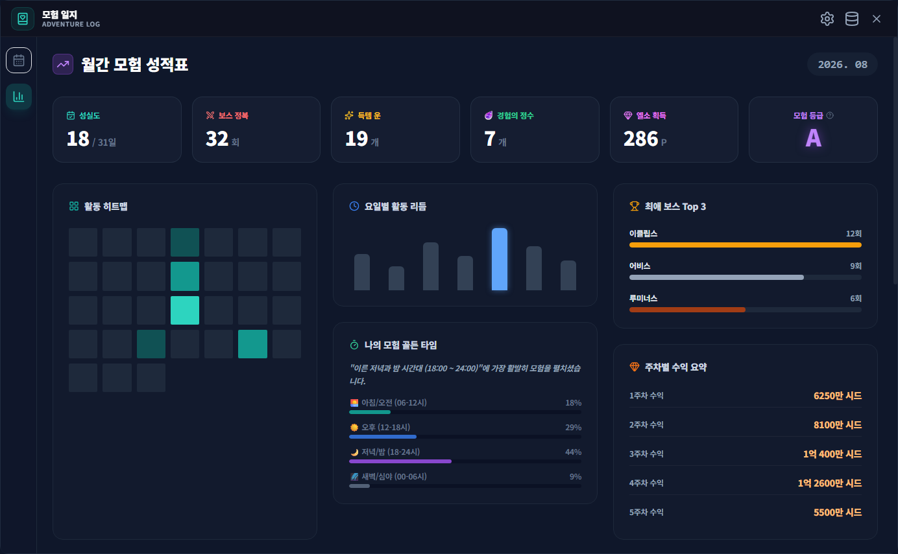

# 모험 일지

## 언제 쓰는 기능인가요?

날짜별 숙제, 득템, 수익과 게임 활동을 모아 보고 월간 통계와 기록을 확인할 때 사용합니다.

## 어디에서 켜나요?

사이드바 또는 독 메뉴의 **모험 일지**를 엽니다.

## 기본 사용법

1. 달력에서 날짜를 선택해 그날의 기록을 봅니다.
2. 자동으로 감지된 득템·숙제·SEED 기록과 직접 추가한 기록을 함께 확인합니다.
3. 필요한 수익이나 메모는 수동으로 추가합니다.
4. 주간·월간 득템 화면의 **품목별 합계**에서 같은 아이템의 총 획득 수량을 먼저 확인합니다.
5. 품목별 합계와 날짜별 기록 사이의 구분선을 위아래로 드래그해 두 영역의 높이를 조절합니다. 조절한 높이는 다음 실행에도 유지됩니다.
6. 통계 화면에서 월간 합계와 활동 분포를 확인합니다.
7. 삭제 버튼이 있는 수동 원본 기록만 개별 삭제할 수 있습니다.

## 자주 혼동하는 점

- 같은 아이템의 여러 기록은 화면에서 합쳐 보일 수 있지만 원본 기록은 로컬 DB에 따로 남습니다.
- **품목별 합계**는 선택한 주간·월간 범위의 아이템을 이름별로 합산한 요약이며, 아래의 날짜별 기록을 삭제하거나 합치는 기능이 아닙니다.
- 자동·과거 기록에는 잘못된 묶음 삭제를 막기 위해 삭제 버튼이 없을 수 있습니다.
- 과거 주차의 주간 숙제는 로그에서 확인된 완료 수를 현재 체크리스트의 주간 숙제 전체 수와 비교해 `완료/전체`로 표시합니다.
- 월간 통계의 **성실도**는 활동 기록이 있는 날짜 수를 선택한 월의 실제 일수와 비교합니다. 2월은 윤년에 따라 28일 또는 29일로 표시됩니다.
- 마정석은 교환 전 보유만으로 수익 처리하지 않습니다. 금화 주머니 환산 또는 사용자가 확정한 계산 결과를 기록합니다.
- 자동 수익 묶음과 펼친 원본 금액은 일간·주간·월간 총수익과 같은 저장 금액을 사용합니다. 금화 주머니 환산액도 각 목록에서 확인할 수 있습니다.
- 일간·주간 타임라인은 숙제와 게임 활동을 실제 시각의 초 단위 순서로 정렬하고, 화면에는 시·분을 표시합니다.
- 모험 일지 DB는 Google Drive 설정·숙제 동기화 대상이 아닙니다.

## 기간별 기록 내보내기

창 오른쪽 위 **기간별 기록 내보내기** 버튼에서 시작일·종료일을 정하고 **기록 확인 → 파일로 저장**을 누릅니다. 최대 366일의 숙제·득템·수익을 브라우저에서 읽는 HTML 파일로 저장합니다. 저장 전에 표시한 건수와 총수익의 스냅샷을 사용하므로 확인 후 들어온 기록도 포함하려면 다시 **기록 확인**을 누르세요.

득템은 현재 일지의 표시 기준을 따르며 수익은 저장된 확정 금액을 사용합니다. 금화 주머니 환산 금액은 이미 수익에 포함되어 있어 다시 더하지 않습니다. 채팅 원문·개인 메모·계정 연동 정보는 포함하지 않으며, 원본 기록은 유지됩니다. 빈 기간도 0건으로 저장할 수 있고 기록이 10만 건을 넘으면 기간을 나누어야 합니다. 이 파일은 읽기용이며 앱 복원에는 기존 ZIP 백업을 사용합니다.

## 문제 해결

- **오늘 기록이 안 보임:** 달력의 선택 날짜와 PC 날짜를 확인하세요.
- **자동 기록이 누락됨:** 게임 채팅 로그와 앱의 로그 경로를 확인하세요.
- **합계가 예상과 다름:** 묶인 항목을 펼쳐 원본 시각과 수량을 확인하세요.
- **다른 PC에 일지가 없음:** 일지는 로컬 데이터이므로 로컬 백업·복원을 사용하세요.
