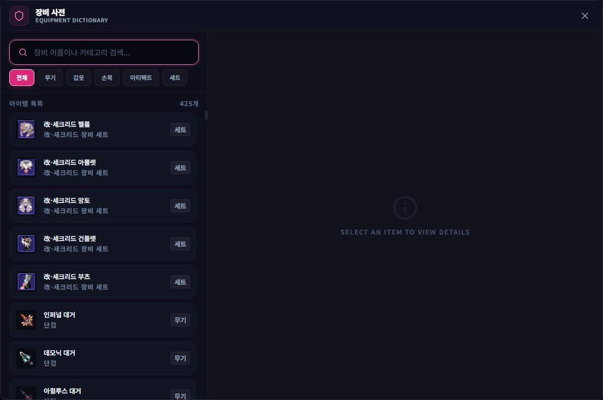
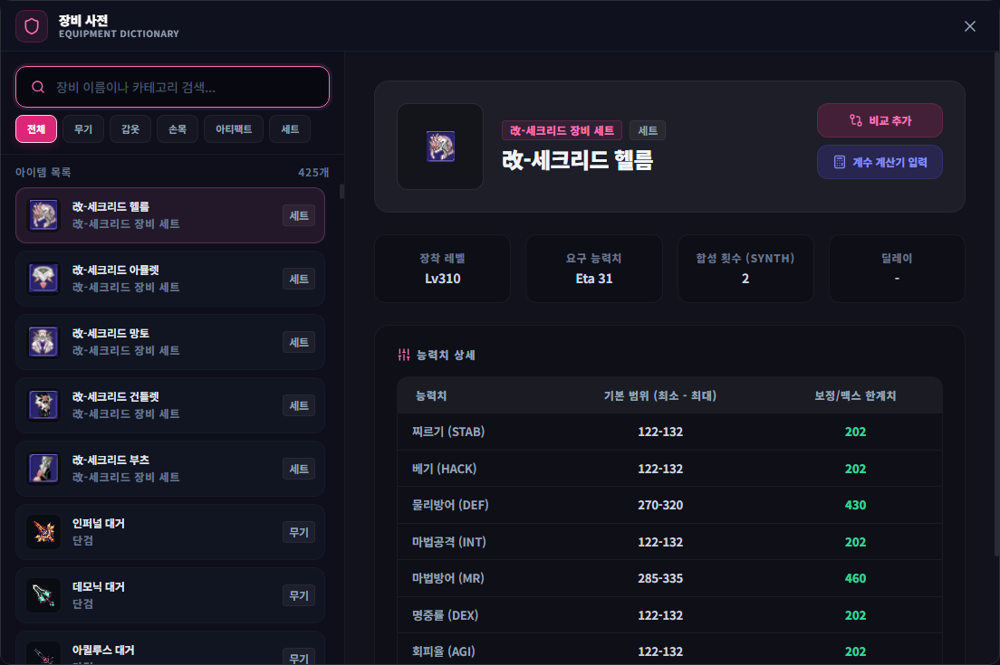

# 장비 & 옵션 사전

## 언제 쓰는 기능인가요?

장비 이름, 부위, 옵션과 진화 정보를 검색하거나 여러 장비를 나란히 비교할 때 사용합니다.

## 어디에서 켜나요?

사이드바 또는 독 메뉴의 **장비 & 옵션 사전**을 엽니다.

## 기본 사용법

1. 이름이나 초성으로 장비를 검색하고 분류를 선택합니다.
2. 장비를 눌러 능력치, 옵션과 관련 정보를 확인합니다.
3. 비교할 장비를 추가해 표에서 차이를 봅니다.
4. 필요하면 **계수 계산기 입력** 또는 **진화 비용 계산**으로 선택 정보를 보냅니다.

## 자주 혼동하는 점

- 사전은 앱에 포함된 데이터 기준이며 게임 서버의 보유 장비를 직접 읽지 않습니다.
- 검색 결과가 없으면 띄어쓰기나 강화 단계 표기를 빼고 이름 일부로 검색하세요.
- 계산기로 보낸 값은 계산기 입력을 돕는 기능이며 실제 장비를 변경하지 않습니다.

## 문제 해결

- **장비가 없음:** 앱을 최신 버전으로 갱신하고 다른 이름·초성으로 검색하세요.
- **비교표가 복잡함:** 비교 항목을 줄인 뒤 다시 추가하세요.
- **계산기에 반영되지 않음:** 계산기 창을 닫고 장비 사전에서 다시 보내 보세요.
