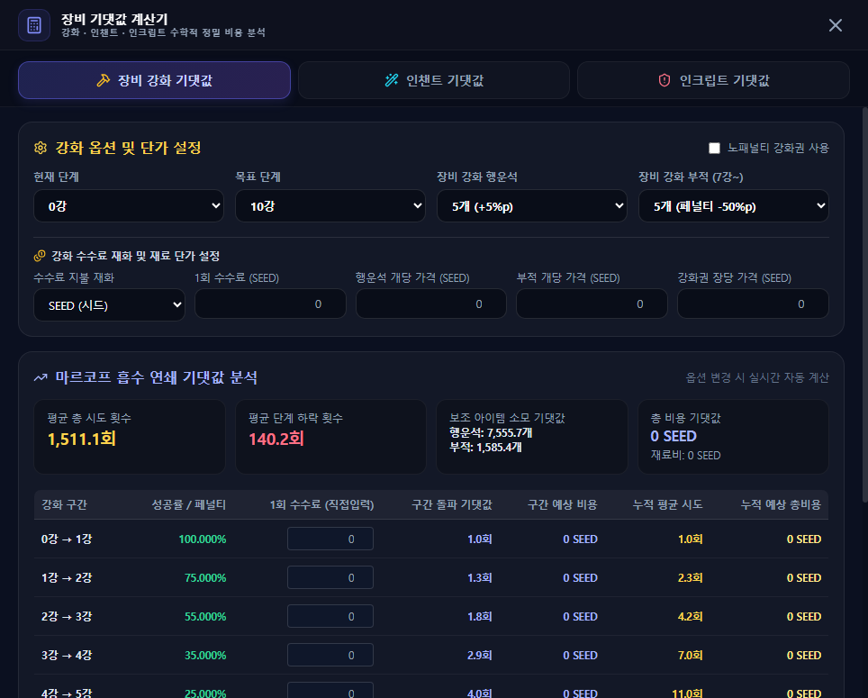

# 장비 강화 · 인챈트 · 인크립트 기댓값

## 언제 쓰는 기능인가요?

장비 강화, 인챈트 또는 인크립트를 시도하기 전에 평균 시도 횟수와 예상 비용을 비교할 때 사용합니다.

## 어디에서 켜나요?

사이드바 또는 독 메뉴의 **장비 강화·인챈트**를 엽니다.

## 기본 사용법

1. 위쪽에서 **장비 강화**, **인챈트**, **인크립트** 중 하나를 선택합니다.
2. 현재 상태, 목표와 사용할 보조 재료를 실제 계획에 맞게 고릅니다.
3. 수수료 재화와 재료의 현재 가격을 입력합니다.
4. 오른쪽 결과에서 평균 시도 횟수, 재료 수량과 예상 비용을 확인합니다.

## 자주 혼동하는 점

- 표시값은 확률에 따른 평균이므로 실제 소모량을 보장하지 않습니다.
- 시드와 엘소는 서로 다른 재화입니다. 수수료 재화를 잘못 선택하지 않았는지 확인하세요.
- 노패널티 강화권과 장비 파괴 보호 주문서는 선택 여부에 따라 결과가 크게 달라집니다.
- 재료 가격을 0으로 두면 해당 재료 비용은 총액에 포함되지 않습니다.

## 문제 해결

- **총비용이 0이거나 너무 낮음:** 수수료와 재료 단가 입력을 확인하세요.
- **원하는 옵션이 보이지 않음:** 현재 선택한 탭과 단계에서만 필요한 옵션이 표시됩니다.
- **게임 결과와 정확히 같지 않음:** 기댓값은 장기 평균이며 개별 시도는 크게 달라질 수 있습니다.
