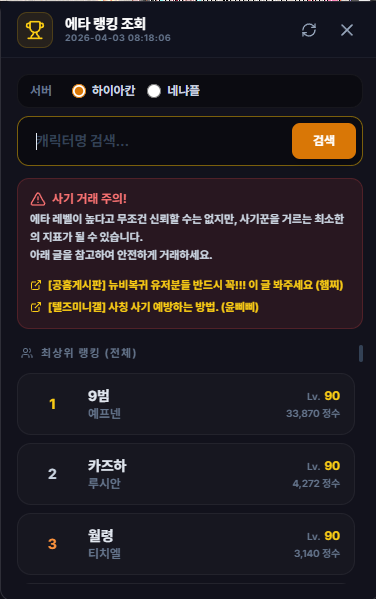

# 에타 랭킹 조회

## 언제 쓰는 기능인가요?

서버별 에타 랭킹을 보고 특정 캐릭터를 이름으로 찾을 때 사용합니다.

## 어디에서 켜나요?

사이드바 또는 독 메뉴의 **에타 랭킹 조회**를 엽니다.

## 기본 사용법

1. 조회할 서버를 선택합니다.
2. 목록에서 순위, 닉네임과 캐릭터 정보를 확인합니다.
3. 특정 캐릭터를 찾으려면 검색창에 닉네임을 입력합니다.
4. 최신 제공 데이터를 다시 확인하려면 새로고침을 누릅니다.
5. 목록을 더 넓게 보고 싶으면 창 가장자리를 끌어 크기를 조절합니다. 조절한 크기는 다음에 다시 열 때 유지됩니다.

## 자주 혼동하는 점

- 표시 결과는 TW-Overlay가 가져온 마지막 랭킹 데이터 기준이며 게임 안의 현재 상태와 시간 차이가 있을 수 있습니다.
- 랭킹에 이름이 있다는 사실만으로 거래 상대의 신원이나 안전을 보장하지 않습니다.
- 인터넷 연결이 없으면 새 데이터를 가져올 수 없습니다.

## 문제 해결

- **검색 결과가 없음:** 서버와 닉네임 철자를 확인하세요.
- **새로고침이 실패함:** 인터넷 연결을 확인하고 잠시 뒤 다시 시도하세요.
- **목록이 오래돼 보임:** 화면의 갱신 시각을 확인하세요.
