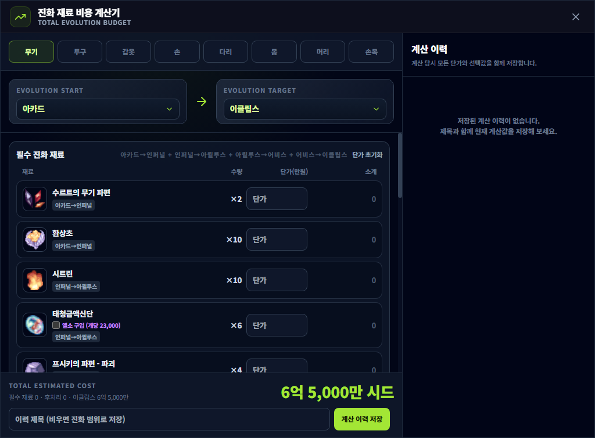
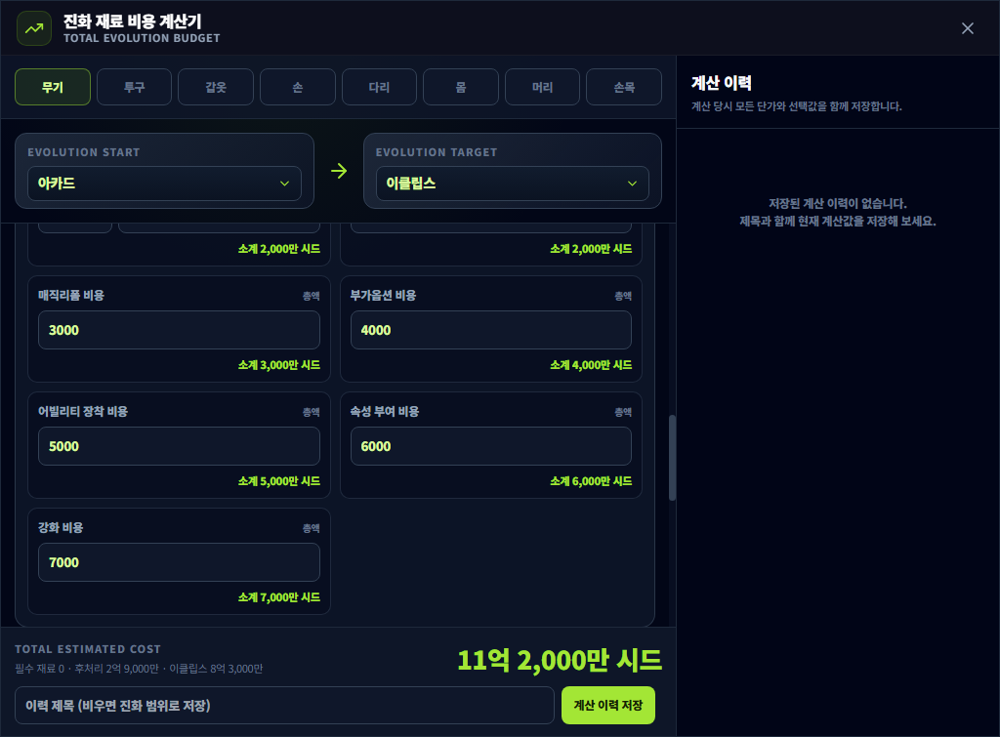

# 진화 재료 비용 계산기

## 언제 쓰는 기능인가요?

무기나 장비를 현재 단계에서 목표 단계까지 진화할 때 필요한 재료 수량과 예상 비용을 합산할 때 사용합니다.

## 어디에서 켜나요?

사이드바 또는 독 메뉴의 **진화 재료 비용 계산기**를 엽니다. 장비 사전의 진화 비용 버튼에서도 선택한 장비 정보와 함께 열 수 있습니다.

## 기본 사용법

1. 무기·투구·갑옷·손·다리·몸·머리·손목 중 계산할 종류를 바로 선택합니다.
2. 현재 단계와 목표 단계를 선택합니다.
3. 재료별 현재 단가와 시드/엘소 구매 여부를 입력합니다. 등록된 재료 이미지는 각 재료 항목 옆에 표시됩니다.
4. 인챈트 주문서 개수·단가, 인챈트 시도, 매직리폼, 부가옵션, 어빌리티 장착, 속성 부여, 강화 비용을 입력합니다.
5. 어비스에서 이클립스로 진화한다면 베이스 장비를 직접 어비스까지 진화할지, 완성된 어비스 장비를 구매할지, 가짜 달여왕 군단의 무구를 구매할지 선택합니다. 직접 진화는 위에서 고른 진화 구간의 재료비만 사용하고, 두 구매 방식은 입력한 구매비를 추가합니다.
6. 인장 6개를 직접 제작할지 대리 제작할지 선택합니다. 직접 제작의 달의 약초 비용은 6억 5,000만 시드로 고정됩니다.
7. 합산된 최종 비용을 확인한 뒤 제목을 입력하여 계산 이력을 저장합니다.
8. 오른쪽 이력에서 저장 당시 계산을 다시 불러와 수정하거나 삭제할 수 있습니다.

## 자주 혼동하는 점

- 여러 단계를 한 번에 고르면 중간 단계의 재료까지 모두 합산합니다.
- 입력한 단가는 다음 실행에도 이 PC에 남습니다. 시세가 바뀌면 직접 갱신하세요.
- 장비 후처리와 이클립스 전용 비용은 입력칸 아래에서 만원 단위를 실제 시드 소계로 바로 확인할 수 있습니다.
- 이력에는 저장 당시 선택한 무기·장비 부위, 진화 범위, 재료 단가, 추가 비용과 최종 계산값이 함께 보관됩니다.
- 인장 대리 제작을 선택하면 직접 제작용 달의 광물·룬의 원석·달의 약초 비용은 중복 합산되지 않습니다.
- 베이스 장비 직접 진화를 선택하면 별도 장비 구매비는 합산되지 않습니다. 시작 단계를 어비스로 고르면 이미 보유한 어비스 장비를 사용하는 계산이 됩니다.
- 표시 비용은 사용자가 입력한 단가 기준이며 실시간 시세를 자동 조회하지 않습니다.

## 문제 해결

- **다른 부위로 바꾸고 싶음:** 화면 상단에서 원하는 부위를 바로 누르세요.
- **비용이 0으로 나옴:** 필요한 재료의 단가가 입력됐는지 확인하세요.
- **예전 단가를 지우고 싶음:** 가격 초기화 버튼을 사용하세요.
- **저장한 계산을 고치고 싶음:** 이력의 수정 버튼을 누르면 선택한 카드와 계산 영역에 `수정 중` 표시가 나타납니다. 변경 저장과 수정 취소 모두 수정 진입 전에 사용하던 계산값으로 돌아갑니다.
