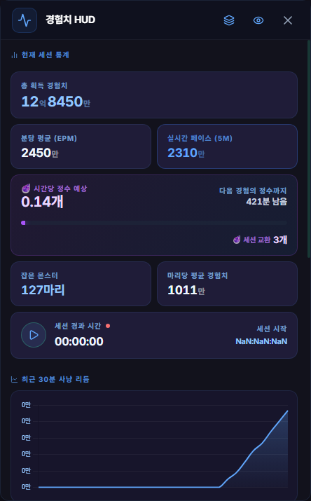

# 경험치 HUD

## 언제 쓰는 기능인가요?

사냥하는 동안 누적 경험치, 분당 경험치, 처치 수와 경험의 정수 진행도를 게임 화면 위에서 확인할 때 사용합니다.

## 어디에서 켜나요?

- 사이드바 또는 독 메뉴의 **경험치 HUD**에서 상세 창을 엽니다.
- 상세 창의 눈 아이콘 또는 **게임 화면에 HUD 표시** 설정으로 게임 위 HUD만 표시하거나 숨깁니다.
- 기본 세션 시작·정지 단축키는 `Ctrl + Shift + Z`입니다.

## 기본 사용법

1. 상세 창에서 **세션 시작**을 누른 뒤 사냥합니다.
2. 누적 경험치, 분당 경험치, 처치 수와 경험의 정수 진행도를 확인합니다.
3. 쉬는 동안에는 **세션 정지**를 누릅니다.
4. 새 측정을 시작하려면 초기화 버튼을 사용합니다.
5. 앱을 켤 때 자동으로 측정하려면 **게임 시작 시 세션 자동 시작**을 직접 켭니다.

## HUD 표시와 세션은 서로 다릅니다

- 신규 설치에서는 게임 위 HUD가 숨겨져 있고 세션도 정지 상태로 시작합니다.
- HUD를 표시해 둔 상태에서 세션을 정지해도 HUD는 그대로 보이며 일시 정지 상태를 표시합니다.
- HUD를 숨겨 둔 상태에서 세션을 시작해도 HUD가 자동으로 나타나지 않습니다.
- 게임을 다시 실행해도 마지막으로 선택한 HUD 표시 여부를 유지합니다.
- **게임 시작 시 세션 자동 시작**을 켠 경우에만 앱이 세션을 자동 시작합니다.

## 자주 혼동하는 점

- 상세 창을 닫는 것과 게임 위 HUD를 숨기는 것은 별개입니다.
- 세션을 정지하면 이후 경험치 로그를 합계에 더하지 않지만, 이미 측정한 값은 초기화 전까지 남습니다.
- 경험의 정수 교환은 100억 경험치 단위로 인식하며, 교환해도 세션의 총 획득 경험치를 줄이지 않습니다.
- HUD 위치는 게임 화면 기준으로 저장되며 모니터나 해상도가 크게 바뀌면 화면 안으로 복구될 수 있습니다.

## 문제 해결

- **사냥해도 값이 오르지 않음:** 세션이 시작 상태인지와 채팅 로그 경로를 확인하세요.
- **게임 위에 HUD가 안 보임:** 상세 창의 눈 아이콘 또는 HUD 표시 설정을 켜세요.
- **앱을 켤 때 자동 측정되지 않음:** **게임 시작 시 세션 자동 시작**을 켜세요.
- **수치가 기대와 다름:** 세션 시작 시점과 중간 정지 여부를 확인한 뒤 필요하면 초기화하고 다시 측정하세요.
