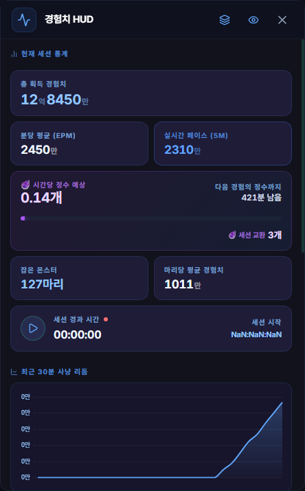

# 경험치 HUD

## 언제 쓰는 기능인가요?

사냥하는 동안 누적 경험치, 분당 경험치, 처치 수와 경험의 정수 진행도를 게임 화면 위에서 확인할 때 사용합니다.

## 어디에서 켜나요?

- 사이드바 또는 독 메뉴의 **경험치 HUD**에서 상세 창을 엽니다.
- 상세 창의 눈 아이콘 또는 **게임 화면에 HUD 표시** 설정으로 게임 위 HUD만 표시하거나 숨깁니다.
- 경험의 정수 경고 사용 여부, 알림음과 음량도 이 상세 창에서 설정합니다.
- 기본 세션 시작·정지 단축키는 `Ctrl + Shift + Z`입니다. 단축키로 시작하면 게임 위 HUD가 함께 표시되고, 일시정지하면 HUD도 함께 숨겨집니다.

## 기본 사용법

1. **측정 현황** 탭에서 **측정 시작**을 누른 뒤 사냥합니다.
2. 총 경험치, 전체 분당 평균, 최근 5분 페이스, 처치 수와 마리당 경험치, 정수 예상량·진행도·교환 횟수를 확인합니다.
3. 직접 쉬려면 상단의 **일시정지**를 누릅니다. 자동 휴식 중에는 **자동 재개 끄기**로 수동 정지할 수 있습니다.
4. **최근 30분 사냥 리듬** 그래프와 세션 시간은 측정 현황에 항상 표시됩니다. 세션 통계 오른쪽 **초기화** 버튼으로 누적 기록을 지울 수 있습니다.
5. 자동 측정, 경험치 알림, HUD 표시·위치는 **측정·알림 설정** 탭에서 바꿉니다. 알림음·음량·위치 좌표도 이 탭에 바로 표시됩니다.

측정 현황의 통계·그래프·사냥 기준은 접힌 영역 없이 표시합니다. 사냥 기준의 평균·표본 수·준비 상태를 확인할 수 있고, 획득량 감소 시 현재 값과 감소율도 표시합니다.

## 쉬는 시간을 자동으로 제외하기

상세 창의 **측정·알림 설정 → 자동 측정 → 휴식 자동 감지**를 켜면, 경험치 획득이 끊긴 뒤 설정 시간(기본 60초)이 지나면 자동 휴식으로 바뀝니다. 감지하는 동안 기다린 시간까지 마지막 획득 시각을 기준으로 제외합니다.

- 다시 경험치를 얻으면 누적 경험치·처치 수·세션 정수 횟수를 유지하면서 이어서 측정합니다.
- 자동 휴식이 확정되면 분별 그래프도 마지막 획득 시점으로 돌아갑니다. 감지 대기 시간이 길어도 최근 사냥 기록이 그래프에서 잘리지 않습니다.
- 사용자가 직접 정지한 경우에는 자동 재개하지 않습니다. 자동 휴식 중 정지 버튼이나 `Ctrl + Shift + Z`를 누르면 자동 재개도 해제됩니다.
- 자동 휴식은 HUD 표시 여부를 바꾸지 않습니다. 켜 둔 HUD에서 현재 상태를 확인할 수 있습니다.
- **경험치 미획득 시간** 항목에서 30초~5분을 선택할 수 있습니다. 자동 감지를 끄면 기존처럼 직접 시작·정지합니다.

## 경험치가 낮아졌을 때 확인하기

**경험치 감소 감지**는 최근 5분의 **1회당 평균 획득량**을 기준으로 판단합니다. 기본값은 평균보다 **20% 감소**한 획득이 3회 연속 발생했을 때이며, 경고 이후 60초 동안 반복 알림을 억제합니다. 평균이 500만이면 400만 미만이 감소 감지 대상입니다. 분당 경험치나 처치 속도를 비교하는 기능은 아닙니다.

- 시작·재개·기준 재설정 후에는 최소 1분과 30회 표본을 확보합니다. 준비 상태와 평균·표본 수를 상세 창에서 확인할 수 있습니다.
- 정수 교환 등의 음수 경험치는 제외합니다. 초기 표본의 중앙값 또는 준비된 평균의 3배를 넘는 큰 일회성 획득도 감지 기준에서 제외하며, 세션 누적에는 원래대로 반영합니다.
- 경고에는 평균·현재 획득량·감소율을 함께 표시합니다. 게임 HUD의 경고는 12초 동안 표시하며, 상세 창에서도 비교 수치를 확인할 수 있습니다.
- 사냥터를 바꿨다면 **측정 현황 → 사냥 측정 도우미 → 기준 다시 측정**을 누르세요. 기준 표본과 경고만 초기화하고 세션 기록은 유지합니다.
- 감소율은 10~50% 중 선택하며, 알림음과 음량은 경험의 정수 경고와 따로 설정합니다.
- 몬스터 종류나 사냥터 변경으로도 경험치가 달라질 수 있습니다. 알림은 버프·도핑을 확인하라는 안내이며 종료 원인을 확정하지 않습니다.

## HUD 표시와 세션은 서로 다릅니다

- 신규 설치에서는 게임 위 HUD가 숨겨져 있고 세션도 정지 상태로 시작합니다.
- HUD를 표시해 둔 상태에서 세션을 정지해도 HUD는 그대로 보이며 일시 정지 상태를 표시합니다.
- HUD를 숨겨 둔 상태에서 세션을 시작해도 HUD가 자동으로 나타나지 않습니다.
- 단, `Ctrl + Shift + Z`는 빠른 사냥 시작·중지용 결합 단축키이므로 세션과 HUD를 함께 켜거나 끕니다.
- 게임을 다시 실행해도 마지막으로 선택한 HUD 표시 여부를 유지합니다.
- **측정·알림 설정 → 자동 측정 → 경험치 세션 자동 시작**을 켠 경우에만 앱이 세션을 자동 시작합니다.

## 자주 혼동하는 점

- 상세 창을 닫는 것과 게임 위 HUD를 숨기는 것은 별개입니다.
- 세션을 정지하면 이후 경험치 로그를 합계에 더하지 않지만, 이미 측정한 값은 초기화 전까지 남습니다.
- 경험의 정수 교환은 100억 경험치 단위로 인식하며, 교환해도 세션의 총 획득 경험치를 줄이지 않습니다.
- 경험의 정수 경고용 경험치는 세션 통계와 별도로 계속 누적합니다. 정상 자동 교환 직전 오경고를 피하도록 10억 여유를 두어, 교환이 없으면 110억, 210억, 310억마다 한 번 경고합니다. 정확한 100억 감소 교환 로그를 감지하면 경고용 누적만 0으로 초기화합니다.
- 세션 시작·일시정지·초기화는 경고용 누적에 영향을 주지 않습니다. 세션 총 경험치와 세션 정수 교환 횟수는 측정 중인 로그만 반영하고, 세션 초기화 시 별도로 0이 됩니다.
- 수동 교환은 100억 경험치 감소 로그 한 줄이 기록됩니다. 자동 전환 버프는 같은 감소 로그와 별도 획득 안내가 함께 기록되므로, 중복을 막기 위해 공통 100억 감소 로그만 교환 1회로 집계합니다.
- 콘텐츠 보상 등으로 직접 획득한 경험의 정수는 교환과 별도로 모험일지와 오늘의 요약에 기록됩니다. 이 전용 집계는 일반 득템 등록 목록에서 경험의 정수를 따로 추가하지 않아도 유지되며, 오늘 요약의 일반 득템 종류·목록에는 중복 표시하지 않습니다.
- 경험의 정수는 일반 득템 등록 대상이 아니므로 모험일지 통계의 **이번 달 누적 득템 리스트**와 **득템 기록** 탭에는 표시하지 않으며, 경험의 정수 전용 합계에서 확인합니다.
- 경험의 정수 상세 설정은 환경 설정에 중복 저장되지 않으며 경험치 HUD 창에서 관리합니다.
- 경험의 정수 알림 음량을 0%로 설정하면 미리듣기도 무음으로 동작하며 알림 카드는 표시합니다.
- HUD 위치는 게임 화면 기준으로 저장됩니다. 재접속이나 해상도 전환 중 게임 화면이 잠시 작아져도 버프 타이머·경험치·퀘스트 HUD의 저장 위치를 중앙 좌표로 덮어쓰지 않습니다.

## 문제 해결

- **사냥해도 값이 오르지 않음:** 세션이 시작 상태인지와 채팅 로그 경로를 확인하세요.
- **게임 위에 HUD가 안 보임:** 상세 창의 눈 아이콘 또는 HUD 표시 설정을 켜세요.
- **앱을 켤 때 자동 측정되지 않음:** **게임 시작 시 세션 자동 시작**을 켜세요.
- **수치가 기대와 다름:** 세션 시작 시점과 중간 정지 여부를 확인한 뒤 필요하면 초기화하고 다시 측정하세요.
