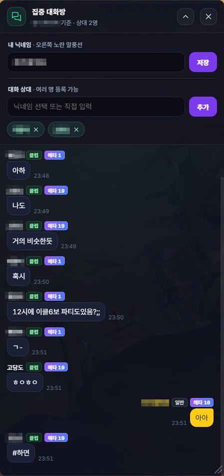

# 집중 대화방

## 언제 쓰는 기능인가요?

특정 닉네임과 주고받은 대화만 별도 창에서 모아 보고 싶을 때 사용합니다.

## 어디에서 켜나요?

사이드바 또는 독 메뉴의 **집중 대화방**을 엽니다. 설정에서 자신의 닉네임을 먼저 입력하면 내 메시지 방향을 구분하기 쉽습니다.

## 기본 사용법

1. 대화 상대 닉네임을 선택하거나 입력합니다.
2. 해당 상대가 보낸 메시지와 내가 보낸 메시지를 한 흐름으로 확인합니다.
3. 위로 스크롤해 이 창에 표시된 이전 대화를 읽습니다. 표시 중인 대상 대화는 최대 150개이며, 더 오래된 로그 조회는 채팅 오버레이를 사용합니다.

## 자주 혼동하는 점

- 집중 대화방은 게임의 별도 메신저 AI 분석이 아니라 채팅 로그에서 특정 상대와의 대화를 모아 보여주는 화면입니다.
- 자신의 닉네임 설정이 틀리면 발신·수신 방향이 기대와 다르게 보일 수 있습니다.
- 원본 채팅과 대화 기록은 현재 PC에만 저장됩니다.
- 닉네임 메모 저장·삭제, 서버별 메모나 에타 색상 변경은 표시 중인 대화와 읽던 위치를 유지합니다. 시스템 메시지나 다른 사람의 대화가 많이 들어와도 설정 변경만으로 목록이 초기화되지 않습니다.
- 대화 상대나 내 닉네임을 바꾸면 현재 세션의 최근 채팅에서 대상을 다시 고릅니다. 명시적인 이력 초기화는 기존 표시도 지웁니다.

## 문제 해결

- **상대가 목록에 없음:** 해당 대화가 채팅 로그에 기록된 뒤 다시 확인하세요.
- **내 메시지가 상대 메시지로 보임:** 설정의 내 닉네임을 정확히 입력하세요.
- **새 메시지가 늦게 보임:** 게임 채팅 로그 파일이 실제로 갱신되는지 확인하세요.
