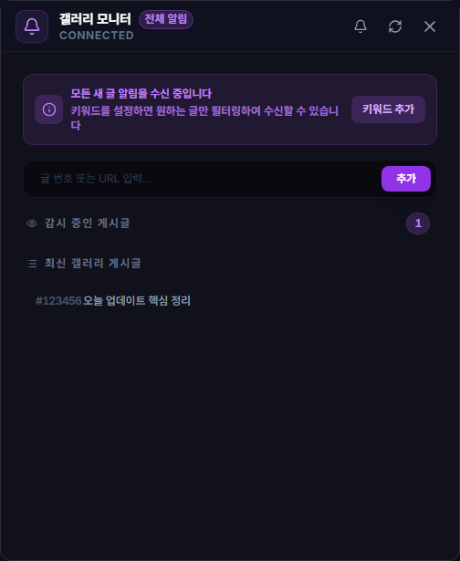

# 갤러리 실시간 모니터링

## 언제 쓰는 기능인가요?

테일즈위버 갤러리의 새 글을 보고, 특정 제목 키워드나 지정 게시글의 새 댓글을 알림받을 때 사용합니다.

## 어디에서 켜나요?

사이드바 또는 독 메뉴의 **갤러리 실시간 모니터링**을 엽니다. 알림 키워드는 설정의 갤러리 항목에서 관리합니다.

## 기본 사용법

1. 최신 글 목록을 확인하고 필요하면 새로고침합니다.
2. 새 글 전체 또는 등록 키워드만 알림받을지 설정합니다.
3. 댓글을 지켜볼 게시글 번호나 URL을 감시 목록에 추가합니다.
4. 목록의 글을 눌러 내용을 엽니다.

## 자주 혼동하는 점

- 외부 게시판 상태와 네트워크에 따라 목록 갱신이 늦거나 잠시 실패할 수 있습니다.
- 키워드 알림은 제목에 등록 문구가 포함된 글을 대상으로 합니다.
- 특정 글 감시는 댓글 수 변화를 확인하는 기능이며 모든 댓글 내용을 저장하지 않습니다.
- TW-Overlay는 게시글의 정확성이나 안전을 보장하지 않습니다.

## 문제 해결

- **목록을 불러오지 못함:** 인터넷 연결을 확인하고 잠시 뒤 새로고침하세요.
- **키워드 알림이 안 옴:** 전체 알림 사용 여부와 등록 키워드를 확인하세요.
- **댓글 감시가 안 됨:** 게시글 번호 또는 URL이 올바르고 글이 삭제되지 않았는지 확인하세요.
