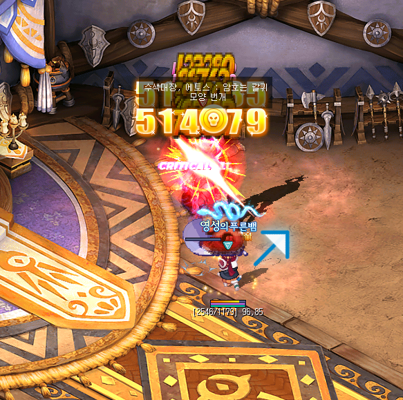
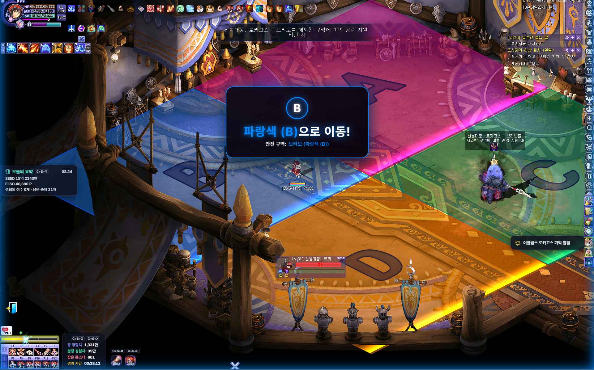

# 이클립스 에토스·로카고스 기믹 알림

## 언제 쓰는 기능인가요?

이클립스 에토스와 로카고스 보스전에서 NPC 대사를 놓치지 않도록, 피해야 할 방향이나 안전·회피 구역을 게임 화면 중앙에 자동으로 표시합니다.

## 어디에서 켜나요?

**설정 → 게임 HUD & 알림 → 게임 진행 알림**에서 **이클립스 에토스 기믹 알림**과 **이클립스 로카고스 기믹 알림**을 각각 켭니다. 두 알림은 알림음과 음량, 미리듣기를 서로 따로 설정할 수 있습니다.

알림은 실시간 채팅 로그를 바탕으로 동작하므로, 먼저 테일즈위버의 채팅 로그 저장과 TW-Overlay의 로그 경로가 정상인지 확인하세요.

## 기본 사용법

### 에토스

`수색대장, 에토스`의 암호 대사를 감지하면 피해야 할 방향을 8방향 화살표로 5초간 표시합니다.

| 암호 | 화살표 방향 |
|---|---|
| 번개 | 위 |
| 갈퀴 모양 번개 | 오른쪽 위 |
| 갈퀴 | 오른쪽 |
| 갈퀴 모양 갈고리 | 오른쪽 아래 |
| 갈고리 | 아래 |
| 파도 모양 갈고리 | 왼쪽 아래 |
| 파도 | 왼쪽 |
| 파도 모양 번개 | 왼쪽 위 |

### 로카고스

`선봉대장, 로카고스`의 마법 공격 대사를 감지하면 구역 표시와 화면 테두리를 5초간 보여 줍니다.

- **`알파/브라보/찰리/델타를 제외한 구역`을 공격:** 언급된 한 구역이 안전합니다. 화면에 표시된 색상·알파벳 구역으로 이동하세요.
- **`알파/브라보/찰리/델타 구역`을 공격:** 언급된 한 구역을 피해야 합니다. 금지 표시와 함께 나머지 안전 구역 3개를 보여 줍니다.

| 구역 | 표시 |
|---|---|
| 알파 | 자주색 A |
| 브라보 | 파란색 B |
| 찰리 | 초록색 C |
| 델타 | 노란색 D |

## 자주 혼동하는 점

- 에토스 화살표는 암호에 맞춰 **피해야 할 방향**을 보여 줍니다.
- 로카고스의 `제외한 구역` 대사는 언급된 구역으로 이동하라는 의미입니다. 반대로 `구역에 마법 공격` 대사는 언급된 구역을 피해야 합니다.
- 기능 스위치를 끄면 화면 알림과 소리가 모두 꺼집니다. 화면 알림만 사용하려면 기능은 켠 채 알림음을 **사용 안 함 (소리 없음)**으로 선택하세요. 알림음과 음량은 보스별로 따로 저장됩니다.
- 과거 채팅 로그를 재분석하는 기능은 기록 복원용입니다. 지난 보스 대사로 실시간 기믹 알림을 다시 띄우지 않습니다.

## 문제 해결

- **대사가 보였지만 알림이 안 뜨는 경우:** 두 기믹 알림의 사용 여부와 채팅 로그 연동 상태를 확인하세요.
- **화면은 보이지만 소리가 안 나는 경우:** 각 보스의 알림음·음량을 확인하고 **미리듣기**로 테스트하세요.
- **음량을 바꿔도 적용되지 않는 경우:** 설정 화면 아래의 **저장 및 적용**을 누른 뒤 다시 미리듣기하세요.
- **알림이 다른 프로그램 뒤에 보이는 경우:** 테일즈위버와 TW-Overlay의 관리자 권한이 같은지 확인하세요.
