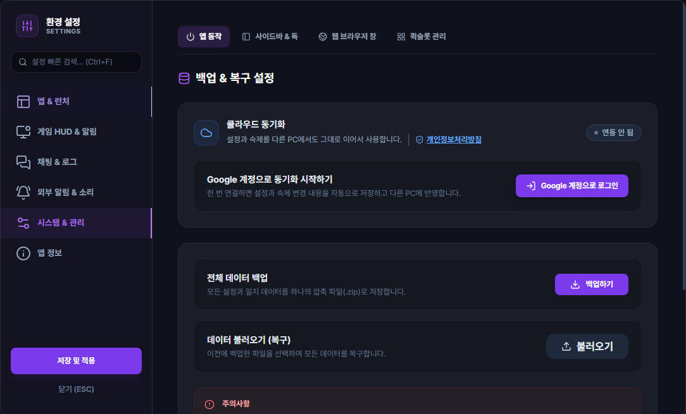
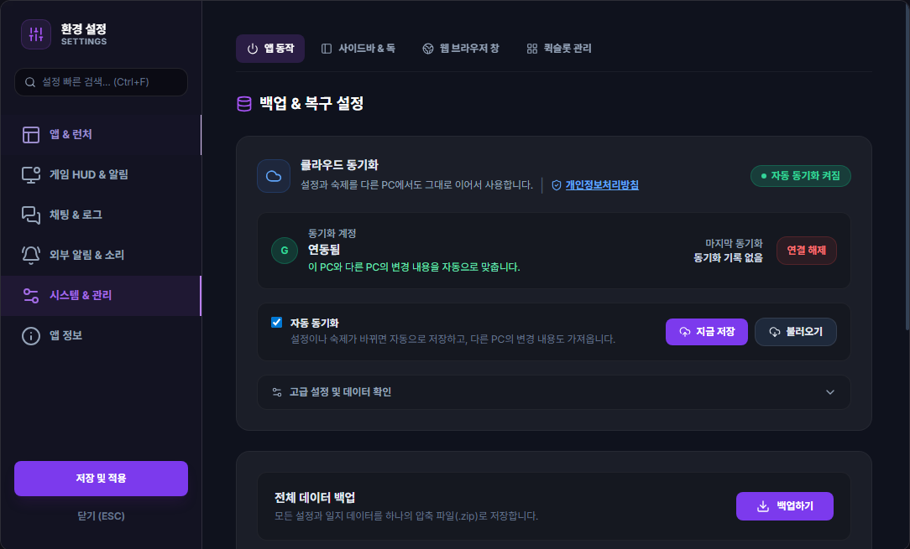
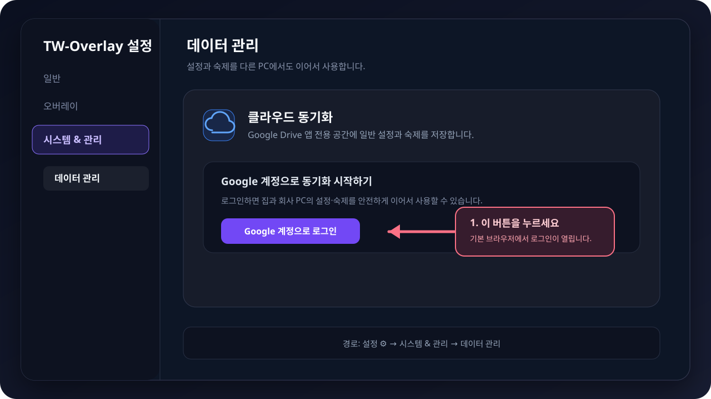
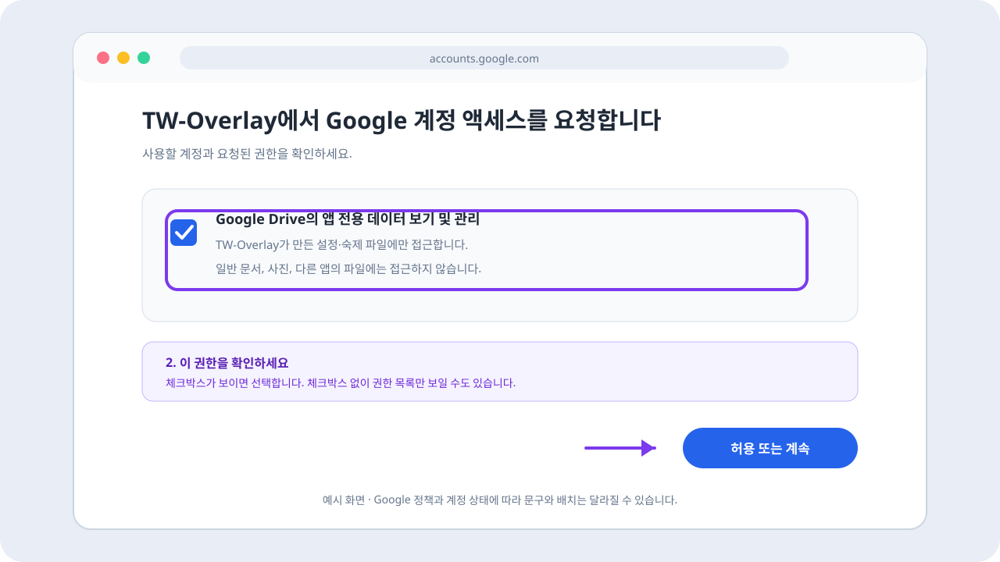

# Google Drive 클라우드 동기화

## 언제 쓰는 기능인가요?

집과 회사처럼 여러 PC에서 같은 일반 설정과 숙제 체크리스트를 이어서 사용할 때 선택적으로 연결합니다. Google 로그인을 하지 않아도 TW-Overlay의 로컬 기능은 모두 사용할 수 있습니다.

## 어디에서 켜나요?

**설정 ⚙️ → 시스템 & 관리 → 데이터 관리**에서 **Google 계정으로 로그인**을 누릅니다.

로그인은 Windows 기본 브라우저에서 진행됩니다. 권한 화면에서 **Google Drive의 앱 전용 데이터 보기 및 관리**를 확인하고 허용하세요. Google 계정 상태에 따라 선택 체크박스가 보이거나, **체크박스 없이 요청 권한 목록**과 허용/계속 버튼만 표시될 수 있습니다.

## 기본 사용법

- **자동 동기화:** 이 PC에서 바뀐 일반 설정과 숙제를 각각 클라우드에 저장하고, 다른 PC의 변경을 주기적으로 확인합니다.
- **`지금 저장`:** 현재 PC의 일반 설정과 숙제를 Google Drive에 바로 저장합니다.
- **`불러오기`:** 클라우드의 일반 설정과 숙제를 선택해 현재 PC로 가져옵니다.
- **`연결 해제`:** 이 PC의 로그인 정보만 지웁니다. 현재 PC와 Google Drive의 저장 데이터는 삭제하지 않습니다.
- 각 상태 카드의 **데이터 확인**에서 일반 설정 또는 숙제 파일을 따로 확인할 수 있습니다.

설정은 변경 후 약 1.5초, 숙제는 변경 후 약 0.5초 동안 변경을 모아 해당 파일만 업로드합니다. 변경할 일이 없으면 데이터 파일을 반복 업로드하지 않습니다. 다른 PC의 변경 확인은 게임 실행 중 약 30초, 게임 미실행 시 약 5분 간격이며 앱·게임 시작, 절전 복귀와 네트워크 복구 때는 바로 확인합니다. 확인 결과가 이전과 같으면 같은 데이터를 반복해서 내려받거나 이 PC에 다시 저장하지 않습니다.

## 여러 PC의 숙제는 어떻게 합치나요?

한 PC의 체크리스트로 다른 PC를 통째로 덮어쓰지 않습니다. 마지막으로 두 PC가 같았던 상태를 기준으로 각 PC의 변경을 비교합니다.

- 한쪽 PC에서만 바꾼 숙제는 그 변경을 반영합니다.
- 서로 다른 캐릭터나 숙제를 바꾸면 양쪽 변경을 모두 유지합니다.
- 같은 캐릭터의 같은 숙제를 완료·해제하거나 횟수를 서로 다르게 바꾸면 정해진 순서로 다시 적용해 같은 최종 결과에 맞춥니다.
- 자동 감지 후 적용할 캐릭터가 여러 명이면 선택 대기 상태도 클라우드에 저장됩니다. 다른 PC에서도 캐릭터 선택 팝업이 표시되며 앱이 캐릭터를 임의로 고르지 않습니다.
- 이미 완료했거나 제외한 캐릭터를 빼고 후보가 한 명뿐이면 그 캐릭터에 자동 반영합니다.

업로드 응답이 유실되거나 다른 PC가 바로 덮어써도 확인되지 않은 숙제 변경은 다음 동기화에서 다시 확인합니다.

## 무엇이 동기화되나요?

- 사이드바·독, 알림, 단축키, 채팅 오버레이 같은 다른 PC에서도 쓸 수 있는 일반 설정
- 숙제 정의와 순서, 캐릭터 프리셋, 캐릭터별 완료·횟수·N/A 상태
- 캐릭터를 아직 정하지 않은 자동 감지 숙제

다음 항목은 클라우드에 올리지 않습니다.

- Discord Webhook URL과 Google OAuth 토큰
- 채팅·메신저 로그 경로와 기타 로컬 파일 경로
- 사용자가 고른 커스텀 사운드 파일 경로
- 창 위치·크기처럼 PC 화면 구성에 종속된 값
- 모험 일지 DB, 채팅 원문, 사냥 동선, 시간 측정 기록과 알람 이력

Google Drive에는 `tw_overlay_settings.json`, `tw_overlay_checklist.json`, `tw_overlay_sync_meta.json` 세 파일을 앱 전용 숨김 영역에 저장합니다. 일반 Drive 문서 목록에 보이지 않는 것이 정상이며, TW-Overlay는 사용자의 일반 Drive 문서에 접근하지 않습니다.

## 자주 혼동하는 점

- 화면에 **변경 확인 중**이 보여도 반드시 업로드 중인 것은 아닙니다. 다른 PC의 새 변경이 있는지 확인하는 수신 작업일 수 있습니다.
- `불러오기`는 정상인 파일을 각각 처리합니다. 설정 파일에 문제가 있어도 정상 숙제 파일까지 함께 실패시키지 않습니다.
- 지원하지 않는 더 새로운 파일 형식은 현재 버전에서 적용하지 않고 해당 파일만 안내합니다. 두 PC의 TW-Overlay 버전을 확인하세요.
- Google 계정 권한을 철회해도 Drive의 숨겨진 앱 데이터는 자동으로 삭제되지 않습니다.

## 문제 해결

- **다시 로그인 필요:** Google 인증이 만료됐습니다. 데이터 관리에서 같은 계정으로 다시 로그인하세요.
- **현재 버전에서 동기화할 수 없음:** 다른 PC가 더 새 버전인지 확인하고 TW-Overlay를 업데이트하세요.
- **한 파일만 복원됨:** 다른 파일의 상태 메시지를 확인하세요. 정상 파일은 이미 독립적으로 적용됐을 수 있습니다.
- **Drive에서 파일을 찾을 수 없음:** 앱 전용 데이터는 일반 파일 목록에 나타나지 않습니다.

## 권한 철회와 데이터 삭제

1. TW-Overlay의 **연결 해제**는 현재 PC의 토큰만 삭제합니다.
2. Google 계정의 [연결된 앱 관리](https://myaccount.google.com/connections)에서 권한을 철회할 수 있습니다.
3. Google Drive 웹의 **설정 → 앱 관리 → TW-Overlay → 숨겨진 앱 데이터 삭제**에서 클라우드 데이터를 지울 수 있습니다.

권한 철회와 **숨겨진 앱 데이터 삭제**는 서로 다른 작업입니다. 클라우드 데이터까지 없애려면 3번을 별도로 수행하세요.
