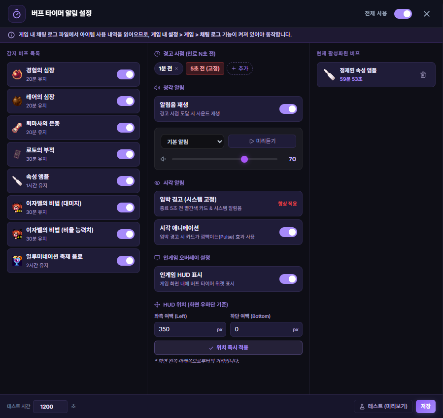

# 지능형 버프 타이머 (Intelligent Buff Timer)

## 1. 기능 개요 및 목적
사냥 효율에 결정적인 영향을 미치는 주요 소모성 버프(도핑)의 사용 여부를 실시간 로그 엔진을 통해 자동으로 감지하고, 남은 시간을 게임 화면 위에 위젯 형태로 실시간 시각화하여 보여주는 스마트 오버레이 도구입니다.

## 2. 주요 UI 구성 요소 설명
- **버프 아이콘 뱃지:** 현재 활성화된 버프의 고유 아이콘을 오버레이 영역에 표시합니다.
- **프로그레스 링:** 아이콘 테두리의 원형 게이지를 통해 남은 시간 비율을 직관적으로 보여줍니다.
- **잔여 시간 텍스트:** 분/초 단위로 남은 시간을 정밀하게 표시합니다.
- **버프 미감지 경고 삼각형:** 
  - 버프 자동 감지 시스템은 켜져 있으나 실제 감지되는 버프가 전혀 없을 때, 사이드바의 버프 아이콘에 빨간색 경고 삼각형(`triangle-alert`)이 점멸합니다.
  - 해당 마크에 마우스를 오버하면 실시간 감지 대상 버프 목록을 안내 툴팁으로 제공합니다.
- **수동 비활성화 (v1.13.4 신규):** 타이머가 돌아가는 도중 버프 배지 아이콘을 **마우스로 직접 클릭**하면, 해당 버프 타이머가 오버레이 창에서 즉시 비활성화(정지 및 숨김) 처리됩니다.
- **만료 경고 알림:** 버프 잔여 시간이 1분 미만으로 떨어지는 등 만료가 임박하면 아이콘이 경고 형태로 깜박입니다.

## 3. 세부 기능 및 작동 방식
- **자동 시작 로직:** 채팅 로그에 "경험의 심장 효과가 시작되었습니다", "속성 앰플 효과가 시작되었습니다"와 같은 아이템 사용 메시지가 찍히는 즉시 해당 버프의 고유 지속 시간(10분, 30분 등)을 계산하여 타이머를 가동합니다.
- **재감지 시간 갱신:** 이미 실행 중인 버프가 새로 감지되면 마지막 감지 시점을 기준으로 남은 시간을 다시 계산합니다.
- **지원하는 버프 종류 (v1.17.12 확장):**
  - **기본 버프 3종:** 경험의 심장, 레어의 심장, 퇴마사의 은총
  - **연동 버프 5종 (v1.13.4 추가):** 로토의 부적, 속성 앰플, 이자벨의 비법 (데미지), 이자벨의 비법 (비율능력치), 일루미네이션 축제 음료
  - **통찰의 비약 2종 (v1.17.12 추가)**: 통찰의 비약 (대: 5분), 통찰의 비약 (특대: 1분)
- **화면 중앙 대형 만료 경고 오버레이 및 알림 중첩 스택 (Stack):**
  - 버프 만료 5초 전, 화면 중앙에 보라색 테두리와 다크 글래스모피즘이 적용된 슬림 가로 바 형태의 대형 경고 창이 2.3초간 출력되어 시각적으로 상기시켜 줍니다.
  - 복수의 버프가 동시에 만료되는 경우 알림 창들이 화면 중앙에 겹치지 않고 수직 정렬로 차곡차곡 쌓이며(Stack UI), 먼저 끝난 카드가 지워지면 하단의 카드가 부드럽게 위로 슬라이드 업되는 애니메이션 모션 기믹을 취합니다. (해당 기능은 환경 설정의 통합 스위치로 전체 온/오프 가능)
- **동적 가시성 제어:** 게임 창이 활성화(Focus)되어 있을 때만 오버레이에 노출되며, 다른 창을 사용할 때는 화면을 방해하지 않도록 자동으로 가려집니다.
- **상태 영속성:** 프로그램 재시작 시에도 마지막으로 기록된 버프 시작 시간과 지속 시간을 대조하여 남은 시간을 정확하게 복구합니다.

## 4. 데이터 출처
- **트리거:** 실시간 로그 엔진의 `BUFF_USED` 이벤트. (경험치 HUD의 `xpTracker.ts` 내부 버프 감지 연동)
- **기준 정보 및 설정:**
  - `src/assets/data/buffs.json` (버프 고유 메타데이터 및 지속 시간 정의)
  - `src/modules/buffTimerManager.ts` (타이머 시작, 만료, 수동 비활성화 백엔드 엔진)

## 5. 스크린샷

*(오버레이 브라우저 옆에 표시되는 버프 뱃지 예시)*
