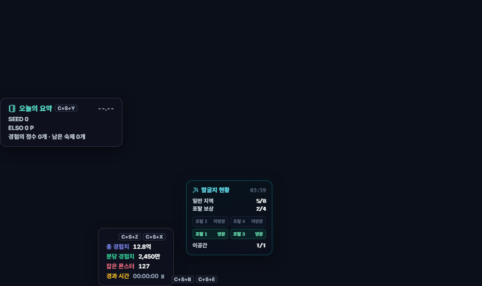

# 웹 오버레이와 사이드바·독

## 언제 쓰는 기능인가요?

게임 위에 웹페이지를 띄우거나, 사이드바·독에서 TW-Overlay 기능 창을 빠르게 열 때 사용합니다.

## 어디에서 켜나요?

사이드바·독의 홈/오버레이 버튼을 사용합니다. 사이드바와 독의 위치·표시 메뉴는 설정에서 바꿀 수 있습니다.

## 기본 사용법

1. 웹 오버레이 주소창에 URL 또는 검색어를 입력합니다.
2. 투명도를 조절해 게임과 웹페이지가 함께 보이게 합니다.
3. 조작할 때는 마우스 투과를 끄고, 게임할 때는 다시 켭니다.
4. 사이드바·독 아이콘으로 체크리스트, 계산기와 도구 창을 엽니다.

## 발굴지 현황판

- 발굴지 입장 로그가 감지되면 게임 화면에 작은 현황판이 자동으로 열립니다.
- 일반 지역 보상 `0/8`, 포탈 보상 `0/4`, 포탈 1~4 방문 여부, 이공간 보상 `0/1`을 각각 표시합니다.
- 상자 개봉과 포탈 이동 채팅이 올라올 때 즉시 갱신되며, 같은 로그가 더 들어와도 최대 횟수를 넘지 않습니다.
- 발굴지는 종료 채팅이 없기 때문에 입장 후 5분 동안만 표시되고 자동으로 사라집니다. 중간 활동으로 표시 시간이 연장되지는 않습니다.
- 포탈 방문 표시는 실제 맵 배치에 맞춰 위쪽 `2 · 4`, 아래쪽 `1 · 3` 순서로 표시됩니다.
- **설정 → 게임 HUD & 알림 → HUD 위젯 관리 → 발굴지 현황 HUD**에서 표시 여부를 켜거나 끌 수 있습니다.
- 과거 채팅 로그 재분석 결과로는 현황판이 열리지 않으며, 현재 게임에서 새로 감지한 입장만 추적합니다.

## 자주 혼동하는 점

- TW-Overlay 창들은 테일즈위버 바로 위에 하나의 앱처럼 배치되지만, 다른 프로그램의 자연스러운 Windows 창 순서를 강제로 바꾸지 않습니다.
- 이 정책은 창모드와 창모드 전체화면에 모두 적용됩니다.
- 웹 오버레이의 PASS 표시는 마우스 입력이 게임으로 통과하는 상태입니다.
- 투명해 보이는 HTML 영역도 창 자체가 존재하면 입력을 받을 수 있습니다. 마우스 투과 상태를 이용하세요.

## 문제 해결

- **게임을 선택했는데 오버레이가 뒤에 있음:** 게임과 앱의 관리자 권한이 같은지 확인하세요.
- **다른 프로그램 위에 오버레이가 남음:** 해당 창을 한 번 선택하고 반복되면 버그 제보에 창모드와 모니터 배치를 적어 주세요.
- **게임을 클릭할 수 없음:** 마우스 투과를 켜세요.
- **웹페이지가 열리지 않음:** 인터넷 연결과 사이트의 앱 내 표시 허용 여부를 확인하세요.
