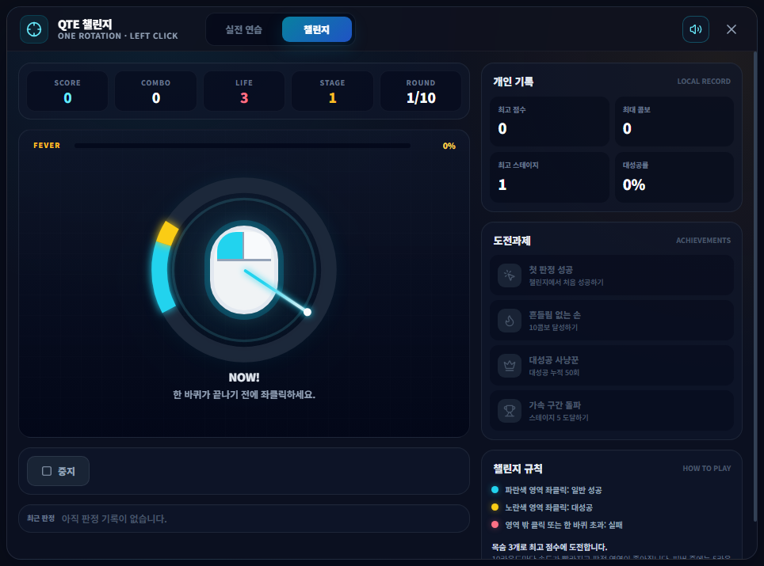

# QTE 챌린지

## 언제 쓰는 기능인가요?

테일즈위버의 한 바퀴 QTE 판정을 연습하거나 점수·콤보·스테이지 기록에 도전하고 싶을 때 사용합니다.

## 어디에서 켜나요?

사이드바 또는 독 메뉴에서 **미니게임 → QTE 챌린지**를 엽니다. 기존 **테일즈위버 무기 강화하기**와는 별개의 창으로 실행됩니다.

## 기본 사용법

1. **실전 연습**에서는 느리게·실전 속도·빠르게 중 원하는 속도를 선택합니다.
2. 바늘이 시계 방향으로 한 바퀴 도는 동안 마우스 왼쪽 버튼을 누릅니다.
3. 파란색 구간은 일반 성공, 더 좁은 노란색 구간은 대성공입니다.
4. 색상 구간 밖을 누르거나 한 바퀴 안에 누르지 못하면 실패합니다.
5. **챌린지**에서는 목숨 3개로 점수, 콤보, 스테이지와 도전과제 기록을 쌓을 수 있습니다.

## 자주 혼동하는 점

- 색상 구간의 위치와 크기는 매 라운드 무작위로 바뀌지만 파란색 구간은 항상 노란색보다 넓습니다.
- 바늘은 두 바퀴 이상 돌지 않습니다. 한 바퀴가 끝나면 즉시 실패로 처리됩니다.
- QTE 챌린지는 연습용 미니게임이며 실제 게임 입력을 자동으로 수행하지 않습니다.
- 개인 기록과 사운드 설정은 현재 PC에만 저장됩니다.

## 문제 해결

- **클릭이 판정되지 않음:** QTE 창 안에서 마우스 왼쪽 버튼을 눌렀는지 확인하세요.
- **소리가 나지 않음:** 오른쪽 위의 사운드 버튼이 켜져 있는지 확인하세요.
- **창이 화면 밖에 있음:** 게임을 종료하거나 최소화한 상태에서 트레이 메뉴로 다시 열면 일반 창 위치 정책에 따라 복구됩니다.
