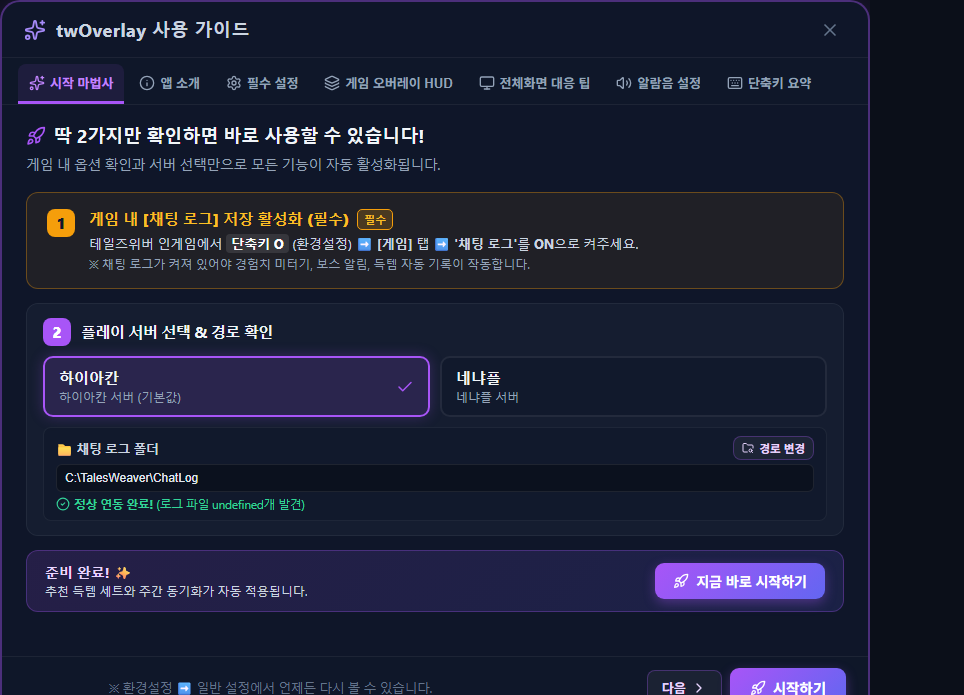
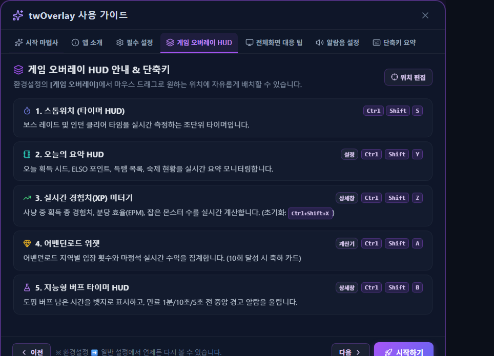

# 빠른 시작

## 설치하기

TW-Overlay는 [공식 GitHub Releases](https://github.com/twliker/tw-overlay/releases)에서 Windows 설치 파일을 받을 수 있습니다. Assets에서 `twOverlay-Setup-x.x.x.exe` 형식의 파일을 내려받아 실행하세요.

Windows가 처음 실행하는 설치 파일을 확인할 수 있습니다. 게시자와 내려받은 주소가 공식 배포 페이지인지 확인한 뒤 안내에 따라 설치하세요.

## 게임에서 먼저 설정할 것

경험치, 득템, 숙제 완료와 버프 사용 같은 게임 이벤트는 테일즈위버의 채팅 로그를 읽어 감지합니다.

1. 테일즈위버에서 `O` 키를 눌러 환경설정을 엽니다.
2. **게임** 탭의 **채팅 로그**를 켭니다.
3. **확인** 또는 **적용**을 누릅니다.

채팅 로그가 꺼져 있으면 앱은 실행돼도 자동 감지 기능이 동작하지 않습니다.

## 처음 실행할 때

1. 시작 안내에서 플레이 서버를 선택합니다.
2. 자동으로 찾은 채팅 로그 폴더가 맞는지 확인합니다.
3. 다른 위치에 게임을 설치했다면 **경로 변경**에서 `TalesWeaver\ChatLog` 폴더를 지정합니다.

## 기본 조작

- 테일즈위버는 **창모드** 또는 **창모드 전체화면**에서 사용하세요.
- 사이드바와 TW-Overlay에서 연 창들은 게임 바로 위에 함께 배치됩니다. 다른 프로그램을 선택하면 Windows의 자연스러운 창 순서를 방해하지 않습니다.
- 기본 마우스 투과 단축키는 `Ctrl + Shift + T`입니다. 설정에서 다른 키로 바꿀 수 있습니다.
- 사이드바 대신 독 메뉴를 쓰려면 설정에서 사이드바 위치를 독으로 바꾸세요. 기본 독 표시 단축키는 `Ctrl + Shift + D`입니다.
- 게임이 꺼져 있어도 시스템 트레이 메뉴에서 체크리스트, 일지와 계산기를 열 수 있습니다.

## 여러 PC에서 사용한다면

**설정 → 시스템 & 관리 → 데이터 관리**에서 Google 계정을 연결하면 일반 설정과 숙제 체크리스트를 동기화할 수 있습니다. 연결하지 않아도 모든 로컬 기능은 그대로 사용할 수 있습니다.

로그인은 기본 브라우저에서 진행됩니다. 권한 화면에서 Google Drive의 앱 전용 데이터 권한을 확인하세요. 자세한 연결·복원·삭제 방법은 [Google Drive 동기화 가이드](./?doc=google-drive-sync)를 참고하세요.

## 문제가 생겼을 때

- **게임을 찾지 못함:** 게임을 먼저 실행하고, 관리자 권한이 서로 다른지 확인하세요.
- **자동 감지가 안 됨:** 게임의 채팅 로그 설정과 앱에 지정한 폴더를 확인하세요.
- **오버레이를 클릭할 수 없음:** `Ctrl + Shift + T`로 마우스 투과를 해제하세요.
- **창 위치가 어색함:** 설정의 화면/오버레이 항목에서 위치를 다시 맞추세요.

기능별 사용법은 왼쪽 가이드 메뉴에서 확인할 수 있습니다.
