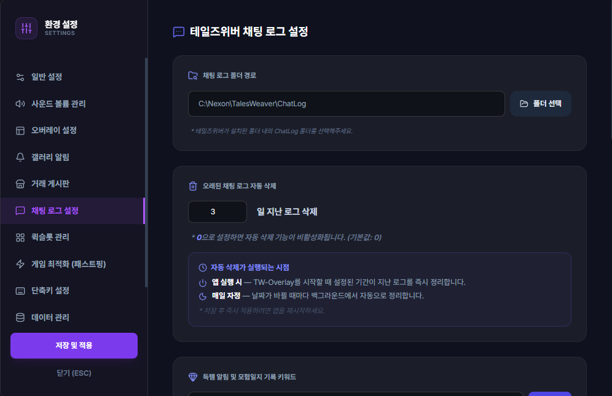

# 🚀 빠른 시작 가이드 (Quick Start)

**TW-Overlay**를 처음 설치하고 사용하시는 모험가분들을 위한 빠른 시작 안내서입니다.  
다운로드부터 필수 인게임 설정, 기본 조작법까지 3분 만에 완료할 수 있습니다.

---

## 📥 1. 어디서, 무엇을 다운로드받나요?

### 1) 공식 다운로드 링크
TW-Overlay는 오픈소스 무료 소프트웨어이며, 공식 GitHub 저장소의 Releases 페이지에서 최신 버전을 내려받으실 수 있습니다.

* 👉 **[TW-Overlay 최신 버전 다운로드 (GitHub Releases)](https://github.com/twliker/tw-overlay/releases)**

### 2) 다운로드할 파일
Releases 페이지의 **Assets** 목록에서 최신 버전의 설치 파일(`.exe`)을 클릭하여 다운로드합니다.
* **`twOverlay-Setup-x.x.x.exe`** (또는 `TW-Overlay-Setup-x.x.x.exe`) : Windows용 간편 원클릭 설치 프로그램 (자동 업데이트 지원, 권장)

---

## 🛡️ 2. 설치 및 실행 시 주의사항 (Windows PC 보호 창)

설치 파일을 처음 실행할 때 아래와 같이 **"Windows의 PC 보호 (SmartScreen)"** 파란색 안내창이 나타날 수 있습니다.

> [!NOTE]
> TW-Overlay는 비영리 오픈소스 프로젝트로, 고가의 기업용 유료 코드서명 인증서를 사용하지 않아 Windows에서 일시적으로 안내창을 표시합니다. 악성코드가 없는 100% 안전한 프로그램이므로 안심하고 진행하셔도 됩니다.

### 💡 파란 창 발생 시 해결 방법:
1. 화면에 보이는 **`[ 추가 정보 ]`** 글자를 클릭합니다.
2. 우측 하단에 새로 나타나는 **`[ 실행 ]`** 버튼을 클릭합니다.
3. 설치 마법사가 진행되며 설치 완료 후 바탕화면에 바로가기 아이콘이 생성되고 자동으로 앱이 실행됩니다.

---

## ⚙️ 3. 테일즈위버 인게임 필수 설정 (★가장 중요★)

TW-Overlay의 핵심 기능(경험치 미터기, 보스 알림, 득템 자동 박제, 숙제 자동 카운팅)이 정상 작동하려면 **테일즈위버 게임 내 채팅 로그 저장이 반드시 켜져 있어야 합니다.**

1. 테일즈위버 게임에 접속합니다.
2. 키보드 **`단축키 O`** 를 눌러 **환경설정** 창을 엽니다.
3. **[게임]** 탭을 클릭합니다.
4. **`채팅 로그`** 항목을 찾아서 **`ON`** (활성화)으로 변경합니다.
5. 우측 하단의 **[확인]** 또는 **[적용]** 버튼을 누릅니다.

> [!IMPORTANT]
> **채팅 로그가 꺼져 있으면 오버레이가 게임 이벤트를 감지할 수 없습니다!**  
> 설치 후 오버레이가 작동하지 않는다면 인게임 채팅 로그가 `ON`으로 켜져 있는지 가장 먼저 확인해주세요.

---

## 🪄 4. 최초 실행 및 연동 확인 (시작 마법사)

TW-Overlay를 처음 실행하면 **시작 마법사(Welcome Guide)**가 표시됩니다.

1. **플레이 서버 선택**: 주로 플레이하시는 서버(예: 하이아칸, 제르나 등)를 선택합니다.
2. **채팅 로그 폴더 확인**:
   * 기본적으로 테일즈위버 기본 설치 경로(`C:\Nexon\TalesWeaver\ChatLog`)를 자동 감지합니다.
   * `정상 연동 완료` 메시지가 표시되면 완료입니다.
   * 만약 다른 드라이브나 폴더에 테일즈위버가 설치되어 있다면 **[경로 변경]** 버튼을 눌러 본인의 `TalesWeaver\ChatLog` 폴더를 직접 지정해주세요.

---

## 🎮 5. 기본 사용법 & 핵심 조작 팁

### 1) 테일즈위버 창모드 권장
* 테일즈위버 게임 환경설정에서 **창모드** 또는 **전체 창모드**로 플레이하시면 사이드바와 HUD가 게임 화면에 자석처럼 부착되어 가장 깔끔하게 표시됩니다.

### 2) 사이드바 & 오버레이 조작
* 게임 실행 시 테일즈위버 창 우측에 사이드바 대시보드가 자동으로 나타납니다.
* **마우스 조작 전환 (`Ctrl + Space`)**:
  * 평상시: 마우스 클릭이 오버레이를 통과하여 게임에 방해되지 않습니다 (마우스 투과).
  * 조작 시: `Ctrl + Space`를 누르거나 사이드바에 마우스를 올리면 오버레이를 직접 클릭하고 메뉴를 열 수 있습니다.
* **하단 Dock 바 모드 (`Ctrl + Shift + D`)**:
  * macOS 스타일의 하단 바를 선호하시는 경우 단축키로 하단 Dock을 켜고 끌 수 있습니다.

### 3) 게임이 꺼져 있어도 단독 실행 가능 (독립 유틸리티 모드)
* 테일즈위버가 켜져 있지 않은 상태에서도 화면 우측 하단 **시스템 트레이 아이콘**을 마우스 우클릭하여 계산기, 약어 사전, 숙제 체크리스트, 모험 일지 등을 언제든 단독으로 열어볼 수 있습니다.

### 4) Google Drive 클라우드 동기화 (다중 PC 사용자 추천)
* 집 PC, 노트북, 서브 컴퓨터를 함께 사용하신다면 **[설정 ⚙️] ➜ [데이터 관리] ➜ [Google 계정으로 로그인]**을 연동해보세요.
* 숙제 완료 체크 상태와 캐릭터 설정이 구글 드라이브(앱 전용 격리 공간)에 안전하게 자동 백업 및 동기화됩니다.
* 브라우저의 권한 확인 화면에서 **Google Drive의 앱 전용 데이터 보기 및 관리** 권한을 확인하고 허용해야 동기화를 사용할 수 있습니다. 체크박스가 표시되는 계정에서는 해당 항목을 선택한 뒤 계속 진행해주세요.
* 로그인 버튼 위치와 권한 화면은 **[Google Drive 동기화 가이드](./?doc=google-drive-sync)**에서 그림으로 확인할 수 있습니다.

---

## 📚 6. 다음 단계: 기능별 상세 가이드 둘러보기

TW-Overlay의 다양한 편의 기능 사용법은 좌측 메뉴의 상세 가이드에서 확인하실 수 있습니다:

* 📋 **[숙제 체크리스트 가이드](./?doc=contents-checker)** : 일일/주간 숙제 관리, 바둑판(Matrix) 뷰, 자동 카운팅
* ☁️ **[Google Drive 동기화 가이드](./?doc=google-drive-sync)** : 안전한 클라우드 데이터 백업 및 복원
* 📈 **[실시간 경험치 HUD 가이드](./?doc=experience-hud)** : 시간당 경험치 측정 및 레벨업 예상 시간
* ⏱️ **[지능형 버프 타이머 가이드](./?doc=intelligent-buff-timer)** : 도핑 버프 지속시간 알림
* 💬 **[채팅 오버레이 가이드](./?doc=chat-overlay)** : 인게임 채팅 필터링 및 득템 키워드 알림
* ⚙️ **[통합 환경 설정 가이드](./?doc=settings)** : 사운드 볼륨, 단축키, 화면 배치 커스텀
