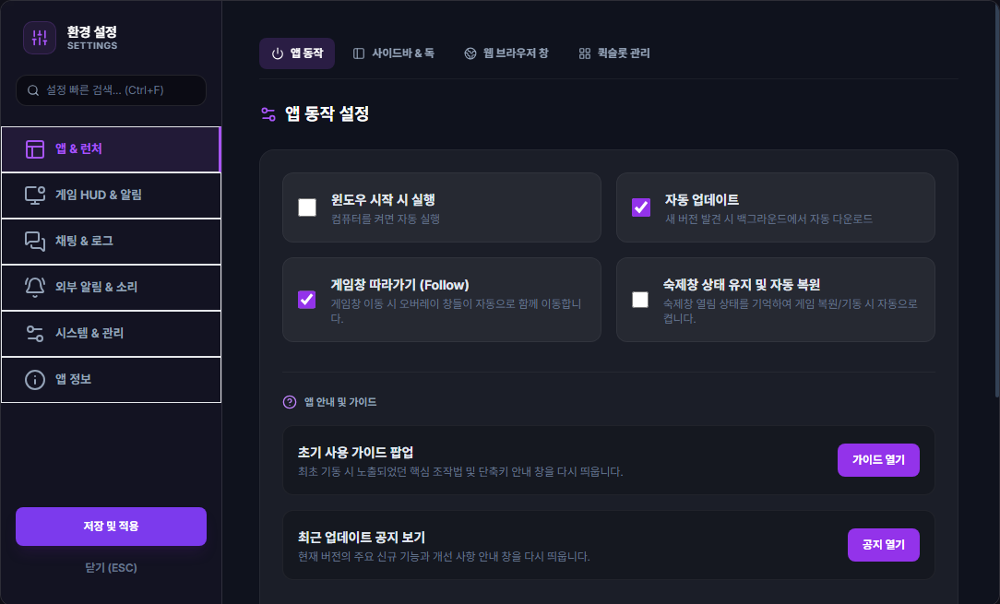
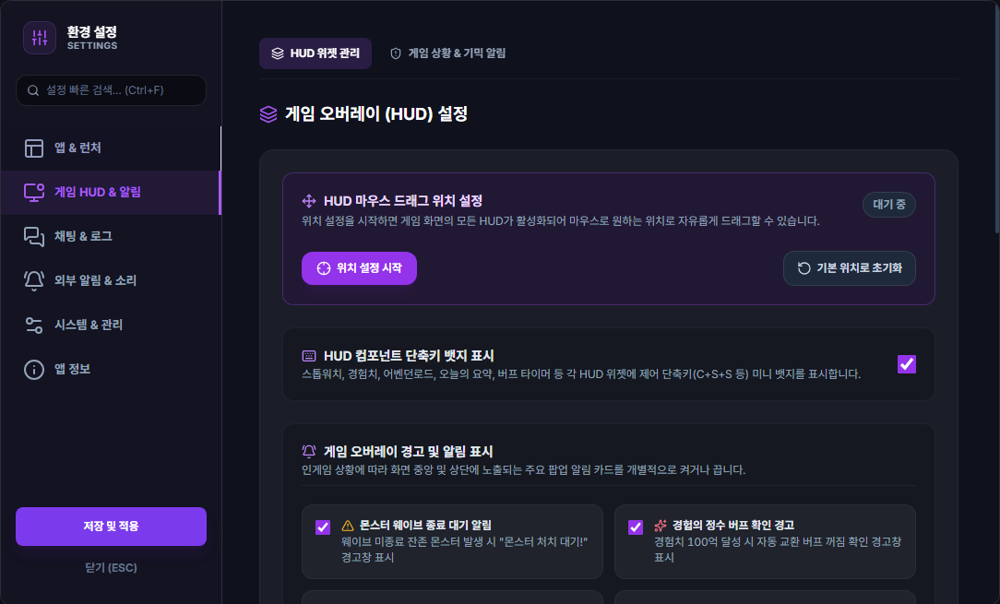
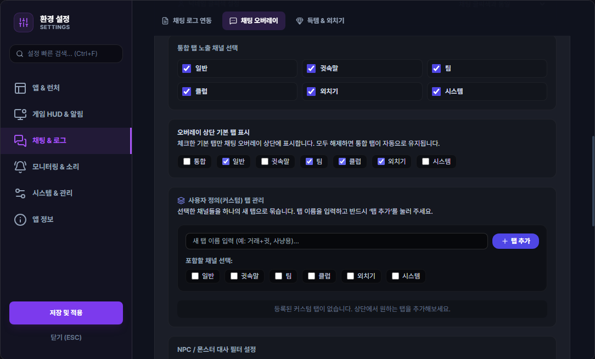
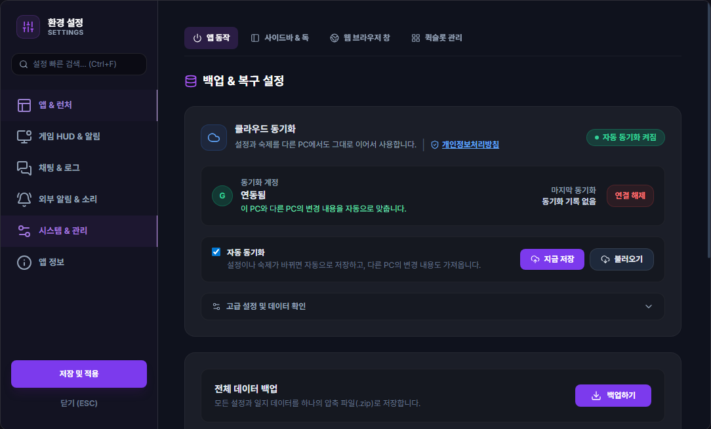

# 환경 설정

## 언제 쓰는 기능인가요?

알림, 소리, 오버레이, 단축키, 메뉴 구성, 데이터 보관과 업데이트 방식을 바꿀 때 사용합니다.

## 어디에서 켜나요?

사이드바·독 메뉴의 톱니바퀴 또는 시스템 트레이 메뉴에서 **설정**을 엽니다. 원하는 항목을 찾기 어렵다면 설정 검색을 사용하세요.

## 기본 사용법

1. 왼쪽에서 설정 분야를 선택합니다.
2. 위쪽 세부 메뉴에서 원하는 화면을 선택합니다.
3. 값을 바꾸고 화면 아래의 **저장 및 적용**을 누릅니다.
4. 창 크기·오버레이 배치처럼 즉시 반영되는 값도 있지만, 저장하지 않은 다른 설정은 닫을 때 취소될 수 있습니다.

HUD 위치를 바꿀 때는 **게임 HUD & 알림 → HUD 위젯 관리 → 위치 설정 시작**을 누른 뒤 게임 화면에서 HUD를 옮기고, 반드시 **위치 저장 및 종료**로 편집을 마칩니다. 위치 편집 중에는 일반 **저장 및 적용** 버튼이 잠기며, 설정 창을 닫거나 **취소**하면 편집 전 위치로 돌아갑니다.

자주 사용하는 분야는 다음과 같습니다.

- **앱 & 런처:** 자동 실행, 사이드바·독, 브라우저 창과 퀵슬롯, 게임 종료 리마인더
- **사용 통계:** 앱 버전·배포 채널과 기능 사용 이벤트를 전송하며, 원하지 않으면 `사용 통계 전송`을 끌 수 있음
- **게임 HUD & 알림:** HUD 배치, 발굴지 현황 HUD 표시 여부와 별도 창이 없는 기믹·도전과제·완료 알림
- **채팅 & 로그:** 채팅 로그 경로, 채팅 오버레이, 득템·외치기
- **모니터링 & 소리:** 거래·갤러리 키워드, 공통 수신 정책, 기능별 상세 설정 바로가기, 알림 기록
- **메뉴 관리:** 사이드바와 독에 보일 기능 선택, 퀵링크 순서
- **단축키:** 마우스 투과, 독, HUD와 시간 측정 단축키
- **시스템 & 관리:** 로그 경로, 로컬 백업·복원, Google Drive 동기화, 업데이트

`자동 업데이트` 설정은 일반 설치본과 Microsoft Store 설치본에 같은 기준으로 적용됩니다. 일반 업데이트는 설정을 켰을 때만 시작 화면에서 설치하며, 끄면 앱을 먼저 열고 앱 정보 메뉴의 빨간 점으로 알립니다. 필수 업데이트는 설정과 관계없이 시작 화면에서 설치합니다. Store의 무음 설치가 허용되지 않은 PC에서는 Windows 승인창이나 Microsoft Store 열기 안내가 표시될 수 있습니다.

`게임 종료 리마인더`는 사용 여부와 표시할 메시지를 모두 설정했을 때, 실행 중이던 테일즈위버가 종료되면 한 번 표시됩니다. 사용자 메시지와 함께 캐릭터별 미완료 숙제를 보여주며 TW-Overlay 자체를 종료하지는 않습니다.

설정 담당 화면은 다음 원칙으로 나뉩니다.

- 필드보스, 버프 타이머, 경험치 HUD·경험의 정수, 지정 단어, Discord, 커스텀 알림과 사기 탐지는 각 기능 창에서 상세 설정합니다.
- 도전과제, 심연의 보물창고, 웨이브와 보스 기믹처럼 별도 설정 창이 없는 알림은 **게임 진행 알림**에서 활성화·알림음·음량을 함께 설정합니다.
- 에토스·로카고스의 화면 표시와 대사 해석은 [이클립스 기믹 알림 가이드](./gimmick-alerts.md)에서 확인할 수 있습니다.
- 거래·갤러리의 서버와 키워드는 **외부 모니터링**에서 관리하고, 각 모니터 창의 종 모양 버튼으로 알림을 빠르게 켜거나 끕니다.

## 자주 혼동하는 점

- 사이드바와 독 메뉴는 같은 기능 목록을 사용합니다. 메뉴 관리에서 숨긴 항목은 둘 다에서 숨겨질 수 있습니다.
- 각 기능의 상세 설정은 한 화면에서만 관리합니다. 중앙 설정의 기능 카드는 해당 상세 창을 여는 바로가기입니다.
- 앱에서 파생된 창은 닫을 때 대부분 숨겨 두었다가 다시 사용합니다. 다시 열 때 새 창처럼 보여도 저장된 위치와 크기를 재사용합니다.
- 사용자가 직접 연 설정·도구·팝업 창은 `Esc`로 닫을 수 있습니다. 검색창, 입력 편집, 모달이나 이미지 확대 화면이 열려 있으면 첫 `Esc`는 해당 화면만 닫고, 다시 `Esc`를 누르면 창이 닫힙니다. 채팅 오버레이, 웹 브라우저 오버레이와 독은 게임 중 실수로 닫히지 않도록 제외합니다.
- 게임 화면 전체를 덮는 HUD와 독을 제외한 기능 창은 우하단 손잡이로 크기를 조절할 수 있으며, 바꾼 크기는 다음 실행에도 유지됩니다.
- **게임창 따라가기**를 켜면 채팅·숙제·도구 창이 게임창과의 간격을 유지하며 함께 이동합니다. 일반 창모드와 창모드 전체화면의 위치는 각각 기억하므로 게임 화면 모드를 바꿨다가 돌아와도 그 모드에서 사용한 위치로 복원됩니다. 전환 중 화면이 잠깐 커지거나 작아지는 동안에는 보조 창 위치를 저장하지 않습니다.
- **게임창 따라가기**를 끄면 해당 창을 현재 화면 위치에 고정해 게임을 옮기거나 화면 모드를 바꾸거나 다시 실행해도 따라가지 않습니다. 설정을 바꿔도 현재 창 위치가 갑자기 바뀌지 않도록 상대 위치와 화면 고정 위치를 함께 기억합니다.
- 게임 화면 위 HUD, 사이드바와 독은 게임에 붙어 있어야 하는 화면이므로 **게임창 따라가기**를 꺼도 계속 게임창을 따라갑니다.
- 게임이 실행되지 않았거나 최소화된 상태에서 트레이로 연 창은 사용하기 쉽도록 화면 중앙에 임시 표시합니다. 이때 옮긴 위치는 게임용 창 위치로 저장하지 않습니다.
- 마우스 투과 단축키의 기본값은 `Ctrl + Shift + T`, 독 표시 단축키의 기본값은 `Ctrl + Shift + D`입니다.
- Fast Ping은 Windows 네트워크 설정을 변경하는 별도 기능입니다. 효과는 PC와 네트워크에 따라 다르며, 안내된 관리자 권한과 되돌리기 절차를 확인한 뒤 사용하세요.
- 커스텀 커서는 TW-Overlay 창 안의 포인터 모양만 바꿉니다. 불편하면 커서 설정에서 기본값으로 되돌릴 수 있습니다.
- 로컬 백업은 이 PC에 파일을 만들고, Google Drive 동기화는 선택한 일반 설정과 숙제만 계정의 앱 전용 공간에 저장합니다.

## 저장과 동기화

- 일반 설정은 로컬 설정 파일에 저장됩니다.
- 일지, 채팅 기록, 사냥 동선과 시간 측정 기록은 로컬 DB에 저장됩니다.
- Google 계정을 연결하면 허용된 일반 설정과 숙제 체크리스트만 동기화됩니다.
- Discord Webhook URL, OAuth 토큰, 로컬 로그 경로와 커스텀 사운드 파일 경로는 클라우드에 올리지 않습니다.
- **채팅 & 로그 → 로그 경로 및 데이터 관리**의 과거 로그 동기화는 기본적으로 새 내용만 이어서 처리합니다. `이미 동기화 완료된 로그도 다시 분석하여 자동 기록 재구성`을 체크하면 완료 파일도 처음부터 분석하고, 성공한 날짜의 채팅 로그 기반 자동 기록만 새 결과로 교체합니다. 수동 일지는 유지되며 과거 로그에서 찾은 숙제는 수행 캐릭터를 알 수 없어 메인 캐릭터에 반영됩니다.

## 문제 해결

- **저장 후 값이 돌아옴:** 같은 설정 창을 여러 개 열지 않았는지 확인하고, 최신 창에서 다시 저장하세요.
- **메뉴 아이콘이 보이지 않음:** 메뉴 관리의 숨김 목록과 검색 필터를 확인하세요.
- **단축키가 동작하지 않음:** 게임 또는 TW-Overlay가 활성화된 상태인지 확인하세요. 그래도 동작하지 않으면 다른 프로그램과 키가 겹치는지 확인하고 새 조합으로 저장하세요.
- **창이 화면 밖에 있음:** 디스플레이 구성을 원래대로 돌린 뒤 열거나 창 위치 초기화 기능을 사용하세요.
- **화면 모드를 바꿀 때 창이 잠깐 멈춤:** 창모드 전환 중 잘못된 위치가 저장되지 않도록 잠시 고정하는 정상 동작입니다. 전환이 끝나면 해당 모드의 위치로 이동합니다.
- **데이터를 옮기고 싶음:** 한 PC 백업은 로컬 백업·복원을, 여러 PC 자동 반영은 Google Drive 동기화를 사용하세요.
