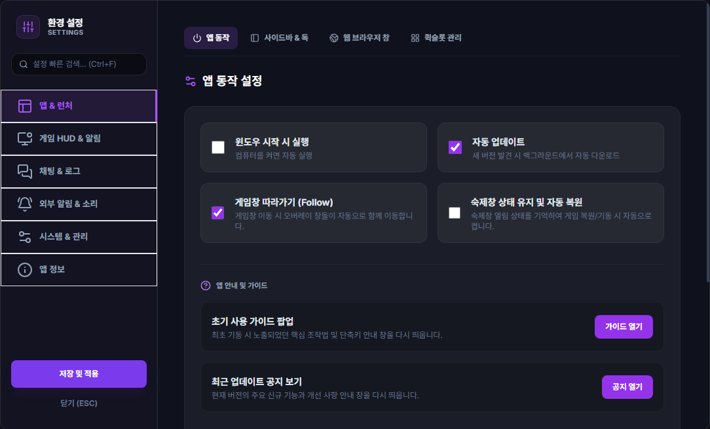
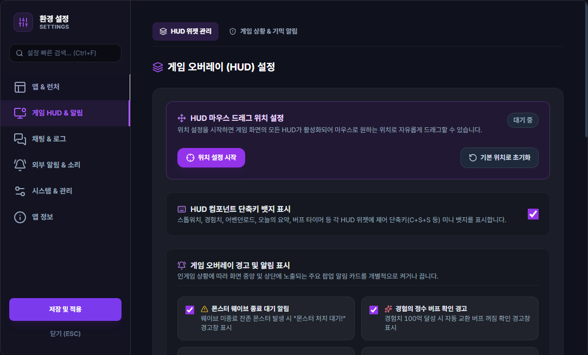
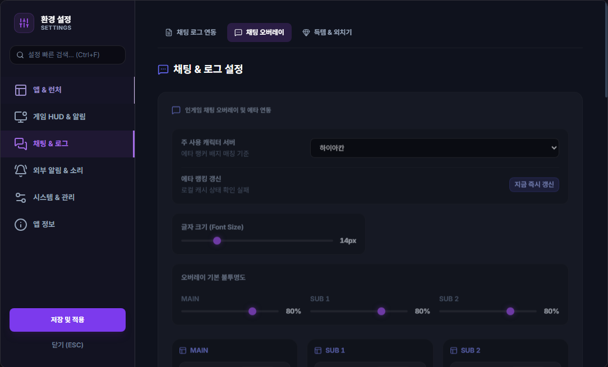
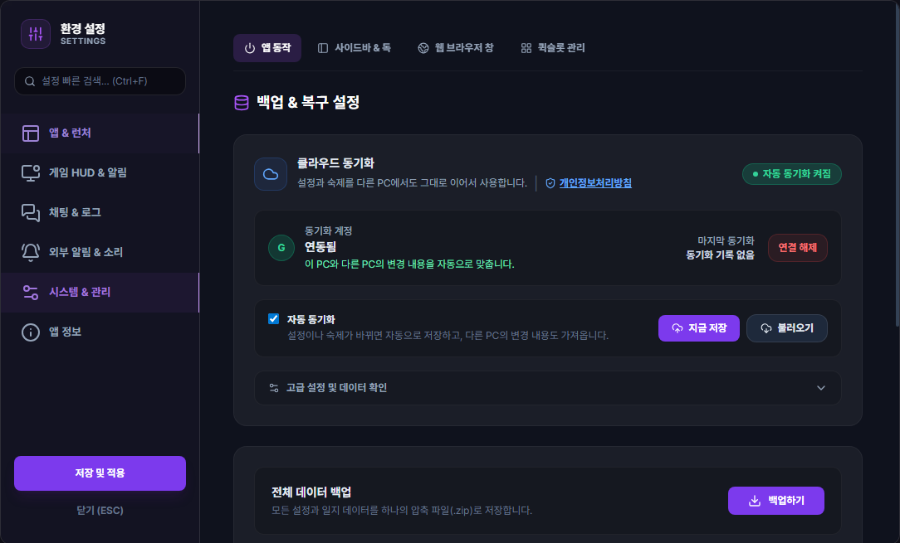

# 환경 설정

## 언제 쓰는 기능인가요?

알림, 소리, 오버레이, 단축키, 메뉴 구성, 데이터 보관과 업데이트 방식을 바꿀 때 사용합니다.

## 어디에서 켜나요?

사이드바·독 메뉴의 톱니바퀴 또는 시스템 트레이 메뉴에서 **설정**을 엽니다. 원하는 항목을 찾기 어렵다면 설정 검색을 사용하세요.

## 기본 사용법

1. 왼쪽에서 설정 분야를 선택합니다.
2. 위쪽 세부 메뉴에서 원하는 화면을 선택합니다.
3. 값을 바꾸고 화면 아래의 **저장 및 적용**을 누릅니다.
   저장 실패가 표시되면 해당 변경은 적용되지 않습니다. 입력 내용을 확인한 뒤 다시 저장하세요. 창 위치 등 이미 진행 중인 자동 저장은 계속 처리됩니다.
4. 창 크기·오버레이 배치처럼 즉시 반영되는 값도 있지만, 저장하지 않은 다른 설정은 닫을 때 취소될 수 있습니다.

설정 창을 열어 둔 동안 다른 PC나 창에서 설정이 갱신되어도 편집 중인 입력, 키워드·퀵슬롯, 단축키와 색상은 유지합니다. 수정하지 않은 항목은 새 설정을 받습니다. **저장 및 적용**은 저장 성공을 확인한 뒤 창을 닫으며, 실패하면 입력을 남겨 다시 저장할 수 있습니다.

거래 서버·사이드바 배치와 메뉴 표시 선택도 편집 중에는 유지됩니다. **즉시 적용**에 성공한 항목은 이후 다른 PC나 창의 최신 설정을 다시 받습니다. 다른 탭의 미저장 입력, 저장 실패 시 입력, 저장을 기다리는 동안 다시 수정한 값은 그대로 유지합니다.

알림음 목록이 늦게 준비되어도 처음 표시된 소리는 미저장 편집으로 취급하지 않습니다. 저장을 기다리는 동안 받은 외부 설정도 이후 갱신을 계속 받으며, 그 사이 직접 다시 편집한 값은 유지됩니다.

**저장 및 적용**으로 명시적으로 저장한 항목은 값이 같아도 단축키·자동 실행 상태를 다시 적용하고 일지 보관 기간에 따른 정리를 실행합니다. 다른 PC에서 설정을 받을 때는 실제로 바뀐 항목만 재적용합니다.

HUD 위치를 바꿀 때는 **게임 HUD & 알림 → HUD 위젯 관리 → 위치 설정 시작**을 누른 뒤 게임 화면에서 HUD를 옮기고, 반드시 **위치 저장 및 종료**로 편집을 마칩니다. 위치 편집 중에는 일반 **저장 및 적용** 버튼이 잠기며, 설정 창을 닫거나 **취소**하면 저장하지 않은 위치 변경을 버립니다. 편집 중 프리셋·공유 배치 또는 다른 창에서 설정을 적용했다면, 취소 후에는 마지막으로 저장된 위치와 표시 상태를 따릅니다. **위치 저장 및 종료**를 누르면 현재 편집 위치를 저장합니다.

HUD 위치 저장에 성공하면 설정 화면의 해당 좌표 입력도 저장한 위치로 바뀝니다. 앞서 직접 입력하고 적용하지 않았던 좌표보다 새로 저장한 위치를 우선하며, 다른 항목의 미저장 입력과 위치 편집 취소·저장 실패 시 초안은 유지합니다.

자주 사용하는 분야는 다음과 같습니다.

- **앱 & 런처:** 자동 실행, 사이드바·독, 브라우저 창과 퀵슬롯, 게임 종료 리마인더
- **사용 통계:** 앱 버전·배포 채널과 기능 사용 이벤트를 전송하며, 원하지 않으면 `사용 통계 전송`을 끌 수 있음
- **게임 HUD & 알림:** HUD 배치, 발굴지 현황 HUD 표시 여부와 별도 창이 없는 기믹·도전과제·완료 알림
- **채팅 & 로그:** 채팅 로그 경로, 채팅 오버레이, 득템·외치기
- **모니터링 & 소리:** 거래·갤러리 키워드, 공통 수신 정책, 기능별 상세 설정 바로가기, 알림 기록
- **메뉴 관리:** 사이드바와 독에 보일 기능 선택, 퀵링크 순서
- **단축키:** 마우스 투과, 독, HUD와 시간 측정 단축키
- **시스템 & 관리:** 로그 경로, 로컬 백업·복원, Google Drive 동기화, 업데이트

`자동 업데이트` 설정은 일반 설치본과 Microsoft Store 설치본에 같은 기준으로 적용됩니다. 일반 업데이트는 설정을 켰을 때만 시작 화면에서 설치하며, 끄면 앱을 먼저 열고 앱 정보 메뉴의 빨간 점으로 알립니다. 필수 업데이트는 설정과 관계없이 시작 화면에서 설치합니다. Store의 무음 설치가 허용되지 않은 PC에서는 Windows 승인창이나 Microsoft Store 열기 안내가 표시될 수 있습니다.

`게임 종료 리마인더`는 사용 여부와 표시할 메시지를 모두 설정했을 때, 실행 중이던 테일즈위버가 종료되면 한 번 표시됩니다. 사용자 메시지와 함께 **프로필별 탭과 남은 숙제 수**를 보여줍니다. 처음에는 마지막으로 사용한 프로필이 선택되며 다른 탭을 눌러 각 프로필의 남은 일일·주간 숙제를 확인할 수 있습니다. 숨김·N/A·완료 항목은 제외하고, 초기화 시각이 지난 숙제는 현재 주기를 기준으로 표시합니다. 남은 숙제가 없는 프로필도 탭을 유지합니다. 탭 전환은 실제 사용 프로필이나 기록 대상을 바꾸지 않으며, 확인 버튼 또는 Esc로 안내 창만 닫을 수 있습니다.

안내가 이미 열려 있으면 새 창을 쌓지 않고 기존 창의 내용을 갱신합니다. 보고 있던 프로필 탭은 유지하며 최소화한 안내는 다시 표시합니다.

시스템 메뉴의 **프로필**은 간결한 목록에서 사용할 프로필을 고르고 **추가/수정**할 때만 편집 폼을 펼칩니다. 기본 창 크기는 640×520이며 직접 조절해 저장한 크기는 유지합니다. **미배정 플레이 기록**은 종류와 대표 내용을 보여주며, 여러 기록은 최근 3개까지 펼쳐 볼 수 있습니다. 새 감지 이벤트의 건수와 구버전 숙제의 **보관 묶음/보류 수량**을 구분하며 최종 모험일지 행 수를 뜻하지 않습니다. 숙제 정보가 누락된 자료는 정보 누락을 안내하고 **무시하기**로 대기 목록을 정리할 수 있게 합니다. 정상적인 기록은 내용을 확인하고 사용할 프로필을 선택한 뒤 배정하면 됩니다.

설정 담당 화면은 다음 원칙으로 나뉩니다.

배정하지 않을 과거 대기는 **무시하기**를 눌러 내용을 확인한 뒤 목록에서 정리할 수 있습니다. 프로필을 선택하기 전에도 사용할 수 있고 숙제·모험일지에는 반영하지 않습니다. 확인 중 기록이 추가되거나 바뀌면 다시 내용을 확인하도록 안내합니다. 정보가 누락된 항목도 같은 방법으로 정리할 수 있으며 현재 플레이의 기록은 무시 대상에서 제외합니다.

- 필드보스, 버프 타이머, 경험치 HUD·경험의 정수, 지정 단어, Discord, 커스텀 알림과 사기 탐지는 각 기능 창에서 상세 설정합니다.
- 도전과제, 심연의 보물창고, 웨이브와 보스 기믹처럼 별도 설정 창이 없는 알림은 **게임 진행 알림**에서 활성화·알림음·음량을 함께 설정합니다.
- 에토스·로카고스의 화면 표시와 대사 해석은 [이클립스 기믹 알림 가이드](./gimmick-alerts.md)에서 확인할 수 있습니다.
- 거래·갤러리의 서버와 키워드는 **외부 모니터링**에서 관리하고, 각 모니터 창의 종 모양 버튼으로 알림을 빠르게 켜거나 끕니다.

## 자주 혼동하는 점

- 사이드바와 독 메뉴는 같은 기능 목록을 사용합니다. 메뉴 관리에서 숨긴 항목은 둘 다에서 숨겨질 수 있습니다.
- 각 기능의 상세 설정은 한 화면에서만 관리합니다. 중앙 설정의 기능 카드는 해당 상세 창을 여는 바로가기입니다.
- 앱에서 파생된 창은 닫을 때 대부분 숨겨 두었다가 다시 사용합니다. 다시 열 때 새 창처럼 보여도 저장된 위치와 크기를 재사용합니다.
- 사용자가 직접 연 설정·도구·팝업 창은 `Esc`로 닫을 수 있습니다. 검색창, 입력 편집, 모달이나 이미지 확대 화면이 열려 있으면 첫 `Esc`는 해당 화면만 닫고, 다시 `Esc`를 누르면 창이 닫힙니다. 채팅 오버레이, 웹 브라우저 오버레이와 독은 게임 중 실수로 닫히지 않도록 제외합니다.
- 게임 화면 전체를 덮는 HUD와 독을 제외한 기능 창은 우하단 손잡이로 크기를 조절할 수 있으며, 바꾼 크기는 다음 실행에도 유지됩니다.
- **게임창 따라가기**를 켜면 채팅·숙제·도구 창이 게임창과의 간격을 유지하며 함께 이동합니다. 일반 창모드와 창모드 전체화면의 위치는 각각 기억하므로 게임 화면 모드를 바꿨다가 돌아와도 그 모드에서 사용한 위치로 복원됩니다. 전환 중 화면이 잠깐 커지거나 작아지는 동안에는 보조 창 위치를 저장하지 않습니다.
- **게임창 따라가기**를 끄면 해당 창을 현재 화면 위치에 고정해 게임을 옮기거나 화면 모드를 바꾸거나 다시 실행해도 따라가지 않습니다. 설정을 바꿔도 현재 창 위치가 갑자기 바뀌지 않도록 상대 위치와 화면 고정 위치를 함께 기억합니다.
- 창을 드래그하는 동안에는 자동 위치 보정이 개입하지 않으며, 마우스를 놓은 최종 위치를 기억합니다. 창을 잡은 채 잠시 멈춰도 이동 중인 상태를 유지합니다.
- 게임 화면 위 HUD, 사이드바와 독은 게임에 붙어 있어야 하는 화면이므로 **게임창 따라가기**를 꺼도 계속 게임창을 따라갑니다.
- 게임이 실행되지 않았거나 최소화된 상태에서 트레이로 연 창은 사용하기 쉽도록 화면 중앙에 임시 표시합니다. 이때 옮긴 위치는 게임용 창 위치로 저장하지 않습니다.
- 프로필·도구 창을 닫은 직후 게임을 최소화하거나 숨겨도, 지연된 자동 포커스 복구가 게임을 다시 펼치지 않습니다.
- 마우스 투과 단축키의 기본값은 `Ctrl + Shift + T`, 독 표시 단축키의 기본값은 `Ctrl + Shift + D`입니다.
- 트레이의 **전체 창 숨기기**는 현재 보이는 창을 잠시 숨기고 **숨긴 창 복원**은 그 창들만 다시 표시합니다. 트레이 아이콘을 두 번 눌러도 복원됩니다. 설정·입력 중인 내용과 창의 위치는 유지하며, 숨기기 전부터 닫혀 있던 창은 새로 열지 않습니다.
- **전체 창 숨기기·복원** 단축키는 환경 설정 → 단축키에서 직접 지정할 수 있습니다. 기본은 미지정이며, 게임·앱이 전경일 때 동작합니다. 다른 프로그램을 사용 중이라면 트레이에서 복원하세요. 게임이 최소화되거나 종료된 동안에는 게임에 붙는 HUD·채팅창의 복원을 게임이 다시 보일 때까지 기다립니다.
- 전체 숨김 중에도 숙제 감지·수익 기록·측정과 기존 알림 소리는 계속됩니다. 숨김 중 발생한 보스·지정 단어 등의 토스트는 복원 때 몰아서 표시하지 않습니다. 개별 기능이나 환경 설정을 명시적으로 열면 전체 숨김을 해제합니다.
- Fast Ping은 Windows 네트워크 설정을 변경하는 별도 기능입니다. 효과는 PC와 네트워크에 따라 다르며, 안내된 관리자 권한과 되돌리기 절차를 확인한 뒤 사용하세요.
- TW-Overlay는 테일즈위버 프로세스의 실행 우선순위를 자동으로 높이지 않습니다.
- 커스텀 커서는 TW-Overlay 창 안의 포인터 모양만 바꿉니다. 불편하면 커서 설정에서 기본값으로 되돌릴 수 있습니다.
- 로컬 백업은 이 PC에 파일을 만들고, Google Drive 동기화는 선택한 일반 설정과 숙제만 계정의 앱 전용 공간에 저장합니다.

## Windows 자동 실행

- Microsoft Store 설치본은 Windows의 시작 앱 기능으로 실행됩니다. 업데이트 후 앱을 한 번 실행하면 이전 버전이 만든 잘못된 Store 자동 실행 등록을 정리합니다.
- 일반 설치본의 자동 실행 등록은 별도로 유지됩니다. 개발용 실행은 설치본의 자동 실행 설정을 바꾸지 않습니다.
- 일반 설치본은 Windows 표시 언어와 무관하게 한글·공백·이모지가 포함된 설치 및 설정 경로를 그대로 사용합니다. 자동 실행 바로가기를 만들지 못한 경우에는 새 시작 항목을 등록하지 않습니다.
- Windows 설정이나 작업 관리자에서 자동 실행을 직접 끈 경우 앱이 이를 강제로 다시 켜지 않습니다. 앱에서 켜기를 선택했을 때 표시되는 안내로 Windows 시작 앱 설정을 열 수 있습니다.
- 자동 실행 시에도 앱 사용에 필요한 관리자 권한 확인이 표시됩니다.

## 저장과 동기화

플레이 프로필에서는 로컬 ZIP 백업에 모든 프로필·숙제·환경설정·선택 대기 기록과 모험일지를 함께 담습니다. 새 백업은 전체 묶음으로 복원하며, 다른 PC에서 가져와도 두 PC를 구분하는 정보는 유지합니다. 구버전의 설정만 있는 백업은 현재 일지를 유지하고, 일지만 있는 백업은 현재 프로필과 설정을 유지합니다. 교체 전에 복구용 사본을 남기고 실패하면 원래 데이터로 돌아옵니다. 프로필의 앱 시작 시 프로필 선택 대기를 적용합니다.

- 일반 설정은 로컬 설정 파일에 저장됩니다.
- 로컬 ZIP 백업에는 설정·일지·커스텀 사운드와 버프 프리셋, 계산기 프로필·입력·기록 등 앱 도구의 브라우저 저장 데이터도 포함됩니다. 복원 완료 안내를 확인하면 재시작하고, 도구 창이 열리기 전에 저장 데이터를 적용합니다. 이전 형식의 백업도 읽을 수 있지만 당시 포함되지 않았던 도구 데이터는 복원되지 않습니다.
- 복원 중에는 설정 쓰기와 동기화를 잠시 멈춥니다. 복원에 실패하면 교체 전 스냅샷으로 되돌린 뒤 다시 저장할 수 있게 합니다.
- 일지, 채팅 기록, 사냥 동선과 시간 측정 기록은 로컬 DB에 저장됩니다.
- Google 계정을 연결하면 프로필·숙제·허용된 프로필 설정과 공통 키워드를 PC별 변경 파일로 동기화합니다. 첫 연결은 양쪽 병합/Google 가져오기/이 PC 유지(동기화 끄기)를 선택하며 적용 전 ZIP을 보관합니다. [Google 동기화](./google-drive-sync.md)를 참고하세요.
- Discord Webhook URL, OAuth 토큰, 로컬 로그 경로와 커스텀 사운드 파일 경로는 클라우드에 올리지 않습니다.
- **채팅 & 로그 → 로그 경로 및 데이터 관리**의 과거 로그 동기화는 기본적으로 새 내용만 이어서 처리합니다. `이미 동기화 완료된 로그도 다시 분석하여 자동 기록 재구성`을 체크하면 완료 파일도 처음부터 분석하고, 성공한 날짜의 채팅 로그 기반 자동 기록만 새 결과로 교체합니다. 수동 일지는 유지되며 숙제는 안내에 동의한 선택 프로필로 복원합니다. 이는 Google 전송과 별개의 로컬 복원 기능입니다.

## 창끼리 정렬

**앱 동작 → 창끼리 모서리 맞춤**은 기본 꺼짐입니다. 켜면 도구·채팅·브라우저 창을 끌어 놓을 때 같은 모니터에서 보이는 다른 창이나 작업 영역 가장자리에 8px 이내로 가까운 위치를 맞춥니다. 자동 배치·프리셋 복원에는 적용하지 않으며 숨겨진 창·최소화된 창은 대상에서 제외합니다. 맞춘 최종 위치는 기존 창 위치 저장·게임창 따라가기 규칙을 따릅니다. HUD 내부 정렬은 기존 HUD 위치 설정에서 사용합니다.

## 선택한 설정 공유

기존 **데이터 백업** 화면에서 **선택한 설정 공유**를 사용합니다. 배치·외관·알림 중 원하는 항목을 선택해 현재 저장된 설정을 JSON 파일로 저장합니다. 배치는 도구·채팅 창과 HUD, 외관은 채팅·고정 메모, 알림은 기존 안내의 켜짐·음량·사전 알림·위치입니다. 입력 중인 설정을 공유하려면 먼저 기존 저장 버튼으로 저장하세요.

**공유 파일 가져오기 → 가져올 항목 선택 → 변경 내용 비교 → 선택한 설정 적용** 순서로 사용합니다. 현재 값과 변경할 값을 보여 주며, 비교 후 관련 설정이 다른 창에서 바뀌면 다시 비교해야 합니다. 저장 실패 시 기존 설정을 유지하고, 성공해도 입력 중이던 미저장 초안은 유지합니다. 파일에 없는 항목은 현재 값을 사용합니다.

창의 열림·숨김 상태와 접힌 숙제창은 유지하고, 독립 창 배치·크기는 현재 화면의 최소 크기와 작업 영역 제한을 따릅니다. HUD는 기존 위젯별 좌표 정책을 사용하므로 다른 게임 해상도에서는 **HUD 위치 설정**으로 배치를 확인·조정하세요. 개인 메모·채팅·캐릭터 진행도·키워드·연동·단축키와 사용자 글꼴·소리 파일은 공유하지 않습니다. 사용자 글꼴을 쓰는 항목은 파일에서 제외하고 받는 PC의 글꼴 선택을 유지합니다. 전체 복구는 기존 ZIP 백업이 담당합니다.

아직 열리는 중인 창에도 공유 배치를 적용할 수 있습니다. 처음 표시될 때 최신 저장 배치를 사용하며, 그동안 공유 배치를 다시 적용하면 마지막 선택을 따릅니다. 닫힌 창을 새로 열지는 않습니다.

## 플레이 프로필 연동

플레이 프로필 기능은 앱 시작 시 준비됩니다. 연동 시 설정 화면에 대상 프로필 이름·서버와 공통 설정의 적용 범위를 표시합니다. 미저장 설정이 있는 상태에서 다른 프로필을 선택하면 **저장 후 전환 / 저장하지 않고 전환 / 취소**를 고를 수 있습니다. 저장 실패나 전환 취소 때는 선택과 입력을 유지하며, 설정을 저장 중이거나 위치를 편집 중이면 먼저 마친 뒤 전환합니다. 작성 중인 키워드·탭은 목록에 추가하거나 입력을 지워야 저장할 수 있습니다. 프로필 서버는 이 화면의 기존 서버 설정과 같은 값이며, 저장된 값이 없으면 필수 선택으로 안내합니다.

**채팅 & 로그 → 과거 로그 동기화**에는 복원할 프로필 이름·서버와 채팅 로그에서 프로필을 판별할 수 없다는 안내를 표시합니다. 프로필을 먼저 선택해야 시작할 수 있으며, 복원 중에는 전환·삭제 및 프로필 설정/숙제 편집을 잠시 기다려야 합니다. 이미 복원된 구간과 기존 미배정 기록은 유지합니다. 완료 안내에도 실제 복원 대상을 표시합니다.

## 문제 해결

- **저장 후 값이 돌아옴:** 같은 설정 창을 여러 개 열지 않았는지 확인하고, 최신 창에서 다시 저장하세요.
- **메뉴 아이콘이 보이지 않음:** 메뉴 관리의 숨김 목록과 검색 필터를 확인하세요.
- **단축키가 동작하지 않음:** 게임 또는 TW-Overlay가 활성화된 상태인지 확인하세요. 그래도 동작하지 않으면 다른 프로그램과 키가 겹치는지 확인하고 새 조합으로 저장하세요.
- **창이 화면 밖에 있음:** 디스플레이 구성을 원래대로 돌린 뒤 열거나 창 위치 초기화 기능을 사용하세요.
- **화면 모드를 바꿀 때 창이 잠깐 멈춤:** 창모드 전환 중 잘못된 위치가 저장되지 않도록 잠시 고정하는 정상 동작입니다. 전환이 끝나면 해당 모드의 위치로 이동합니다.
- **데이터를 옮기고 싶음:** 한 PC 백업은 로컬 백업·복원을, 여러 PC 자동 반영은 Google Drive 동기화를 사용하세요.

프로필 목록의 **순서 변경**에서 손잡이를 드래그하거나 ↑·↓ 버튼을 누릅니다. 손잡이에 키보드 초점을 맞춘 뒤 위·아래 방향키로도 이동할 수 있습니다. 즉시 이 PC에 저장되며 다음 실행과 게임 종료 리마인더 탭 순서에도 적용합니다. 사용 중인 프로필과 숙제 상태는 바뀌지 않고 Google로 순서를 보내지는 않습니다.

프로필 선택창의 숙제 대기 기록 **무시하기**와 모험일지의 **이전 프로필 정리**는 별개입니다. 모험일지에서 이전 프로필을 무시하면 확인 후 그 기록을 **미배정**으로 옮깁니다. 선택 중인 현재 프로필에 보내지 않습니다.
