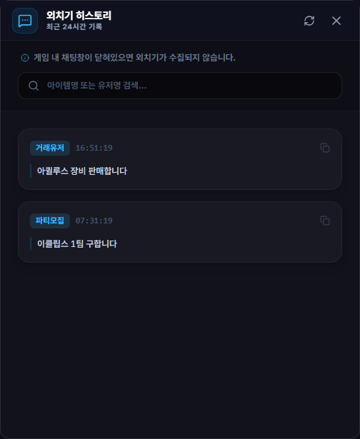

# 외치기 검색 & 히스토리

## 언제 쓰는 기능인가요?

게임 중 지나간 외치기를 다시 찾거나 아이템명, 닉네임과 메시지 내용으로 검색할 때 사용합니다.

## 어디에서 켜나요?

사이드바 또는 독 메뉴의 **외치기 검색 & 히스토리**를 엽니다.

## 기본 사용법

1. 최신 외치기를 시간순으로 확인합니다.
2. 검색창에 아이템명, 닉네임 또는 문구를 입력합니다.
3. 닉네임을 눌러 클립보드에 복사한 뒤 게임 귓속말에 활용합니다.
4. 위로 스크롤해 더 오래된 로컬 기록을 불러옵니다.

## 자주 혼동하는 점

- 창을 닫아도 앱이 실행 중이고 채팅 로그를 읽는 동안 외치기는 계속 로컬 DB에 저장됩니다.
- 기록 보존 기간은 설정값에 따라 정리됩니다. 이미 삭제된 과거 기록은 검색할 수 없습니다.
- 외치기 원문과 검색 기록은 Google Drive로 동기화되지 않습니다.
- 키워드 알림은 이 화면의 검색어가 아니라 설정에 등록한 알림 키워드를 사용합니다.

## 문제 해결

- **아무 기록도 없음:** 게임 채팅 로그 저장과 앱의 로그 경로를 확인하세요.
- **검색 결과가 늦게 바뀜:** 이전 요청이 끝나기 전에 검색어를 바꿔도 가장 최근 검색만 표시되므로 잠시 기다리세요.
- **닉네임 복사가 안 됨:** 목록의 닉네임 영역을 클릭했는지 확인하세요.
