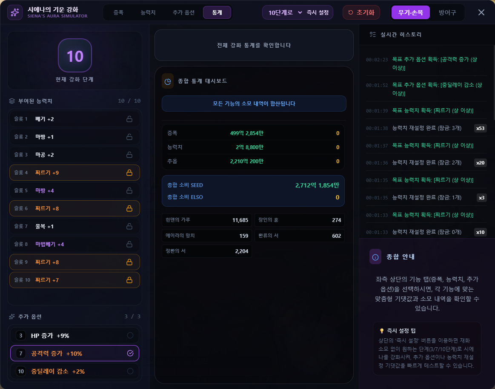

# 시에나의 기운

## 언제 쓰는 기능인가요?

시에나의 기운 장비의 증폭, 능력치 재설정과 추가 옵션 변경을 가상으로 시도하고 소모 재화를 비교할 때 사용합니다.

## 어디에서 켜나요?

사이드바 또는 독 메뉴의 **시에나의 기운**을 엽니다.

## 기본 사용법

1. 무기·손목 또는 방어구를 선택합니다.
2. **증폭**, **능력치**, **추가 옵션** 탭에서 현재 상태와 목표를 지정합니다.
3. 한 번씩 시도하거나 자동 시작으로 목표까지 반복합니다.
4. **통계** 탭에서 누적 시도와 SEED/엘소 소모량을 확인합니다.

## 자주 혼동하는 점

- 이 기능은 실제 게임 장비를 변경하지 않는 확률 시뮬레이션입니다.
- 자동 실행 결과는 한 번의 확률 실험이므로 실행할 때마다 달라질 수 있습니다.
- SEED와 엘소 선택에 따라 비용 표시가 달라집니다.
- 전체 초기화는 현재 시뮬레이션 상태와 누적 통계를 지웁니다.

## 문제 해결

- **자동 실행이 끝나지 않음:** 목표 조건이 현재 설정으로 가능한지 확인하고 자동 실행을 중지하세요.
- **비용이 예상과 다름:** 장비 종류와 선택 재화를 확인하세요.
- **처음부터 다시 하고 싶음:** 화면 위쪽의 전체 초기화를 사용하세요.
