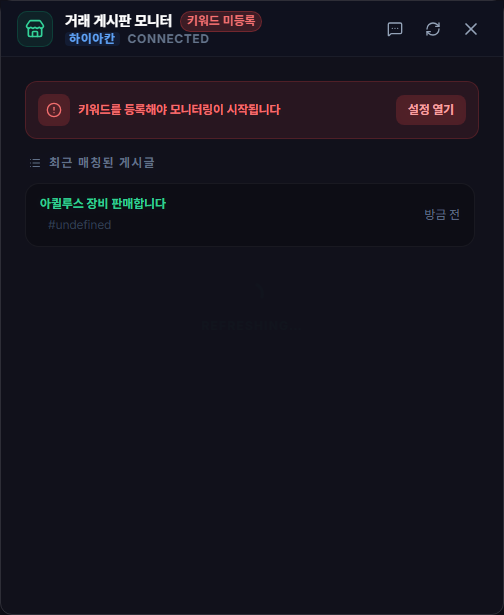

# 거래 게시판 모니터링

## 언제 쓰는 기능인가요?

선택한 서버의 거래 게시판에서 원하는 아이템 키워드가 포함된 새 글을 모아 보고 알림받을 때 사용합니다.

## 어디에서 켜나요?

사이드바 또는 독 메뉴의 **거래 게시판 모니터링**을 엽니다. 서버와 키워드는 설정의 거래 항목에서 지정합니다.

## 기본 사용법

1. 거래할 서버를 선택합니다.
2. 찾을 아이템명이나 문구를 키워드로 등록합니다.
3. 거래 모니터 창 위쪽의 종 모양 버튼으로 알림을 켭니다.
4. 글을 눌러 원문에서 가격과 작성자를 직접 확인합니다.

## 자주 혼동하는 점

- 등록 키워드는 게시글 제목을 기준으로 찾습니다.
- 종 모양 버튼은 알림만 빠르게 켜거나 끕니다. 서버와 키워드는 환경 설정의 **외부 모니터링**에서 변경합니다.
- 외부 게시판 상태와 로그인 정책에 따라 원문 열기나 갱신이 실패할 수 있습니다.
- 같은 글의 반복 알림을 줄이지만, 수정·재등록된 글은 새 글로 보일 수 있습니다.
- 일부 키워드 검색이 실패해도 성공한 검색의 새 글은 알립니다. 실패한 키워드는 마지막으로 성공한 확인 위치에서 다시 확인하며, 앱을 재시작해도 이 위치와 이미 알린 글의 중복 방지 상태를 이어받습니다. 수동 목록 새로고침으로 아직 알리지 않은 검색 결과를 건너뛰지 않습니다.
- 같은 서버로 설정을 다시 저장해도 확인 지점은 유지합니다. 실제 서버를 바꾸면 새 서버의 현재 글을 기준으로 감시를 시작합니다.
- 목록에 표시됐다는 사실은 판매자와 거래의 안전을 보장하지 않습니다.

## 문제 해결

- **매칭 글이 없음:** 서버, 키워드 철자와 너무 구체적인 문구인지 확인하세요.
- **새 글이 늦게 보임:** 백그라운드 확인 주기 뒤 반영될 수 있으므로 수동 새로고침을 사용하세요.
- **연결 실패가 반복됨:** 기본 5분 간격에 연속 실패에 따른 지연을 더해 6분, 7분, 9분, 최대 10분 간격으로 재시도하며, 성공하면 기본 간격으로 돌아갑니다. 인증서 오류가 있으면 PC 시각과 네트워크를 확인하세요. 인증서 검증을 끄고 연결하지 않습니다.
- **원문이 안 열림:** 인터넷 연결과 기본 브라우저, 외부 게시판 접속 상태를 확인하세요.
