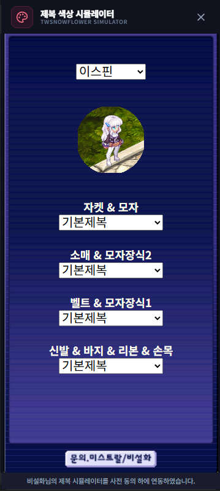

# 제복 색상 시뮬레이터

## 언제 쓰는 기능인가요?

염색 전에 제복 색상 조합을 미리 비교하고 싶을 때 사용하는 외부 연동 도구입니다.

## 어디에서 켜나요?

사이드바 또는 독 메뉴의 **제복 색상 시뮬레이터**를 엽니다.

## 기본 사용법

1. 창 안의 시뮬레이터가 로드될 때까지 기다립니다.
2. 캐릭터와 제복 부위, 색상을 선택해 조합을 비교합니다.
3. 원하는 조합을 확인한 뒤 게임에서 직접 적용합니다.

## 자주 혼동하는 점

- 외부 웹 서비스를 TW-Overlay 창 안에 표시하므로 인터넷 연결이 필요합니다.
- 시뮬레이터의 결과는 미리보기이며 게임 계정이나 아이템을 직접 변경하지 않습니다.
- 외부 서비스의 구성이나 제공 여부는 TW-Overlay 업데이트와 별개로 바뀔 수 있습니다.

## 문제 해결

- **빈 화면이 보임:** 인터넷 연결을 확인하고 창을 다시 여세요.
- **일부 화면이 잘림:** 창 크기를 늘리거나 내부 스크롤을 사용하세요.
- **외부 서비스만 열리지 않음:** 방화벽이나 보안 프로그램의 차단 여부를 확인하세요.
