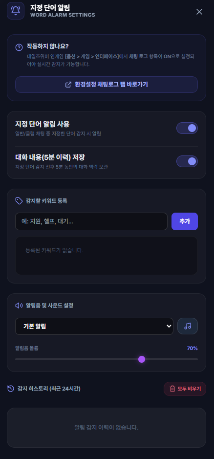

# 키워드 & 득템 단어 알림

## 언제 쓰는 기능인가요?

게임 채팅에서 특정 아이템명, 닉네임이나 문구가 나타났을 때 소리와 알림으로 놓치지 않으려면 사용합니다.

## 어디에서 켜나요?

사이드바 또는 독 메뉴의 **키워드 & 득템 단어 알림**을 엽니다.

## 기본 사용법

1. 감지할 단어나 닉네임을 등록합니다.
2. 알림 기능과 필요하면 감지 이력 저장을 켭니다.
3. 알림음과 음량을 고르고 미리 듣습니다.
4. 감지 이력에서 해당 메시지와 앞뒤 대화 문맥을 확인합니다.

## 자주 혼동하는 점

- 등록 단어는 게임 채팅 로그에 실제로 기록된 메시지와 비교합니다.
- 감지 이력은 메시지 이해를 위해 주변 대화를 함께 저장할 수 있습니다.
- 이력 보존 기간이 지나면 오래된 로컬 기록은 정리됩니다.
- 채팅 원문, 알림 이력과 커스텀 사운드 파일 경로는 Google Drive로 동기화되지 않습니다.

## 문제 해결

- **알림이 안 옴:** 기능 사용 여부, 키워드 철자, 로그 경로와 음량을 확인하세요.
- **너무 자주 울림:** 더 긴 문구를 등록하거나 불필요한 넓은 단어를 삭제하세요.
- **이력이 비어 있음:** 감지 이력 저장 옵션이 켜져 있는지 확인하세요.
